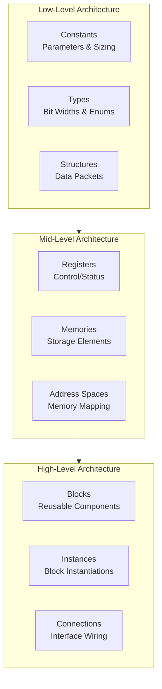
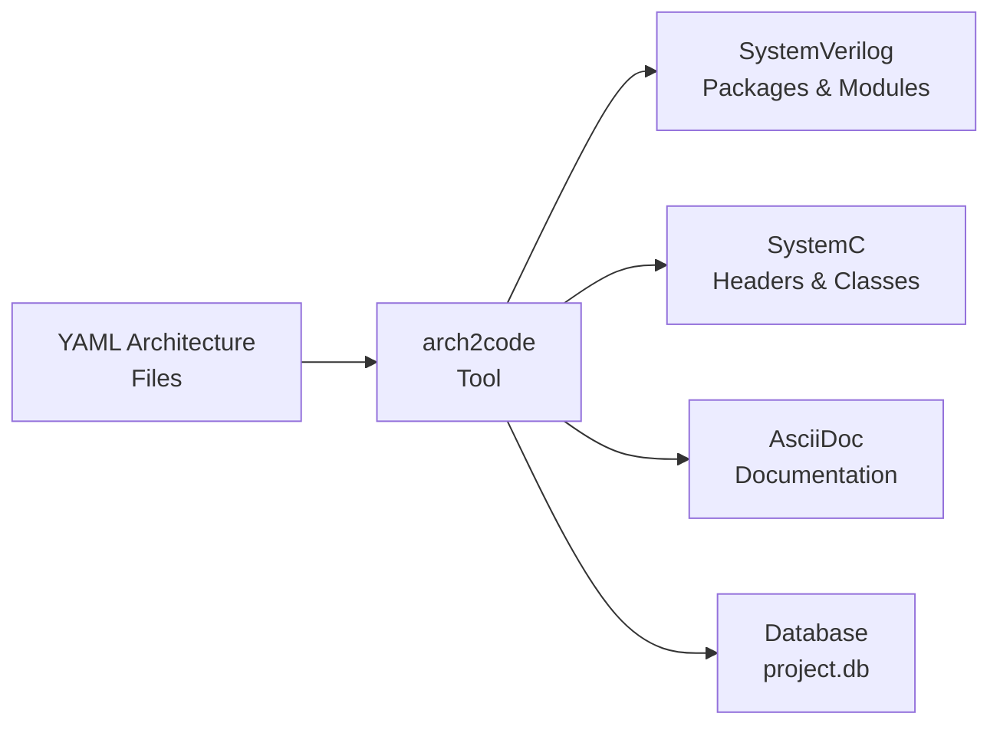
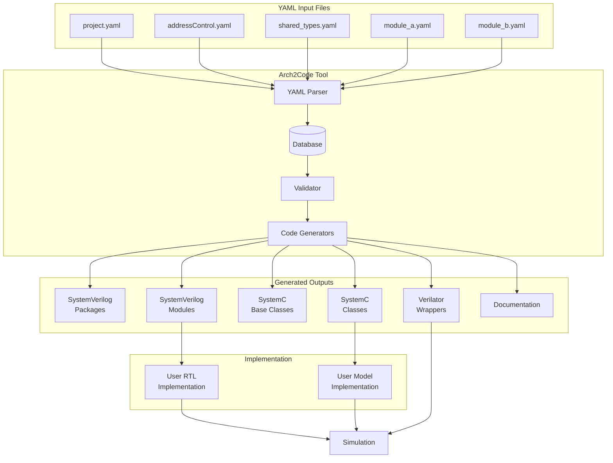

# Arch2Code AI Agent Rules and Guidelines

**Version:** 1.0  
**Purpose:** Enable AI agents to assist users in creating YAML architecture files and implementing SystemVerilog/SystemC modules using the arch2code toolchain.

**Documentation Reference:** https://github.com/arch2code/arch2code/wiki

---

## Table of Contents

1. [Quick Reference](#quick-reference)
2. [Core Concepts](#core-concepts)
3. [YAML File Structure](#yaml-file-structure)
4. [Low-Level Architecture Elements](#low-level-architecture-elements)
5. [Interfaces & Interface Types](#interfaces--interface-types)
6. [Blocks & Instances](#blocks--instances)
7. [Connections & Connection Maps](#connections--connection-maps)
8. [Registers & Address Management](#registers--address-management)
9. [Project Configuration](#project-configuration)
10. [Implementation Guidelines](#implementation-guidelines)
11. [Best Practices & Common Patterns](#best-practices--common-patterns)
12. [Error Prevention Rules](#error-prevention-rules)
13. [Code Generation Templates](#code-generation-templates)
14. [Troubleshooting](#troubleshooting)
15. [Appendix](#appendix)

---

## Quick Reference

### ⚠️ CRITICAL: Use Make Targets, Not Python Directly

**ALWAYS use make targets for code generation:**
- ✅ `make gen` - Generate code from YAML
- ✅ `make db` - Update project database
- ✅ `make newmodule` - Create new module
- ✅ `make clean` - Clean generated files
- ✅ `make help` - View all available targets

**NEVER use direct Python commands:**
- ❌ `python arch2code.py ...` - Bypasses project configuration
- ❌ `python builder/arch2code.py ...` - May use wrong environment
- ❌ Direct Python execution - Breaks dependency management

The make targets ensure proper environment setup, dependency management, and project-specific configurations.

---

### Minimal Project Structure

```
project_root/
├── arch/
│   └── yaml/
│       ├── project.yaml          # Main project configuration
│       ├── config/
│       │   └── addressControl.yaml
│       └── module/
│           └── module.yaml       # Module architecture
├── model/                        # SystemC implementation
├── rtl/                          # SystemVerilog implementation
└── Makefile
```

### Essential YAML Elements

```yaml
# Constants
constants:
  BUFFER_SIZE: {value: 1024, desc: "Buffer size in words"}
  ADDR_WIDTH: {eval: '($BUFFER_SIZE-1).bit_length()', desc: "Address width"}

# Types
types:
  byte_t:
    width: 8
    desc: "8-bit byte"
  status_t:
    desc: "Status field"  # width auto-calculated from enum
    enum:
      - {enumName: STATUS_IDLE, value: 0, desc: "Idle state"}
      - {enumName: STATUS_BUSY, value: 1, desc: "Busy state"}

# Structures
structures:
  data_packet_t:
    payload: {varType: byte_t, arraySize: 16, desc: "Data payload"}
    valid: {varType: bit_t, desc: "Valid flag"}

# Interfaces
interfaces:
  data_channel:
    interfaceType: rdy_vld
    desc: "Data transfer channel"
    structures:
      - {structure: data_packet_t, structureType: data_t}

# Blocks
blocks:
  producer:
    desc: "Data producer block"
    hasRtl: true
    hasMdl: true

# Instances
instances:
  u_producer: {container: top, instanceType: producer, instGroup: main}

# Connections
connections:
  - {interface: data_channel, src: u_producer, dst: u_consumer}
```

---

## Core Concepts

### Architecture Philosophy

Arch2code implements a **Single Source of Truth (SSoT)** methodology where architecture is defined once in YAML and all implementation artifacts are generated from this definition.

### Three-Level Architecture Hierarchy



#### Low-Level: Data Structures
- **Constants**: Architectural parameters (buffer sizes, widths, counts)
- **Types**: Basic data types with bit widths and optional enumerations
- **Structures**: Composite data types combining multiple fields

#### Mid-Level: Design Objects
- **Registers**: Memory-mapped control and status registers
- **Memories**: Storage elements with address spaces
- **Address Groups**: Hierarchical address space organization

#### High-Level: Hierarchical Elements
- **Blocks**: Reusable design components (can be instantiated multiple times)
- **Instances**: Specific instantiations of blocks within a hierarchy
- **Connections**: Interface-based communication between instances

### Code Generation Flow



---

## YAML File Structure

### Project File (`project.yaml`)

The project file is the entry point that orchestrates all architecture files.

**Required Fields:**
- `projectName`: Unique identifier for the project
- `projectFiles`: List of architecture YAML files to include
- `topInstance`: Name of the top-level instance (root of hierarchy)
- `dirs`: Directory structure mapping

**Optional Fields:**
- `dbSchema`: Custom schema file path
- `addressControl`: Address control configuration file
- `docConfig`, `cppConfig`, `svConfig`: Custom template configurations
- `fileGeneration`: File generation template configuration

#### Complete Example

```yaml
projectName: my_design

projectFiles:
  - top_level.yaml
  - subsystem_a/subsystem_a.yaml
  - subsystem_b/subsystem_b.yaml

dbSchema: config/schema.yaml  # Optional custom schema
addressControl: config/addressControl.yaml

topInstance: top_tb

dirs:
  root: ../..                      # Required: project root
  base: $root/base                 # Base classes
  model: $root/model               # SystemC models
  rtl: $root/rtl                   # SystemVerilog RTL
  vl_wrap: $root/verif/vl_wrap     # Verilator wrappers
  tb: $root/tb                     # Testbenches
  fwInc: $root/fw/include          # Firmware includes (if needed)

# Optional: Only needed for firmware header generation
# fileGeneration:
#   fileMap:
#     includeFW: {name: "IncludesFW", ext: {hdr: "h"}, cond: {smartInclude: true}, mode: context, basePath: fwInc, desc: "FW includes"}
#   fileCopyrightStatement: "Copyright Your Company 2025"
```

**AI Agent Guidance:**
- Always create `project.yaml` as the first file in a new project
- Use `$root` and `$a2c` macros for path portability
- The `root` directory in `dirs` is required and serves as the base for all other paths
- `$a2c` is automatically defined and points to the arch2code installation directory
- **File generation defaults are inherited** from `builder/base/config/project.yaml` - no need to define fileMap unless customizing
- Only add `fileGeneration.fileMap.includeFW` if your project needs firmware header files

### Architecture Files

Architecture files contain the actual design definitions. They can be organized hierarchically.

#### File Organization Strategies

**Strategy 1: Monolithic (Simple Projects)**
```
arch/yaml/
├── project.yaml
├── config/
│   └── addressControl.yaml
└── design.yaml  # All architecture in one file
```

**Strategy 2: Hierarchical (Recommended for Large Projects)**
```
arch/yaml/
├── project.yaml
├── config/
│   └── addressControl.yaml
├── shared_types.yaml        # Common types shared across modules
├── top_level.yaml           # Top-level connections
├── subsystem_a/
│   ├── subsystem_a.yaml     # Subsystem A architecture
│   └── module_x.yaml        # Sub-module
└── subsystem_b/
    └── subsystem_b.yaml     # Subsystem B architecture
```

#### Include Mechanism

Use `include` to share definitions across files:

```yaml
# shared_types.yaml
constants:
  DATAPATH_WIDTH: {value: 32, desc: "System datapath width"}

types:
  datapath_t:
    width: DATAPATH_WIDTH
    desc: "Datapath type"

# module_a.yaml
include:
  - ../shared_types.yaml

structures:
  module_a_data_t:
    data: {varType: datapath_t, desc: "Uses shared type"}
```

**AI Agent Guidance:**
- Use relative paths in `include` statements
- Paths are resolved relative to the including file's location
- Avoid circular includes
- Place shared types in dedicated files for reusability

---

## Low-Level Architecture Elements

All types, consts, structs should be managed in the yaml, not in the user code

### Constants

Constants define architectural parameters used throughout the design.

#### Syntax

```yaml
constants:
  CONSTANT_NAME: {value: <number>, desc: "<description>"}
  # OR with evaluation
  CALCULATED_CONST: {eval: '<expression>', desc: "<description>"}
```

#### Rules

1. **Naming Convention**: Use UPPER_CASE_WITH_UNDERSCORES
2. **Value or Eval**: Must specify either `value` OR `eval`, not both
3. **Description**: Required for documentation
4. **Math Expressions**: Supports `+`, `-`, `*`, `/`, parentheses
5. **References**: Use `$CONSTANT_NAME` to reference other constants
6. **Python Expressions**: Eval is based on std Python methods like `.bit_length()`

#### Examples

```yaml
constants:
  # Simple value
  BUFFER_SIZE: {value: 1024, desc: "Buffer size in words"}
  
  # Calculated from another constant
  BUFFER_ADDR_WIDTH: {eval: '($BUFFER_SIZE-1).bit_length()', desc: "Address width for buffer"}
  
  # Arithmetic expressions
  TOTAL_SIZE: {eval: '$BUFFER_SIZE * 2', desc: "Double buffer size"}
  
  # Complex expression
  FIFO_DEPTH: {eval: '($BUFFER_SIZE + 15) / 16', desc: "FIFO depth in 16-word blocks"}
```

**AI Agent Guidance:**
- When a user asks for a configurable size, create a constant
- Use `.bit_length()` to calculate address widths: `(SIZE-1).bit_length()`
- For power-of-2 checks or calculations, constants are essential
- Always add clear descriptions for maintainability

### Types

Types define bit widths and optional enumerations for data elements.

#### Syntax

```yaml
types:
  type_name:
    width: <number_or_constant>  # Required if no enum; auto-calculated if enum provided
    desc: "<description>"         # Required
    enum:                         # Optional
      - {enumName: <NAME>, value: <number>, desc: "<description>"}
```

#### Rules

1. **Naming Convention**: Use snake_case ending with `_t` (e.g., `byte_t`, `status_t`)
2. **Width**: 
   - **Required** for non-enum types (error if omitted)
   - **Auto-calculated** for enum types (calculated from largest enum value)
   - Can be a number or reference a constant name directly
3. **Enumerations**: Optional list of named values
4. **Enum Naming**: Use UPPER_CASE for enumeration names
5. **Description**: Required for all types and enum values

#### Examples

```yaml
types:
  # Simple fixed-width type
  bit_t:
    width: 1
    desc: "Single bit"
  
  byte_t:
    width: 8
    desc: "8-bit byte"
  
  # Type with constant width
  datapath_t:
    width: DATAPATH_WIDTH  # References constant
    desc: "Main datapath width"
  
  # Type with enumeration
  opcode_t:
    width: 4
    desc: "Operation code"
    enum:
      - {enumName: OPCODE_NOP, value: 0x0, desc: "No operation"}
      - {enumName: OPCODE_READ, value: 0x1, desc: "Read operation"}
      - {enumName: OPCODE_WRITE, value: 0x2, desc: "Write operation"}
      - {enumName: OPCODE_RESET, value: 0xF, desc: "Reset operation"}
  
  # Single-bit enum (FSM states, flags)
  direction_t:
    desc: "Transfer direction"  # width calculated from enum as 1
    enum:
      - {enumName: DIRECTION_READ, value: 0, desc: "Read from memory"}
      - {enumName: DIRECTION_WRITE, value: 1, desc: "Write to memory"}
```

**AI Agent Guidance:**
- For FSM states or command opcodes, always use enumerations
- **Width is mandatory** for non-enum types - omitting it will cause an error
- For enum types, width is auto-calculated from the largest enum value (can be omitted)
- Enum values can be non-contiguous (e.g., 0x00, 0x01, 0xFF)
- All types should be defined in the YAML, not in the code

### Structures

Structures group multiple fields into composite data types for interface communication.

#### Syntax

```yaml
structures:
  structure_name:
    field_name: {varType: <type_name>, desc: "<description>"}
    # OR with sub-structure
    field_name: {subStruct: <structure_name>, desc: "<description>"}
    # OR with array
    field_name: {varType: <type_name>, arraySize: <number>, desc: "<description>"}
    # Optional generator tag
    field_name: {varType: <type_name>, generator: <tag>, desc: "<description>"}
```

#### Rules

1. **Naming Convention**: Use snake_case ending with `_t` or `_st`
2. **Field Types**: Use `varType` for types OR `subStruct` for nested structures (not both)
3. **Arrays**: Use `arraySize` for fixed-size arrays
4. **Generator Tags**: Optional tags for code generation (e.g., `address`, `data`, `tracker(name)`)
5. **Packing**: Structures are packed in generated code (SystemVerilog `packed`, SystemC `sc_bv`)
6. **Field Order**: Fields are packed in the order defined (top field is MSB)

#### Examples

```yaml
structures:
  # Simple structure
  apb_addr_t:
    address: {varType: dword32_t, generator: address, desc: "APB address"}
  
  apb_data_t:
    data: {varType: dword32_t, generator: data, desc: "APB data"}
  
  # Structure with multiple fields
  packet_header_t:
    dest_id: {varType: byte_t, desc: "Destination ID"}
    src_id: {varType: byte_t, desc: "Source ID"}
    opcode: {varType: opcode_t, desc: "Operation code"}
    length: {varType: word16_t, desc: "Payload length in bytes"}
  
  # Structure with array field
  axi_data_t:
    data: {varType: datapath_t, desc: "Data payload"}
    strb: {varType: bit_t, arraySize: 4, desc: "Byte strobe signals"}
    last: {varType: bit_t, desc: "Last transfer flag"}
  
  # Nested structure
  full_packet_t:
    header: {subStruct: packet_header_t, desc: "Packet header"}
    payload: {varType: byte_t, arraySize: 256, desc: "Packet payload"}
    crc: {varType: word16_t, desc: "CRC checksum"}
  
  # Structure with tracker generator
  command_t:
    cmd: {varType: opcode_t, generator: tracker(cmd), desc: "Command with tracker"}
    addr: {varType: dword32_t, desc: "Target address"}
```

**AI Agent Guidance:**
- For register interfaces, typically create separate `_addr_t` and `_data_t` structures
- Use `generator: address` for address structures and `generator: data` for data structures
- Use `generator: tracker(name)` to enable transaction tracking in verification
- Arrays are useful for byte strobes, multi-beat data, or fixed-size buffers
- Nested structures help organize complex data types hierarchically

---

## Interfaces & Interface Types

### Interface Concept

Interfaces define the communication protocol and data structures between block instances. Arch2code uses predefined interface types with specific signaling protocols.

### Available Interface Types

Based on `builder/interfaces/` directory:

| Interface Type | Protocol | Use Case |
|---------------|----------|----------|
| `rdy_vld` | Ready-valid handshaking | Streaming data, backpressure support |
| `req_ack` | Request-acknowledge bidirectional | Command-response protocols |
| `push_ack` | Valid-acknowledge (push) | FIFO writes, one-way flow control |
| `pop_ack` | Ready-acknowledge (pop) | FIFO reads, consumer-driven |
| `apb` | AMBA APB (ARM standard) | Memory-mapped register access |
| `lmmi` | Lattice Memory Mapped Interface | Simple memory-mapped access |
| `axi4_stream` | AXI4-Stream | High-performance streaming |
| `axi_read` | AXI4 read channel | Memory read transactions |
| `axi_write` | AXI4 write channel | Memory write transactions |
| `status` | Status signal (no handshake) | Static signals, monitoring |
| `notify_ack` | Notify-acknowledge | Event notifications |
| `memory` | Memory interface | SRAM/ROM access |
| `external_reg` | External register | Register access |
| `raw` | Raw signals | Custom protocols |

### Interface Definition Syntax

```yaml
interfaces:
  interface_name:
    interfaceType: <type>
    desc: "<description>"
    structures:
      - {structure: <struct_name>, structureType: <binding>}
```

#### Rules

1. **Naming Convention**: Use snake_case for interface names
2. **Interface Type**: Must match a defined interface type
3. **Structures**: Bind structures to interface structureTypes
4. **Common StructureTypes**:
   - `data_t`: Primary data payload
   - `addr_t`: Address information
   - `rdata_t`: Response/read data
5. **Multiple Structures**: Some interfaces support multiple structure bindings (e.g., APB has addr_t and data_t)

### Interface Type Details

#### rdy_vld (Ready-Valid)

**Signals:**
- `vld`: Valid signal (source asserts when data available)
- `data`: Data structure
- `rdy`: Ready signal (destination asserts when can accept)

**Protocol:** Source drives `vld` and `data`, destination drives `rdy`. Transfer occurs when both `vld` and `rdy` are high.

**Example:**
```yaml
interfaces:
  data_stream:
    interfaceType: rdy_vld
    desc: "Data streaming interface"
    structures:
      - {structure: stream_data_t, structureType: data_t}
```

#### apb (AMBA APB)

**Signals:**
- `paddr`: Address
- `psel`: Select
- `penable`: Enable
- `pwrite`: Write enable
- `pwdata`: Write data
- `pready`: Ready
- `prdata`: Read data
- `pslverr`: Slave error

**Protocol:** Standard ARM AMBA APB protocol with setup and access phases.

**Example:**
```yaml
interfaces:
  cpu_reg_bus:
    interfaceType: apb
    desc: "CPU register bus"
    structures:
      - {structure: apb_addr_t, structureType: addr_t}
      - {structure: apb_data_t, structureType: data_t}
```

#### req_ack (Request-Acknowledge)

**Signals:**
- `req`: Request signal
- `data`: Request data
- `ack`: Acknowledge signal
- `rdata`: Response data

**Protocol:** Bidirectional with request and response phases.

**Example:**
```yaml
interfaces:
  command_if:
    interfaceType: req_ack
    desc: "Command interface"
    structures:
      - {structure: command_t, structureType: data_t}
      - {structure: response_t, structureType: rdata_t}
```

#### push_ack (Push-Acknowledge)

**Signals:**
- `vld`: Valid signal
- `data`: Data payload
- `ack`: Acknowledge signal

**Protocol:** Source pushes when valid, destination acknowledges.

**Example:**
```yaml
interfaces:
  fifo_write:
    interfaceType: push_ack
    desc: "FIFO write interface"
    structures:
      - {structure: fifo_data_t, structureType: data_t}
```

#### pop_ack (Pop-Acknowledge)

**Signals:**
- `rdy`: Ready signal
- `rdata`: Read data
- `ack`: Acknowledge signal

**Protocol:** Destination requests when ready, source acknowledges with data.

**Example:**
```yaml
interfaces:
  fifo_read:
    interfaceType: pop_ack
    desc: "FIFO read interface"
    structures:
      - {structure: fifo_data_t, structureType: rdata_t}
```

**AI Agent Guidance:**
- For streaming data with backpressure, use `rdy_vld`
- For register access, use `apb` or `lmmi`
- For command-response patterns, use `req_ack`
- For FIFO-like interfaces, use `push_ack` (write) and `pop_ack` (read)
- The `structureType` must match what the interface definition expects
- Check `builder/interfaces/<type>/<type>_if.yaml` for structureType requirements

---

## Blocks & Instances

### Blocks

Blocks are reusable design components that can be instantiated one or more times in the hierarchy.

#### Syntax

```yaml
blocks:
  block_name:
    desc: "<description>"
    hasVl: <true|false>       # Has Verilator wrapper
    hasRtl: <true|false>      # Has RTL implementation
    hasMdl: <true|false>      # Has SystemC model
    hasTb: <true|false>       # Has testbench
    isRegHandler: <true|false> # Is this a register decoder block (special)
    params:                    # Optional, for parameterized blocks
      - <param_name>
```

#### Rules

1. **Naming Convention**: Use snake_case for block names
2. **Description**: Required field
3. **Implementation Flags**: Control code generation
   - `hasRtl: true`: Generate SystemVerilog module skeleton
   - `hasMdl: true`: Generate SystemC class skeleton
   - `hasVl: true`: Generate Verilator wrapper
   - `hasTb: true`: Generate testbench skeleton
4. **Special Flags**:
   - `isRegHandler: true`: Indicates this is a register decoder block (auto-generated blocks have this)
   - **Do not manually set** `isRegHandler` - it's set automatically for `<blockname>_regs` blocks
5. **Default Values** (from schema):
   - `hasRtl`: defaults to `true` (most blocks have RTL)
   - `hasMdl`: defaults to `true` (most blocks have model)
   - `hasVl`: defaults to `false` (Verilator is optional)
   - `hasTb`: defaults to `false` (only top-level needs testbench)
   - `isRegHandler`: defaults to `false` (only for register handler blocks)

#### Examples

```yaml
blocks:
  # Simple block (hasRtl=true, hasMdl=true by default)
  fifo:
    desc: "FIFO buffer"
  
  # Model-only block (no RTL)
  cpu:
    desc: "CPU behavioral model"
    hasRtl: false
  
  # RTL-only block (no model)
  physical_phy:
    desc: "Physical layer (RTL only)"
    hasMdl: false
  
  # Top-level testbench
  top_tb:
    desc: "System testbench"
    hasTb: true
  
  # Block with Verilator co-simulation
  dma_tandem:
    desc: "DMA with RTL/model co-sim"
    hasVl: true
```

**AI Agent Guidance:**
- By default, blocks have both RTL and model (`hasRtl: true`, `hasMdl: true`)
- Set `hasRtl: false` for model-only blocks (e.g., behavioral CPU models)
- Set `hasMdl: false` for RTL-only blocks (e.g., physical layer, analog interfaces)
- Set `hasVl: true` when you want to co-simulate RTL with SystemC (Verilator)
- Set `hasTb: true` only for top-level testbench containers
- **Block register handlers are auto-generated**: If a block has registers or FW-accessible memories, arch2code automatically creates a `<blockname>_regs` block to handle register access within that block

### Instances

Instances are specific instantiations of blocks within the design hierarchy.

#### Syntax

```yaml
instances:
  instance_name:
    container: <parent_block_name>
    instanceType: <block_name>
    instGroup: <group_name>      # Optional, for ID enumeration
    addressGroup: <addr_group>   # Optional, required if block has addressable elements
    addressID: <number>          # Optional, auto-assigned if omitted
    addressMultiples: <number>   # Optional, defaults to 1
    variant: <variant_name>      # Optional, for variant-specific parameters
    color: <color_name>          # Optional, for visualization (not fully functional)
    count: <number>              # Optional, defaults to 1 (not fully supported yet)
    offset: <number>             # Optional, defaults to 0 (overridden by address generation)
```

#### Rules

1. **Naming Convention**: Typically prefix with `u_` (e.g., `u_fifo`, `u_processor`)
2. **Container**: Must reference a defined block
3. **Instance Type**: Must reference a defined block
4. **Self-Referential**: Top-level can have `container` = `instanceType`
5. **Instance Groups**: Optional grouping for ID enumeration generation
6. **Address Groups**: Required for blocks with registers, or memories with FW access
7. **Unique Names**: All instance names must be unique across the entire project
8. **Optional Fields**:
   - `variant`: Use with parameterized blocks (see parameters section)
   - `addressMultiples`: Use when block needs multiple address spaces (large memories)
   - `count`: Not fully supported yet - defaults to 1
   - `offset`: Not recommended - let arch2code auto-generate addresses
   - `color`: For visualization only (not fully functional)

#### Examples

```yaml
instances:
  # Top-level self-referential instance
  top:
    container: top
    instanceType: top
    instGroup: top
  
  # Simple functional instances
  u_processor:
    container: top
    instanceType: cpu
    instGroup: main
  
  u_memory:
    container: top
    instanceType: ram_block
    instGroup: main
  
  # Memory-mapped register block
  u_control_regs:
    container: top
    instanceType: control_registers
    instGroup: peripherals
    addressGroup: system_addr_space
    addressID: 0x0  # Explicit address ID
  
  # Instance with multiple address spaces
  u_dma:
    container: top
    instanceType: dma_controller
    instGroup: peripherals
    addressGroup: system_addr_space
    addressMultiples: 4  # Allocates 4 address spaces
  
  # Hierarchical instances (instance within instance)
  u_subsystem_a:
    container: top
    instanceType: subsystem_a
    instGroup: subsystems
  
  u_module_x:
    container: subsystem_a  # Parent is subsystem_a
    instanceType: module_x
    instGroup: subsystem_a_modules
```

**AI Agent Guidance:**
- Always create a top-level instance first (self-referential)
- Use `instGroup` to organize instances for ID enumeration generation
- Set `addressGroup` for any block that has registers or FW-accessible memories
- Let `addressID` auto-assign unless specific ordering is required
- Use hierarchical instances to mirror the physical design hierarchy
- **You must manually create top-level bus decoder instances** (e.g., `u_apb_decode_system`) that route between blocks
- **Block-level register handlers** (e.g., `u_<blockname>_regs`) are auto-generated - don't create these
- Reference your manual decoder instance in `addressControl.yaml` → `AddressGroups` → `decoderInstance`

---

## Connections & Connection Maps

**Reference:** [Arch2Code Wiki - High Level Architecture](https://github.com/arch2code/arch2code/wiki/4-Yaml-High-Level-Arch)

### Direct Connections

Connections define interface-based communication between instances **within the same container**.

#### Syntax

```yaml
connections:
  - interface: <interface_name>
    src: <source_instance>
    dst: <destination_instance>
    name: <connection_name>          # Optional, overrides interface name, used for disambiguation
    srcport: <port_name>             # Optional, sets src port name (takes precedence over name)
    dstport: <port_name>             # Optional, sets dst port name (takes precedence over name)
    interfaceName: <channel_name>    # Optional, sets channel/interface instance name in generated code
    maxTransferSize: <bytes>         # Optional, for multicycle interfaces
    tracker: <alloc|dealloc|...>     # Optional, for tracker debug feature
```

#### Rules

1. **Interface**: Must reference a defined interface
2. **Source/Destination**: Must reference valid instances in the SAME container
3. **Direction**: Source is typically "master" or "producer", destination is "slave" or "consumer"
4. **Optional Fields Purpose**:
   - `name`: Use when multiple connections use same interface (for disambiguation)
   - `srcport`/`dstport`: Use when you need different port names at each end
   - `interfaceName`: Use to override the generated channel/interface instance name
   - `maxTransferSize`: Use to override interface's default transfer size
   - `tracker`: Use for tracker debug feature

#### Examples

```yaml
connections:
  # Simple point-to-point connection
  - interface: data_stream
    src: u_producer
    dst: u_consumer
  
  # Multiple connections with same interface type (use name for disambiguation)
  - interface: apb_bus
    src: u_cpu
    dst: u_peripheral_a
    name: cpu_to_periph_a
  
  - interface: apb_bus
    src: u_cpu
    dst: u_peripheral_b
    name: cpu_to_periph_b
  
  # Connection with custom channel name
  - interface: data_stream
    src: u_producer
    dst: u_consumer
    interfaceName: custom_channel_name
```

#### Naming Precedence Rules (Critical for AI Agents)

Understanding port and channel naming is essential for correct disambiguation:

**Port Name Precedence:**
- **Source Port**: `srcport` (if specified) → `name` (if specified) → `interface` (default)
- **Destination Port**: `dstport` (if specified) → `name` (if specified) → `interface` (default)

**Channel/Interface Instance Name Precedence:**
- `interfaceName` (if specified) → `srcport` (if specified) → `name` (if specified) → `interface` (default)

**AI Agent Guidance:**
- Connections are unidirectional in terms of data flow (src → dst)
- For bidirectional protocols (e.g., req_ack), one connection handles both directions
- Use descriptive `name` when multiple connections of same interface exist
- Use `srcport`/`dstport` when you need different port names at each end
- Use `interfaceName` to override the default channel/interface instance name in generated code
- Verify interface structureTypes match between connected blocks
- **Connections ONLY connect instances in the SAME container** - use connectionMaps for hierarchical routing

### Connection Maps

Connection maps allow top-level interfaces to be routed to internal sub-block instances.

#### Syntax

```yaml
connectionMaps:
  - interface: <interface_name>
    block: <parent_block_name>
    direction: <src|dst>
    instance: <target_instance>
    name: <connection_name>     # Optional, must match connection if used
    port: <port_name>           # Optional, must match srcport/dstport from connection
    instancePort: <port_name>   # Optional, port name in target instance
```

#### Rules

1. **Purpose**: Maps external block interfaces to internal instance connections
2. **Block**: The parent block that contains the interface port
3. **Direction**: Whether the parent block is `src` or `dst` for this interface
4. **Instance**: The internal instance to map to
5. **Name**: Must match connection name if specified in original connection
6. **Port**: Must match `srcport` (if direction=src) or `dstport` (if direction=dst) from connection
7. **Critical**: Connections define communication within ONE container; connectionMaps bridge across container boundaries
8. **Chaining**: Multiple hierarchical connection maps can be used (one per level)

#### Example 1: Simple Hierarchical Connection

**Scenario:** Connect through a container block to an internal instance

```yaml
blocks:
  top:
    desc: "Top level"
  adam:
    desc: "Adam block (container)"
  bob:
    desc: "Bob block"
  colin:
    desc: "Colin block (inside adam)"

instances:
  u_top:   {container: top,  instanceType: top}
  u_adam:  {container: top,  instanceType: adam}
  u_bob:   {container: top,  instanceType: bob}
  u_colin: {container: adam, instanceType: colin}  # Inside adam!

# Connection at top level
connections:
  - interface: xxx
    src: u_bob
    dst: u_adam  # Connection to adam block

# Map adam's dst interface down to colin instance
connectionMaps:
  - interface: xxx
    block: adam
    direction: dst      # adam is destination in connection
    instance: u_colin   # Route to colin inside adam
```

**Flow:** `u_bob` → `u_adam` (boundary) → `u_colin` (internal)

**Key Points:**
- Connection is at `top` level (both bob and adam in same container)
- ConnectionMap routes from `adam` block boundary to `u_colin` instance inside it
- Direction `dst` because adam is the destination in the original connection

#### Example 2: Named Ports with Disambiguation

**Scenario:** Different port names at each end for clarity

```yaml
blocks:
  top:
    desc: "Top level"
  adam:
    desc: "Adam block"
  bob:
    desc: "Bob block"
  colin:
    desc: "Colin block"

instances:
  u_top:   {container: top,  instanceType: top}
  u_adam:  {container: top,  instanceType: adam}
  u_bob:   {container: top,  instanceType: bob}
  u_colin: {container: adam, instanceType: colin}

# Connection with different port names at each end
connections:
  - interface: xxx
    src: u_bob
    srcport: dave   # Bob's port named "dave"
    dst: u_adam
    dstport: eric   # Adam's port named "eric"

# Map with port matching
connectionMaps:
  - interface: xxx
    block: adam
    direction: dst
    port: eric          # MUST match dstport from connection
    instance: u_colin
    instancePort: fred  # Colin's internal port named "fred"
```

**Port Names Generated:**
- `bob` block: port named `dave` (from srcport)
- `adam` block: port named `eric` (from dstport)
- `colin` block: port named `fred` (from instancePort)

**Key Points:**
- `srcport`/`dstport` allow different names at connection ends
- `port` in connectionMap MUST match the corresponding `srcport` or `dstport`
- `instancePort` specifies the port name in the target instance
- Useful when multiple connections of same interface need unique names

**AI Agent Guidance:**
- Use connection maps when a block has hierarchical interfaces that need to connect to internal sub-blocks
- The `direction` must match the block's role in the original connection
- If connection uses `srcport`/`dstport`, connectionMap's `port` must match the appropriate one
- Connection maps are essential for hierarchical designs
- The mapped instance must exist within the specified block's container hierarchy
- **Remember**: Connections connect instances in SAME container; connectionMaps bridge container boundaries

### Connection & ConnectionMap Quick Reference

**For AI Agents: Decision Tree**

```
Need to connect two instances?
├─ Are they in the SAME container?
│  └─ YES → Use connections: {interface, src, dst}
│     └─ Multiple connections of same interface?
│        └─ YES → Add name: field for disambiguation
│     └─ Need different port names at each end?
│        └─ YES → Add srcport: and dstport:
│     └─ Need custom channel name?
│        └─ YES → Add interfaceName:
│
└─ Are they in DIFFERENT containers (hierarchical)?
   └─ YES → Use connections: for top level
            PLUS connectionMaps: to route into container
      └─ Direction in connectionMap?
         ├─ Block is src → direction: src
         └─ Block is dst → direction: dst
      └─ Connection uses srcport/dstport?
         └─ YES → connectionMap port: MUST match
```

**Naming Reference Card**

| Generated Name For | Precedence Order (First Found Wins) |
|-------------------|-------------------------------------|
| Source Port | `srcport` → `name` → `interface` |
| Destination Port | `dstport` → `name` → `interface` |
| Channel/Interface Instance | `interfaceName` → `srcport` → `name` → `interface` |
| Internal Port (via connectionMap) | `instancePort` (if specified) |

**Common Patterns**

| Pattern | Use | Example Fields |
|---------|-----|---------------|
| Simple connection | Two instances in same container | `interface, src, dst` |
| Multiple same interface | Disambiguation needed | Add `name:` |
| Different port names | Each end needs unique name | Add `srcport:`, `dstport:` |
| Custom channel | Override generated name | Add `interfaceName:` |
| Hierarchical routing | Cross container boundary | `connections:` + `connectionMaps:` |

---

## Registers & Address Management

### Register Definitions

Registers are memory-mapped control and status elements.

#### Syntax

```yaml
registers:
  - register: <register_name>
    regType: <rw|ro|ext>
    block: <owner_block_name>
    structure: <structure_name>
    desc: "<description>"
```

#### Rules

1. **Register Types**:
   - `rw`: Read-write register
   - `ro`: Read-only register (status)
   - `ext`: External register (control handled by user logic, eg for registers that create actions on write)
2. **Block**: The block that owns this register
3. **Structure**: Data structure defining register fields
4. **Description**: Required for documentation

#### Automatic Block-Level Register Handler Generation

**Important:** When you define registers for a block OR when a block has firmware-accessible memories (`regAccess: true`), arch2code automatically generates:

1. **Register Handler Block**: A block named `<blockname>_regs`
   - Example: If block is `dma_controller` → `dma_controller_regs`
   - Example: If block is `uart` → `uart_regs`
   - Generated for blocks with:
     - One or more registers defined
     - One or more memories with `regAccess: true` (FW accessible)
   - This block handles register read/write operations within that specific block

2. **Purpose**: The `<blockname>_regs` block:
   - Decodes register addresses within the block's address space
   - Handles register read/write logic
   - Connects to the block's internal registers/memories
   - Is automatically instantiated within the parent block

**What This Means:**
- You **do not** need to manually create `<blockname>_regs` blocks in your YAML
- These blocks are automatically generated and instantiated
- They handle register access **within** each block

#### Manual Top-Level Bus Decoder (Required)

**Important:** You **MUST manually create** the top-level bus decoder that routes the register bus to multiple blocks:

1. **Top-Level Decoder Block**: You must define (e.g., `apb_decode_system`)
   - This decodes the top-level address space
   - Routes register bus to the appropriate block based on address
   - Must be explicitly defined in your YAML

2. **Decoder Instance**: You must instantiate (e.g., `u_apb_decode_system`)
   - Must be explicitly created in `instances` section
   - Must be referenced in `addressControl.yaml`

3. **AddressGroup Reference**: 
   - The `decoderInstance` field in `AddressGroups` must reference your manual decoder instance
   - Example: `decoderInstance: u_apb_decode_system`

**Example:**
```yaml
# YOU MUST MANUALLY CREATE THIS:
blocks:
  apb_decode_system:
    desc: "APB decoder for system address space"
    hasRtl: true
    hasMdl: true

instances:
  u_apb_decode_system:
    container: top
    instanceType: apb_decode_system
    instGroup: decoders

# In addressControl.yaml
AddressGroups:
  system:
    decoderInstance: u_apb_decode_system  # References decoder
    primaryDecode: true
```

#### Complete Example with Auto-Generated and Manual Components

```yaml
# ============================================
# In addressControl.yaml
# ============================================
RegisterBusInterface: cpu_apb_reg  # Specifies APB interface for registers

AddressGroups:
  system:
    addressIncrement: 0x01000000
    maxAddressSpaces: 16
    varType: system_addr_id_t
    enumPrefix: SYSTEM_ADDR_
    decoderInstance: u_apb_decode_system  # YOUR manual decoder
    primaryDecode: true

# ============================================
# In your architecture YAML
# ============================================

# 1. YOU MUST MANUALLY CREATE: Top-level bus decoder
blocks:
  apb_decode_system:
    desc: "APB decoder routing to multiple blocks"
    hasRtl: true
    hasMdl: true

instances:
  u_apb_decode_system:
    container: top
    instanceType: apb_decode_system
    instGroup: decoders

# 2. Define your block with registers
blocks:
  dma_controller:
    desc: "DMA controller"
    hasRtl: true
    hasMdl: true

instances:
  u_dma_controller:
    container: top
    instanceType: dma_controller
    instGroup: peripherals
    addressGroup: system  # Links to address group

# 3. Define registers for the block
registers:
  - register: config
    regType: rw
    block: dma_controller
    structure: dma_config_t
    desc: "DMA configuration register"
  
  - register: status
    regType: ro
    block: dma_controller
    structure: dma_status_t
    desc: "DMA status register"
  
  - register: external_ctrl
    regType: ext
    block: dma_controller
    structure: dma_external_t
    desc: "External control register"

# 4. Connect CPU to your manual decoder
connections:
  - interface: cpu_apb_reg
    src: u_cpu
    dst: u_apb_decode_system
```

**Behind the Scenes:**
After processing, arch2code **automatically** creates:

```yaml
# AUTO-GENERATED: Block-level register handler (not in your YAML)
blocks:
  dma_controller_regs:
    desc: "Register handler for dma_controller"
    hasRtl: true
    hasMdl: true
    isRegHandler: true  # Special flag

# The dma_controller_regs block is automatically instantiated
# inside the dma_controller block and handles register operations
```

**Key Points:**
- **Manual**: `apb_decode_system` (top-level decoder routing between blocks)
- **Automatic**: `dma_controller_regs` (block-level register handler)
- The automatic block handles registers **within** dma_controller
- The manual decoder routes the bus **to** dma_controller (and other blocks)

### Register Connections

When a block is instantiated multiple times, register connections specify which instance owns each register.

```yaml
registerConnections:
  - register: <register_name>
    block: <block_name>
    instance: <instance_name>
```

**Example:**
```yaml
registers:
  - register: config
    regType: rw
    block: uart
    structure: uart_config_t
    desc: "UART configuration"

registerConnections:
  - register: config
    block: uart
    instance: u_uart_0
  
  - register: config
    block: uart
    instance: u_uart_1
```

### Memory Definitions

Memories define storage elements that can be accessed by firmware or hardware.

#### Syntax

```yaml
memories:
  - memory: <memory_name>
    block: <owner_block_name>
    structure: <data_structure_name>
    addressStruct: <address_structure_name>
    wordLines: <size_or_constant>
    desc: "<description>"
    regAccess: <true|false>     # Optional, defaults to false
    local: <true|false>          # Optional, defaults to false
    memoryType: <singlePort|dualPort|register>  # Optional, defaults to dualPort
```

#### Rules

1. **Memory Types**:
   - `singlePort`: Single-port memory (one read/write port)
   - `dualPort`: Dual-port memory (default, separate read and write ports)
   - `register`: Register-based memory (flops)
2. **regAccess**: Set to `true` for firmware-accessible memories
   - **Triggers automatic `<blockname>_regs` generation** (just like registers)
   - Memory becomes memory-mapped via register interface
   - The block-level register handler manages both registers and memories
3. **local**: Set to `true` for flop-based memories with fast array access
4. **Block**: The block that owns/implements this memory
5. **Structure**: Data structure defining memory data format
6. **addressStruct**: Address structure for memory addressing
7. **wordLines**: Number of addressable locations (can be constant reference)

#### Example with Firmware Access

```yaml
# FW-accessible memory (triggers dma_controller_regs auto-generation)
memories:
  - memory: buffer_mem
    block: dma_controller
    structure: buffer_data_t
    addressStruct: buffer_addr_t
    wordLines: BUFFER_SIZE  # References constant
    desc: "DMA buffer memory"
    regAccess: true  # Makes it FW-accessible, triggers dma_controller_regs generation
    memoryType: dualPort

# Local flop-based memory (no FW access)
memories:
  - memory: fifo_storage
    block: fifo
    structure: fifo_entry_t
    addressStruct: fifo_addr_t
    wordLines: 16
    desc: "FIFO storage"
    local: true
    regAccess: false  # No FW access, internal only
```

**Important:** When `regAccess: true`:
- Arch2code automatically generates the `<blockname>_regs` block (just like for registers)
- The `<blockname>_regs` block handles both register and memory access for that block
- The memory becomes memory-mapped and accessible via the register bus interface
- The instance must have `addressGroup` set to allocate address space
- You still need to manually create the top-level bus decoder (e.g., `apb_decode_system`)

### Address Control File

The address control file (`addressControl.yaml`) manages memory-mapped address space organization.

#### AddressGroups

Address groups define hierarchical address spaces.

```yaml
AddressGroups:
  group_name:
    addressIncrement: <bytes>
    maxAddressSpaces: <count>
    varType: <type_name>
    enumPrefix: <PREFIX_>
    decoderInstance: <decoder_instance_name>
    primaryDecode: <true|false>
```

**Fields:**
- `addressIncrement`: Byte spacing between instances (e.g., 0x00100000)
- `maxAddressSpaces`: Maximum number of addressable instances
- `varType`: Generated enumeration type name
- `enumPrefix`: Prefix for enumeration constants
- `decoderInstance`: **Your manually-created top-level decoder instance** (e.g., `u_apb_decode_system`)
  - This must reference an instance you explicitly defined in your YAML
  - Routes register bus to blocks within this address group
- `primaryDecode`: True for root address space

**Example:**
```yaml
AddressGroups:
  system:
    addressIncrement: 0x01000000  # 16MB spacing
    maxAddressSpaces: 16
    varType: system_addr_id_t
    enumPrefix: SYSTEM_ADDR_
    decoderInstance: u_system_decoder  # YOU must create this instance
    primaryDecode: true
  
  peripheral:
    addressIncrement: 0x00010000  # 64KB spacing
    maxAddressSpaces: 32
    varType: periph_addr_id_t
    enumPrefix: PERIPH_ADDR_
    decoderInstance: u_periph_decoder  # YOU must create this instance
    primaryDecode: false
```

**Important Note on Decoder Instances:**
- `decoderInstance` must reference a **manually-created** instance in your YAML
- Example: You must define `apb_decode_system` block and `u_apb_decode_system` instance
- This is the **top-level** decoder that routes the bus between multiple blocks
- Do not confuse with `<blockname>_regs` which is auto-generated per block

#### InstanceGroups

Instance groups provide ID enumeration without address space allocation.

```yaml
InstanceGroups:
  group_name:
    varType: <type_name>
    enumPrefix: <PREFIX_>
```

**Example:**
```yaml
InstanceGroups:
  top:
    varType: inst_id_t
    enumPrefix: INST_ID_
```

#### AddressObjects

Address objects control the ordering and alignment of memory-mapped elements.

```yaml
AddressObjects:
  object_type:
    alignment: <memsize|bytes>
    sizeRoundUpPowerOf2: <true|false>
    sortDescending: <true|false>
```

**Example:**
```yaml
AddressObjects:
  memories:
    alignment: memsize  # Align to memory size
    sizeRoundUpPowerOf2: true
    sortDescending: true  # Largest first
  
  registers:
    alignment: 8  # 8-byte alignment
    sortDescending: true
```

#### RegisterBusInterface

Specifies the interface used for register access.

```yaml
RegisterBusInterface: <interface_name>
```

**Example:**
```yaml
RegisterBusInterface: cpu_apb_reg
```

**AI Agent Guidance:**
- Create hierarchical address groups for multi-level decode
- Use `memsize` alignment for memories to enable lower-bit internal decode
- Set `primaryDecode: true` only for the top-level address group
- Instance groups are useful for error reporting and debug ID assignment
- **You must manually create and instantiate the decoder referenced in `decoderInstance`**
- The decoder instance must exist and have appropriate interface connections

### Register Decoder Architecture (Critical Understanding)

Arch2code uses a **two-level decoder architecture** for register access:

```
CPU → [Top-Level Decoder] → [Block-Level Handler] → Registers/Memories
      (MANUAL)                 (AUTO-GENERATED)
      
      apb_decode_system        dma_controller_regs
      (you create this)        (arch2code creates this)
```

#### Level 1: Top-Level Bus Decoder (MANUAL - You Create)
- **Name Pattern**: `apb_decode_<system_name>` or `lmmi_decode_<system_name>`
- **Purpose**: Routes register bus to the correct block based on high-order address bits
- **You Must**:
  - Define the decoder block in `blocks` section
  - Create an instance in `instances` section
  - Reference it in `addressControl.yaml` → `AddressGroups` → `decoderInstance`
  - Connect CPU (or bus master) to this decoder instance
- **Example**: `apb_decode_system`, `u_apb_decode_system`

#### Level 2: Block-Level Register Handler (AUTO - Arch2code Creates)
- **Name Pattern**: `<blockname>_regs`
- **Purpose**: Handles register/memory access within a specific block's address space
- **Arch2code Automatically**:
  - Creates the `<blockname>_regs` block
  - Instantiates it within the parent block
  - Wires it to the block's registers and memories
- **Triggered By**:
  - Registers defined for the block
  - Memories with `regAccess: true` for the block
- **Example**: `dma_controller_regs`, `uart_regs`

#### Complete Flow Example

```yaml
# YOU CREATE: Top-level decoder
blocks:
  apb_decode_system:
    desc: "System APB decoder"
    hasRtl: true
    hasMdl: true

instances:
  u_apb_decode_system:
    container: top
    instanceType: apb_decode_system
    instGroup: decoders

connections:
  - interface: cpu_apb_reg
    src: u_cpu
    dst: u_apb_decode_system  # CPU → Top decoder

# YOU CREATE: Blocks with registers
blocks:
  dma_controller:
    desc: "DMA controller"

instances:
  u_dma_controller:
    container: top
    instanceType: dma_controller
    addressGroup: system

registers:
  - register: config
    regType: rw
    block: dma_controller
    structure: config_t
    desc: "Config"

# ARCH2CODE AUTO-CREATES:
# Block: dma_controller_regs
#   - Handles register decode within dma_controller
#   - Instantiated automatically inside dma_controller
#   - Connected to config register
```

**Key Principle:**
- **Manual**: Top-level routing between blocks
- **Automatic**: Register handling within each block

---

## Project Configuration

### Directory Structure Mapping

The `dirs` section maps logical paths to physical directories.

#### Required Directories

```yaml
dirs:
  root: <relative_path>  # REQUIRED: Project root
```

#### Common Directory Mappings

```yaml
dirs:
  root: ../..                      # Project root
  base: $root/base                 # Base classes
  model: $root/model               # SystemC models
  rtl: $root/rtl                   # SystemVerilog RTL
  vl_wrap: $root/verif/vl_wrap     # Verilator wrappers
  tb: $root/tb                     # Testbenches
  fwInc: $root/fw/includes         # Firmware includes
```

**Macros:**
- `$root`: References the `root` directory
- `$a2c`: Auto-defined, points to arch2code installation

### File Generation Configuration

The `fileGeneration` section controls automatic file skeleton generation.

**IMPORTANT:** Comprehensive defaults are provided in `builder/base/config/project.yaml`. Most projects do not need to customize file generation settings.

#### Default Configuration

Arch2code provides complete default file mappings for:
- SystemC base classes and model files
- SystemVerilog RTL modules
- Verilator wrappers (SystemC and SystemVerilog)
- Testbench files
- Include files (SystemC) and package files (SystemVerilog)

These defaults are automatically inherited from `builder/base/config/project.yaml` and cover standard project structures.

#### When to Customize

The **only common customization** is adding firmware include file generation:

```yaml
# In your project.yaml
fileGeneration:
  fileMap:
    # Add firmware includes (only if you need FW headers generated)
    includeFW: { 
      name: "IncludesFW", 
      ext: {hdr: "h"}, 
      cond: {smartInclude: true}, 
      mode: context, 
      basePath: fwInc, 
      desc: "Firmware include file"
    }
```

**Notes:**
- The `includeFW` mapping generates header files in the `fwInc` directory (typically `$root/fw/include`)
- `smartInclude: true` means files are only created if there is register or memory content to export
- `mode: context` generates one file per YAML file (not per block)
- This is commented out by default in `builder/base/config/project.yaml` (line 63)

#### Custom Copyright Statement

You can optionally customize the copyright statement:

```yaml
fileGeneration:
  fileCopyrightStatement: "Copyright Your Company 2025. All Rights Reserved."
```

**AI Agent Guidance:**
- **Do NOT define full fileMap sections** - use defaults from `builder/base/config/project.yaml`
- **Only add `includeFW`** if the project needs firmware header files
- For other customizations, consult `builder/base/config/project.yaml` for the complete reference
- The defaults handle all standard SystemC, SystemVerilog, Verilator, and testbench file generation

### Post-Processing

Optional post-processing scripts run after YAML parsing.

```yaml
postProcess:
  - $a2c/config/postParseChecks.py
  - $a2c/config/postParseRegister.py
```

**AI Agent Guidance:**
- Use post-processing for validation and consistency checks
- Standard post-processors are in `$a2c/config/`
- Custom post-processors can be added for project-specific validation

---

## Implementation Guidelines

### Code Generation Workflow

**Step 0: Create New Modules (If Needed)**

**⚠️ CRITICAL:** When adding new blocks or YAML files, use `make newmodule` - do NOT create files manually.

```bash
make newmodule
```

This interactive tool will:
- Prompt for module name and location
- Create properly structured YAML file in `arch/yaml/`
- Generate file skeletons for implementation (`.h`, `.cpp`, `.sv`)
- Update project structure with correct naming conventions
- Ensure consistency with existing project organization

**DO NOT manually create:**
- New YAML files in `arch/yaml/`
- New block definitions from scratch
- Implementation file skeletons

Manual creation bypasses:
- Naming convention enforcement
- Directory structure rules
- File template application
- Project database synchronization

**Step 1: Modify YAML Architecture Files**
- Edit existing files in `arch/yaml/` directory (or files created by `make newmodule`)
- Follow schema defined in `builder/base/config/schema.yaml`
- Validate syntax and references

**Step 2: Generate Code Using Make Targets**

```bash
# Full workflow: Parse YAML and generate all artifacts
make db    # Parse YAML → create/update project database (.db files)
make gen   # Generate SystemVerilog, SystemC, and documentation

# Or combine both steps (if your Makefile supports it)
make all

# Create new modules interactively
make newmodule

# Clean all generated files
make clean
```

**Step 3: Implement Custom Logic**
- Add implementation in `rtl/` (SystemVerilog) or `model/` (SystemC)
- Use generated base classes and interfaces
- Do NOT modify auto-generated files (marked with `GENERATED_CODE_`)

**Step 4: Build and Test**
```bash
# Build simulation (SystemC example)
cd rundir
make

# Run tests
make sim
```

**⚠️ CRITICAL RULE: Never Run Python Directly**
- ❌ `python arch2code.py ...` 
- ❌ `python builder/arch2code.py ...`
- ✅ Always use `make` targets

The make targets handle:
- Python path configuration
- Builder submodule location
- Project-specific environment variables
- Dependency tracking between YAML and generated code
- Correct working directory

---

### SystemVerilog Implementation

#### Auto-Generated Files

Arch2code generates:

1. **Packages** (`<module>_package.sv`)
   - Constants as `localparam`
   - Types as `typedef`
   - Enumerations
   - Structures as `typedef struct packed`

2. **Module Interfaces**
   - Interface ports based on connections
   - Parameterized with structure types

3. **Module Skeletons**
   - Module declaration with ports
   - Clock and reset as needed
   - Register blocks
   - Instance declarations

4. **Register Blocks**
   - Address decode logic
   - Register read/write logic
   - Reset values

#### Implementation Workflow

1. Run arch2code to generate skeletons
2. Implement functionality in designated regions (usually between `GENERATED_CODE` markers)
3. Re-run arch2code - manual code in safe regions is preserved

#### Example Generated Package

```systemverilog
// Auto-generated
package my_module_package;
localparam int unsigned BUFFER_SIZE = 32'h0000_0400;

typedef logic[7:0] byte_t;
typedef logic[31:0] dword32_t;

typedef enum logic[1:0] {
  STATUS_IDLE = 2'h0,
  STATUS_BUSY = 2'h1
} status_t;

typedef struct packed {
  dword32_t address;
} apb_addr_t;

typedef struct packed {
  dword32_t data;
} apb_data_t;

endpackage : my_module_package
```

#### Example Generated Module

```systemverilog
// Auto-generated module skeleton
module my_module
  import my_module_package::*;
(
  input  logic clk,
  input  logic rst_n,
  apb_if.dst   apb_s,
  rdy_vld_if.src data_out
);

// GENERATED_CODE_BEGIN --template=registers
// Register block auto-generated
// GENERATED_CODE_END

// GENERATED_CODE_BEGIN --template=instances
// Instance declarations
// GENERATED_CODE_END

// IMPLEMENTATION_BEGIN
// Add your implementation here
// IMPLEMENTATION_END

endmodule
```

**AI Agent Guidance:**
- Never manually edit files between `GENERATED_CODE_BEGIN` and `GENERATED_CODE_END`
- Add custom logic in `IMPLEMENTATION` regions
- Import packages with `import package_name::*;`
- Use generated typedefs for signal declarations

### SystemC Implementation

#### Auto-Generated Files

1. **Base Classes** (`<Module>Base.h`)
   - Pure virtual interface definitions
   - Port declarations
   - Virtual methods for transactions

2. **Module Classes** (`<Module>.h`, `<Module>.cpp`)
   - Derived from base class
   - Constructor with port bindings
   - Thread/method declarations

3. **Includes** (`<context>Includes.h`, `<context>Includes.cpp`)
   - Type definitions
   - Structure classes
   - Utility functions

#### Implementation Workflow

1. Run arch2code to generate base and skeleton
2. Implement behavior in module class methods
3. Re-run arch2code - preserves implementation

#### Example Generated Base Class

```cpp
// Auto-generated base class
#ifndef MY_MODULE_BASE_H
#define MY_MODULE_BASE_H

#include <systemc.h>
#include "rdy_vld_channel.h"
#include "apb_channel.h"

class my_moduleBase : public sc_module {
public:
  // Ports
  apb_channel<apb_addr_t, apb_data_t>* apb_s;
  rdy_vld_channel<stream_data_t>* data_out;
  
  // Constructor
  my_moduleBase(sc_module_name name) : sc_module(name) {}
  
  // Virtual methods
  virtual void process() = 0;
};

#endif
```

#### Example Implementation

```cpp
// User implementation
#ifndef MY_MODULE_H
#define MY_MODULE_H

#include "my_moduleBase.h"

class my_module : public my_moduleBase {
public:
  SC_HAS_PROCESS(my_module);
  
  my_module(sc_module_name name) : my_moduleBase(name) {
    SC_THREAD(process);
  }
  
  void process() override {
    // Implement behavior
    while (true) {
      wait(clk.posedge_event());
      // ... implementation ...
    }
  }
};

#endif
```

**AI Agent Guidance:**
- Never edit `*Base.h` files - they are fully regenerated
- Implement behavior in derived module classes
- Use channel abstractions (e.g., `apb_channel`, `rdy_vld_channel`)
- For Verilator integration, use generated `*_hdl_sc_wrapper.h` files

---

## Best Practices & Common Patterns

### 1. Module Creation Workflow

**⚠️ ALWAYS use `make newmodule` when creating new modules or blocks.**

**Correct Approach:**
```bash
# User wants to add a new "uart" block
make newmodule

# Interactive prompts will ask:
# - Module name: uart
# - Directory: arch/yaml/peripherals/
# - Type: block/interface/etc.
# - Generate implementation skeletons: yes

# Tool creates:
# - arch/yaml/peripherals/uart.yaml (with template structure)
# - rtl/peripherals/uart.sv (if hasRtl)
# - model/peripherals/uart.h/.cpp (if hasMdl)
```

**Wrong Approach (DO NOT DO THIS):**
```bash
# ❌ Manually creating file
touch arch/yaml/peripherals/uart.yaml
# ❌ Copying from another file
cp arch/yaml/i2c.yaml arch/yaml/uart.yaml
```

**Why `make newmodule` is Required:**
- Enforces naming conventions (snake_case for blocks, etc.)
- Creates correct directory structure
- Applies proper file templates with required fields
- Generates matching implementation file skeletons
- Registers module in project database
- Prevents structural inconsistencies

**When Manual Editing is Appropriate:**
- Adding new blocks to **existing** YAML files
- Modifying existing block definitions
- Adding types, structures, constants to existing files
- Creating include/shared files (e.g., `shared_types.yaml`)

---

### 2. Shared Types Pattern

Create a `shared_types.yaml` file for types used across multiple modules.

```yaml
# shared_types.yaml
constants:
  DATAPATH_WIDTH: {value: 32, desc: "System datapath width"}

types:
  bit_t: {width: 1, desc: "Single bit"}
  byte8_t: {width: 8, desc: "8-bit byte"}
  word16_t: {width: 16, desc: "16-bit word"}
  dword32_t: {width: 32, desc: "32-bit double word"}
  datapath_t: {width: DATAPATH_WIDTH, desc: "Datapath type"}

# Include in other files
include:
  - ../shared_types.yaml
```

### 3. Hierarchical Organization Pattern

Organize large projects hierarchically:

```
arch/yaml/
├── project.yaml
├── shared_types.yaml
├── top_level.yaml              # Top connections only
├── subsystem_a/
│   ├── subsystem_a.yaml        # Subsystem blocks & instances
│   ├── module_x.yaml
│   └── module_y.yaml
└── subsystem_b/
    └── subsystem_b.yaml
```

### 4. Register Block Pattern

Standard pattern for register blocks:

```yaml
# 1. Define register structures
structures:
  config_reg_t:
    enable: {varType: bit_t, desc: "Enable bit"}
    mode: {varType: mode_t, desc: "Operation mode"}
  
  status_reg_t:
    busy: {varType: bit_t, desc: "Busy flag"}
    error: {varType: bit_t, desc: "Error flag"}

# 2. Define register interface
interfaces:
  reg_bus:
    interfaceType: apb
    desc: "Register bus"
    structures:
      - {structure: apb_addr_t, structureType: addr_t}
      - {structure: apb_data_t, structureType: data_t}

# 3. MANUALLY CREATE: Top-level bus decoder
blocks:
  apb_decode_system:
    desc: "APB decoder for system bus"
    hasRtl: true
    hasMdl: true

instances:
  u_apb_decode_system:
    container: top
    instanceType: apb_decode_system
    instGroup: decoders

# 4. Define your block with registers
blocks:
  my_module:
    desc: "My module with registers"
    hasRtl: true
    hasMdl: true

instances:
  u_my_module:
    container: top
    instanceType: my_module
    instGroup: peripherals
    addressGroup: system  # Required for registers

# 5. Define registers
registers:
  - register: config
    regType: rw
    block: my_module
    structure: config_reg_t
    desc: "Configuration register"
  
  - register: status
    regType: ro
    block: my_module
    structure: status_reg_t
    desc: "Status register"

# 6. Connect CPU to your manual decoder
connections:
  - interface: reg_bus
    src: u_cpu
    dst: u_apb_decode_system

# 7. In addressControl.yaml
AddressGroups:
  system:
    decoderInstance: u_apb_decode_system  # Reference your manual decoder
    primaryDecode: true
```

**What Gets Auto-Generated:**
```yaml
# Arch2code automatically creates:
blocks:
  my_module_regs:  # Block-level register handler
    desc: "Register handler for my_module"
    isRegHandler: true

# This my_module_regs block is automatically instantiated
# within my_module and handles register operations
```

**Key Points:**
- **You MUST manually create**: Top-level bus decoder (`apb_decode_system`)
- **Arch2code auto-creates**: Block-level register handler (`my_module_regs`)
- Top-level decoder routes between multiple blocks
- Block-level handler manages registers within one block
- Reference your manual decoder in `addressControl.yaml` → `decoderInstance`

### 5. Streaming Data Pattern

Pattern for streaming data interfaces:

```yaml
structures:
  stream_data_t:
    data: {varType: datapath_t, desc: "Data payload"}
    last: {varType: bit_t, desc: "Last beat flag"}
    user: {varType: byte8_t, desc: "User sideband"}

interfaces:
  data_stream:
    interfaceType: rdy_vld
    desc: "Streaming data interface"
    structures:
      - {structure: stream_data_t, structureType: data_t}

connections:
  - interface: data_stream
    src: u_producer
    dst: u_consumer
```

### 6. Command-Response Pattern

Pattern for command-response protocols:

```yaml
structures:
  command_t:
    opcode: {varType: opcode_t, desc: "Command opcode"}
    address: {varType: dword32_t, desc: "Target address"}
    length: {varType: word16_t, desc: "Transfer length"}
  
  response_t:
    status: {varType: status_t, desc: "Response status"}
    data: {varType: dword32_t, desc: "Response data"}

interfaces:
  cmd_if:
    interfaceType: req_ack
    desc: "Command interface"
    structures:
      - {structure: command_t, structureType: data_t}
      - {structure: response_t, structureType: rdata_t}
```

### 7. Address Map Pattern

Hierarchical address mapping:

```yaml
# addressControl.yaml
AddressGroups:
  system:
    addressIncrement: 0x01000000
    maxAddressSpaces: 16
    varType: system_addr_t
    enumPrefix: SYSTEM_
    decoderInstance: u_system_decoder
    primaryDecode: true
  
  subsystem_a:
    addressIncrement: 0x00100000
    maxAddressSpaces: 32
    varType: subsys_a_addr_t
    enumPrefix: SUBSYS_A_
    decoderInstance: u_subsys_a_decoder
    primaryDecode: false

# Instance with address mapping
instances:
  u_subsystem_a:
    container: top
    instanceType: subsystem_a
    instGroup: subsystems
    addressGroup: system
    addressID: 0x0
  
  u_module_x:
    container: subsystem_a
    instanceType: module_x
    instGroup: subsys_a_modules
    addressGroup: subsystem_a
    addressID: 0x0
```

### 8. Naming Conventions Summary

| Element | Convention | Example |
|---------|-----------|---------|
| Constants | UPPER_SNAKE_CASE | `BUFFER_SIZE`, `DATA_WIDTH` |
| Types | snake_case_t | `byte_t`, `opcode_t`, `packet_t` |
| Structures | snake_case_t or _st | `apb_addr_t`, `data_packet_st` |
| Enums | UPPER_SNAKE_CASE | `OPCODE_READ`, `STATUS_IDLE` |
| Interfaces | snake_case | `data_stream`, `cpu_reg_bus` |
| Blocks | snake_case | `fifo`, `aes_engine`, `uart` |
| Instances | u_snake_case | `u_fifo`, `u_cpu`, `u_uart_0` |
| Registers | snake_case | `config`, `status`, `control` |

### 9. Code Generation Markers

Understanding generated code markers:

```systemverilog
// GENERATED_CODE_PARAM --context=module.yaml
// This marks the source YAML context

// GENERATED_CODE_BEGIN --template=package --fileMapKey=package_sv
// ... generated content ...
// GENERATED_CODE_END
// Do not edit between BEGIN and END

// IMPLEMENTATION_BEGIN
// Safe zone for manual code
// IMPLEMENTATION_END
```

**Rules:**
- Never edit between `GENERATED_CODE_BEGIN` and `GENERATED_CODE_END`
- Add custom code in `IMPLEMENTATION` regions or after all generated sections
- Re-running arch2code will regenerate GENERATED sections but preserve IMPLEMENTATION

---

## Error Prevention Rules

### 1. Required vs Optional Fields

#### Always Required
- `desc`: Description field in almost all elements
- `projectName`: In project.yaml
- `topInstance`: In project.yaml
- `dirs.root`: In project.yaml
- `container`: In instances
- `instanceType`: In instances
- `interface`, `src`, `dst`: In connections

#### Context-Dependent Required
- `addressGroup`: Required for instances with registers
- `addressControl`: Required if any instance has addressGroup
- `structures`: Required in interfaces (at least one)
- `value` OR `eval`: Required in constants (exactly one)

### 2. Type Width Requirements

**Critical Rule:** Width is **required** for all non-enum types.

```yaml
# ❌ BAD - missing width for non-enum type
types:
  data_t:
    desc: "Data type"  # ERROR: width is required!

# ✅ GOOD - width specified
types:
  data_t:
    width: 32
    desc: "Data type"

# ✅ ALSO GOOD - enum type (width auto-calculated)
types:
  state_t:
    desc: "FSM state"  # OK: width calculated from enum
    enum:
      - {enumName: IDLE, value: 0, desc: "Idle"}
      - {enumName: BUSY, value: 1, desc: "Busy"}
```

### 3. Reference Validation

Always validate references exist before use:

```yaml
# ❌ BAD - references non-existent type
structures:
  my_struct_t:
    field: {varType: undefined_type_t, desc: "Error!"}

# ✅ GOOD - type is defined first
types:
  my_type_t: {width: 8, desc: "My type"}

structures:
  my_struct_t:
    field: {varType: my_type_t, desc: "Correct"}
```

### 4. Connection Consistency

```yaml
# ❌ BAD - instances don't exist
connections:
  - interface: data_if
    src: u_nonexistent
    dst: u_also_missing

# ✅ GOOD - instances defined
instances:
  u_producer: {container: top, instanceType: producer, instGroup: main}
  u_consumer: {container: top, instanceType: consumer, instGroup: main}

connections:
  - interface: data_if
    src: u_producer
    dst: u_consumer
```

### 5. Address Space Conflicts

```yaml
# ❌ BAD - address IDs conflict
instances:
  u_module_a:
    addressGroup: system
    addressID: 0x0
  u_module_b:
    addressGroup: system
    addressID: 0x0  # Conflict!

# ✅ GOOD - unique addresses
instances:
  u_module_a:
    addressGroup: system
    addressID: 0x0
  u_module_b:
    addressGroup: system
    addressID: 0x1
  # Or let arch2code auto-assign by omitting addressID
```

### 6. Naming Collisions

```yaml
# ❌ BAD - duplicate instance names
instances:
  u_fifo: {container: top, instanceType: fifo, instGroup: main}
  u_fifo: {container: subsys, instanceType: fifo, instGroup: sub}  # Collision!

# ✅ GOOD - unique names
instances:
  u_top_fifo: {container: top, instanceType: fifo, instGroup: main}
  u_subsys_fifo: {container: subsys, instanceType: fifo, instGroup: sub}
```

### 7. Structure Type Mismatches

```yaml
# ❌ BAD - structureType doesn't match interface requirements
interfaces:
  data_if:
    interfaceType: apb  # APB requires addr_t and data_t
    structures:
      - {structure: my_struct_t, structureType: wrong_type}  # Error!

# ✅ GOOD - correct structureTypes for APB
interfaces:
  reg_if:
    interfaceType: apb
    structures:
      - {structure: apb_addr_t, structureType: addr_t}
      - {structure: apb_data_t, structureType: data_t}
```

### 8. Constant Expression Errors

```yaml
# ❌ BAD - referencing undefined constant
constants:
  ADDR_WIDTH: {eval: '$UNDEFINED_CONST.bit_length()', desc: "Error"}

# ✅ GOOD - reference exists
constants:
  BUFFER_SIZE: {value: 1024, desc: "Buffer size"}
  ADDR_WIDTH: {eval: '($BUFFER_SIZE-1).bit_length()', desc: "Address width"}
```

### 9. Container Hierarchy Violations

```yaml
# ❌ BAD - instance references non-parent container
instances:
  u_module_a: {container: top, instanceType: module_a, instGroup: main}
  u_module_b: {container: module_c, instanceType: module_b, instGroup: sub}  # module_c not instantiated!

# ✅ GOOD - proper hierarchy
instances:
  u_top: {container: top, instanceType: top, instGroup: top}
  u_module_a: {container: top, instanceType: module_a, instGroup: main}
  u_module_b: {container: module_a, instanceType: module_b, instGroup: sub}
```

### 10. Block Flag Inconsistencies

```yaml
# ⚠️ WARNING - block unnecessarily disables defaults
blocks:
  my_module:
    desc: "My module"
    hasRtl: true  # Redundant - defaults to true
    hasMdl: true  # Redundant - defaults to true

# ✅ BETTER - rely on defaults
blocks:
  my_module:
    desc: "My module"
    # hasRtl and hasMdl default to true

# ✅ GOOD - explicitly disable when needed
blocks:
  model_only:
    desc: "Model-only CPU"
    hasRtl: false  # Explicitly no RTL
  
  rtl_only:
    desc: "RTL-only PHY"
    hasMdl: false  # Explicitly no model
```

### 11. Missing Top-Level Bus Decoder

```yaml
# ❌ BAD - forgetting to create top-level bus decoder
registers:
  - register: config
    regType: rw
    block: my_module
    structure: config_t
    desc: "Configuration register"

instances:
  u_my_module:
    container: top
    instanceType: my_module
    addressGroup: system

# ERROR: No decoder to route bus to my_module!
# addressControl.yaml references non-existent decoder:
AddressGroups:
  system:
    decoderInstance: u_apb_decode_system  # This doesn't exist!

# ✅ GOOD - create the top-level bus decoder
blocks:
  apb_decode_system:
    desc: "APB bus decoder"
    hasRtl: true
    hasMdl: true

instances:
  u_apb_decode_system:
    container: top
    instanceType: apb_decode_system
    instGroup: decoders

connections:
  - interface: cpu_apb_reg
    src: u_cpu
    dst: u_apb_decode_system

# In addressControl.yaml
AddressGroups:
  system:
    decoderInstance: u_apb_decode_system  # Now it exists!
```

**Why:** The top-level bus decoder (that routes between multiple blocks) must be manually created. Arch2code only auto-generates the block-level register handlers (e.g., `my_module_regs`).

### 12. Include Path Errors

```yaml
# ❌ BAD - absolute or incorrect path
include:
  - /absolute/path/shared.yaml  # Don't use absolute paths
  - ../../outside/project.yaml   # Outside project structure

# ✅ GOOD - relative to current file
include:
  - ../shared_types.yaml
  - common/interfaces.yaml
```

**AI Agent Guidance:**
- **Always specify `width` for non-enum types** - omitting it is an error
- Always validate all references before suggesting YAML
- Check that interface structureTypes match the interface definition requirements
- Verify container hierarchy is valid (containers must be instantiated)
- Ensure address groups exist in addressControl.yaml before using in instances
- Use consistent naming conventions throughout
- Remember: blocks default to `hasRtl: true` and `hasMdl: true` (only specify if different)
- **Always manually create top-level bus decoders** (e.g., `apb_decode_system`) - these route between multiple blocks
- **Never manually create block-level register handlers** (e.g., `<blockname>_regs`) - these are auto-generated
- Reference your manual decoder in `addressControl.yaml` → `AddressGroups` → `decoderInstance`
- When in doubt, let arch2code auto-assign IDs rather than specifying explicit values

---

## Code Generation Templates

### Template System Overview

Arch2code uses Python-based templates to generate code. Templates are located in:
- `builder/templates/systemVerilog/`: SystemVerilog generators
- `builder/templates/systemc/`: SystemC generators
- `builder/templates/doc/`: Documentation generators
- `builder/templates/fileGen/`: File generation orchestration

### Template Customization

Projects can override default templates through config files:

```yaml
# project.yaml
docConfig: config/docConfig.yaml
cppConfig: config/cppConfig.yaml
svConfig: config/svConfig.yaml
```

### SystemVerilog Templates

Key templates in `builder/templates/systemVerilog/`:

| Template | Purpose | Output |
|----------|---------|--------|
| `package.py` | Types, enums, structures | `*_package.sv` |
| `constantsTypesEnumsStructures.py` | Package contents | Embedded in packages |
| `moduleInterfacesInstances.py` | Module ports & instances | Module skeletons |
| `moduleRegs.py` | Register blocks | Register decode logic |
| `apbDecodeModule.py` | APB decoder | Address decoder modules |
| `encoder.py` | Encoding logic | Encode/decode functions |

### SystemC Templates

Key templates in `builder/templates/systemc/`:

| Template | Purpose | Output |
|----------|---------|--------|
| `baseClassDecl.py` | Base class declaration | `*Base.h` |
| `classDecl.py` | Derived class declaration | `*.h` |
| `constructor.py` | Constructor implementation | `*.cpp` |
| `blockRegs.py` | Register access methods | Register methods |
| `structures.py` | Structure classes | Structure definitions |
| `headers.py` | Header file generation | Include guards, imports |
| `includes.py` | Include file generation | `*Includes.h/cpp` |
| `testbench.py` | Testbench generation | `*Testbench.h/cpp` |

### Understanding Generated Code

#### SystemVerilog Package Structure

```systemverilog
// GENERATED_CODE_PARAM --context=<yaml_file>
package <module>_package;

// Constants
localparam int unsigned CONST_NAME = <value>;

// Types
typedef logic[<width>-1:0] <type_name>;

// Enumerations
typedef enum logic[<width>-1:0] {
  ENUM_VALUE1 = <value>,
  ENUM_VALUE2 = <value>
} <enum_type>;

// Structures
typedef struct packed {
  <type> <field>;
} <struct_name>;

endpackage : <module>_package
```

#### SystemVerilog Module Structure

```systemverilog
module <module_name>
  import <module>_package::*;
(
  input  logic clk,
  input  logic rst_n,
  // Interface ports
  <interface_type>.modport <port_name>
);

// GENERATED_CODE_BEGIN --template=registers
// Register block
// GENERATED_CODE_END

// GENERATED_CODE_BEGIN --template=instances
// Sub-module instances
// GENERATED_CODE_END

// IMPLEMENTATION_BEGIN
// User implementation area
// IMPLEMENTATION_END

endmodule : <module_name>
```

#### SystemC Base Class Structure

```cpp
#ifndef <MODULE>_BASE_H
#define <MODULE>_BASE_H

#include <systemc.h>
#include "<interface>_channel.h"

class <module>Base : public sc_module {
public:
  // Port declarations
  <channel_type>* <port_name>;
  
  // Constructor
  <module>Base(sc_module_name name);
  
  // Virtual methods
  virtual void <method_name>() = 0;
};

#endif
```

### Customizing Generation

To customize generation behavior:

1. **Create custom template**: Copy from `builder/templates/` and modify
2. **Reference in config**: Point to custom template in project config
3. **Maintain compatibility**: Keep generator interface consistent

**AI Agent Guidance:**
- Don't modify templates unless specifically requested
- Understand generated code structure to guide implementation
- Point users to safe implementation regions
- When issues arise, check if templates need updating vs YAML needs fixing

---

## Troubleshooting

### Common Issues and Solutions

#### Issue 1: "Interface type 'X' not found"

**Cause:** Referencing undefined or misspelled interface type.

**Solution:**
```yaml
# Check interfaceType against available types
# Valid types: rdy_vld, req_ack, push_ack, pop_ack, apb, lmmi, axi4_stream, etc.

# ❌ Wrong
interfaces:
  my_if:
    interfaceType: ready_valid  # Incorrect name

# ✅ Correct
interfaces:
  my_if:
    interfaceType: rdy_vld
```

#### Issue 2: "Structure 'X' not defined"

**Cause:** Using structure before it's defined or in wrong scope.

**Solution:**
```yaml
# Define structure before use
structures:
  my_data_t:
    field: {varType: byte_t, desc: "Field"}

# Then use in interface
interfaces:
  my_if:
    interfaceType: rdy_vld
    structures:
      - {structure: my_data_t, structureType: data_t}
```

**Alternative:** Use `include` if structure is in another file.

#### Issue 3: "Instance 'X' not found in container 'Y'"

**Cause:** Instance created with incorrect container or container not instantiated.

**Solution:**
```yaml
# Ensure proper hierarchy
instances:
  # Parent must exist first
  u_parent:
    container: top
    instanceType: parent
    instGroup: main
  
  # Child references parent as container
  u_child:
    container: parent  # Must match instanceType of u_parent
    instanceType: child
    instGroup: sub
```

#### Issue 4: "Address group 'X' not defined"

**Cause:** Instance references addressGroup not in addressControl.yaml.

**Solution:**
```yaml
# In addressControl.yaml
AddressGroups:
  system:
    addressIncrement: 0x01000000
    maxAddressSpaces: 16
    varType: system_addr_t
    enumPrefix: SYSTEM_
    decoderInstance: u_decoder
    primaryDecode: true

# In architecture.yaml
instances:
  u_module:
    addressGroup: system  # Must match AddressGroups key
```

#### Issue 5: "Constant 'X' not defined"

**Cause:** Using constant before definition or wrong reference syntax.

**Solution:**
```yaml
# Define constant first
constants:
  BUFFER_SIZE: {value: 1024, desc: "Buffer size"}

# Reference with $ prefix in eval
constants:
  ADDR_WIDTH: {eval: '($BUFFER_SIZE-1).bit_length()', desc: "Address width"}

# Reference by name (no $) in width
types:
  buffer_addr_t:
    width: ADDR_WIDTH  # No $ prefix for direct references
    desc: "Buffer address type"
```

#### Issue 5a: "Type 'X' missing width field" or width-related errors

**Cause:** Width field omitted for non-enum type (width is required).

**Solution:**
```yaml
# ❌ Wrong - width missing for non-enum type
types:
  my_type_t:
    desc: "My type"  # ERROR: width is required!

# ✅ Correct - width specified
types:
  my_type_t:
    width: 8
    desc: "My type"

# ✅ Also correct - enum types auto-calculate width
types:
  status_t:
    desc: "Status type"  # width auto-calculated from enum values
    enum:
      - {enumName: STATUS_IDLE, value: 0, desc: "Idle"}
      - {enumName: STATUS_BUSY, value: 1, desc: "Busy"}
```

**Key Rule:** Width is **required** for all non-enum types. Only enum types can omit width (it's calculated automatically).

#### Issue 6: Connection fails between instances

**Cause:** Interface structureTypes mismatch or instances don't have compatible interfaces.

**Solution:**
```yaml
# Verify both blocks have compatible interface definitions
# Check that the interface is properly defined on both src and dst

# Example debugging:
# 1. Check interface definition
interfaces:
  data_if:
    interfaceType: rdy_vld
    structures:
      - {structure: data_t, structureType: data_t}

# 2. Check both blocks exist
blocks:
  producer: {desc: "Producer"}
  consumer: {desc: "Consumer"}

# 3. Check both instances exist
instances:
  u_producer: {container: top, instanceType: producer, instGroup: main}
  u_consumer: {container: top, instanceType: consumer, instGroup: main}

# 4. Check connection
connections:
  - interface: data_if
    src: u_producer
    dst: u_consumer
```

#### Issue 7: Generated code doesn't compile

**Cause:** Various possibilities - type mismatches, missing imports, syntax errors.

**Solution:**
1. Check generated package for syntax errors
2. Verify all types are properly defined
3. Check for naming conflicts
4. Ensure proper import statements
5. Review template customizations if any

**Debugging steps:**
```bash
# Regenerate with verbose output (if supported by project Makefile)
make gen VERBOSE=1

# Or check the generation log/output
make db
make gen

# Check generated files
# Look for incomplete generation or syntax errors

# Verify YAML syntax
# Use YAML validator to catch syntax issues early
```

#### Issue 8: Include file not found

**Cause:** Incorrect relative path in include statement.

**Solution:**
```yaml
# Include paths are relative to the file containing the include

# File structure:
# arch/yaml/
#   project.yaml
#   shared_types.yaml
#   module/
#     module.yaml

# In module/module.yaml:
include:
  - ../shared_types.yaml  # Go up one directory

# Not:
include:
  - shared_types.yaml  # Won't find it
  - /arch/yaml/shared_types.yaml  # Don't use absolute
```

#### Issue 9: Register not accessible

**Cause:** Missing top-level bus decoder or incorrect configuration.

**Solution:**
```yaml
# 1. CREATE the top-level bus decoder (REQUIRED)
blocks:
  apb_decode_system:
    desc: "APB system bus decoder"
    hasRtl: true
    hasMdl: true

instances:
  u_apb_decode_system:
    container: top
    instanceType: apb_decode_system
    instGroup: decoders

# 2. Connect CPU to the decoder
connections:
  - interface: cpu_apb_reg
    src: u_cpu
    dst: u_apb_decode_system

# 3. Ensure instance has addressGroup
instances:
  u_module:
    container: top
    instanceType: module
    instGroup: main
    addressGroup: system  # Required for register access

# 4. Reference decoder in addressControl.yaml
RegisterBusInterface: cpu_apb_reg

AddressGroups:
  system:
    decoderInstance: u_apb_decode_system  # Must match your instance
    primaryDecode: true
```

**Common Mistakes:**
```yaml
# ❌ MISTAKE 1: Forgetting to create top-level decoder
# You MUST manually create apb_decode_system (or similar)
# Arch2code does NOT auto-create this

# ❌ MISTAKE 2: Manually creating block-level register handler
blocks:
  my_module_regs:  # DON'T create this - it's auto-generated!
    desc: "Register handler"

# ✅ CORRECT: Create top-level decoder, define registers
blocks:
  apb_decode_system:  # Manual - routes between blocks
    desc: "System decoder"

registers:
  - register: config
    regType: rw
    block: my_module  # Triggers auto-generation of my_module_regs
    structure: config_t
    desc: "Config"
```

#### Issue 10: Verilator compilation fails

**Cause:** Various RTL issues or wrapper generation problems.

**Solution:**
1. Check that `hasVl: true` and `hasRtl: true` are both set
2. Verify Verilator wrapper files are generated
3. Check for SystemVerilog constructs not supported by Verilator
4. Use `--trace` for debugging
5. Review generated `_hdl_sv_wrapper.sv` and `_hdl_sc_wrapper.h`

**AI Agent Guidance:**
- Always validate YAML syntax before running arch2code
- Check file paths and references carefully
- Use verbose mode for better error messages
- Read error messages carefully - they usually point to the exact issue
- Verify all required fields are present
- Check that all references (types, structures, instances) exist before use

---

## Appendix

### A. Interface Type Reference

#### Quick Reference Table

| Interface | Handshake | Direction | Use Case | Required StructureTypes |
|-----------|-----------|-----------|----------|----------------------|
| `rdy_vld` | vld/rdy | Unidirectional | Streaming with backpressure | `data_t` |
| `req_ack` | req/ack | Bidirectional | Command-response | `data_t`, `rdata_t` |
| `push_ack` | vld/ack | Unidirectional | FIFO write | `data_t` |
| `pop_ack` | rdy/ack | Unidirectional | FIFO read | `rdata_t` |
| `apb` | APB protocol | Bidirectional | Register access | `addr_t`, `data_t` |
| `lmmi` | LMMI protocol | Bidirectional | Simple register access | `addr_t`, `data_t` |
| `axi4_stream` | TVALID/TREADY | Unidirectional | High-speed streaming | `data_t` |
| `axi_read` | AXI4 | Bidirectional | Memory read | Multiple |
| `axi_write` | AXI4 | Bidirectional | Memory write | Multiple |
| `status` | None | Unidirectional | Static signals | `data_t` |
| `notify_ack` | notify/ack | Unidirectional | Event notification | `data_t` |

#### Interface Files Location

All interface definitions are in: `builder/interfaces/<interface_type>/`

Each interface directory contains:
- `<type>_if.yaml`: Interface definition
- `<type>_if.sv`: SystemVerilog interface
- `<type>_channel.h`: SystemC channel
- `<type>_bfm.h`: Bus functional model

### B. Built-in Types

While you should define project-specific types, these are common conventions:

| Type Name | Width | Description |
|-----------|-------|-------------|
| `bit_t` | 1 | Single bit |
| `byte8_t` | 8 | 8-bit byte |
| `word16_t` | 16 | 16-bit word |
| `dword32_t` | 32 | 32-bit double word |
| `qword64_t` | 64 | 64-bit quad word |

### C. Reserved Keywords

Avoid using these as identifiers:

**YAML Reserved:**
- `include`, `constants`, `types`, `structures`, `interfaces`, `blocks`, `instances`, `connections`, `registers`
- `value`, `eval`, `desc`, `width`, `enum`, `varType`, `subStruct`, `arraySize`
- `interfaceType`, `hasVl`, `hasRtl`, `hasMdl`, `hasTb`
- `container`, `instanceType`, `instGroup`, `addressGroup`

**SystemVerilog Reserved:**
- All SystemVerilog keywords (`module`, `input`, `output`, `logic`, `interface`, etc.)

**SystemC Reserved:**
- All C++ and SystemC keywords (`class`, `void`, `sc_module`, `sc_signal`, etc.)

### D. File Extensions

| Extension | Purpose |
|-----------|---------|
| `.yaml` | Architecture definition files |
| `.sv` | SystemVerilog files |
| `.h` | C/C++/SystemC header files |
| `.cpp` | C++/SystemC source files |
| `.db` | Arch2code database (generated) |
| `.f` | File list for simulation |

### E. Code Generation Commands

**IMPORTANT:** Always use make targets, NOT direct Python commands.

```bash
# View available make targets
make help

# Generate project database and code (full workflow)
make db         # Parse YAML and create project database
make gen        # Generate SystemVerilog, SystemC, and documentation

# Create a new module in the project
make newmodule  # Interactive module creation

# Clean generated files and database
make clean

# Run simulation (project-specific)
make sim        # If available in your project

# Setup AI assistant support
make cursor_setup

# View documentation
# See project README for specific instructions
```

**Why use make targets:**
- Ensures proper environment variables are set
- Manages dependencies between generation steps
- Provides consistent interface across all arch2code projects
- Handles Python path and module imports correctly

**DO NOT use direct Python commands** like `python arch2code.py` - these bypass project-specific configurations and may fail or produce incorrect results.

### F. Directory Structure Template

```
project_name/
├── arch/
│   └── yaml/
│       ├── project.yaml
│       ├── config/
│       │   ├── addressControl.yaml
│       │   ├── docConfig.yaml
│       │   ├── cppConfig.yaml
│       │   └── svConfig.yaml
│       ├── shared_types.yaml
│       └── <modules>/
│           └── <module>.yaml
├── base/                      # Base classes
├── model/                     # SystemC models
│   ├── <module>/
│   │   ├── <module>.h
│   │   └── <module>.cpp
│   └── *Includes.h/cpp
├── rtl/                       # SystemVerilog RTL
│   ├── <module>/
│   │   └── <module>.sv
│   ├── *_package.sv
│   └── rtl.f
├── verif/
│   └── vl_wrap/              # Verilator wrappers
├── tb/                        # Testbenches
│   └── <module>/
│       └── <module>Testbench.h/cpp
├── fw/                        # Firmware (optional)
│   └── includes/
├── Makefile
└── README.md
```

### G. Mermaid Diagram: Complete Flow



### H. Additional Resources

- **Arch2Code Wiki**: https://github.com/arch2code/arch2code/wiki
- **Example Projects**: `builder/base/examples/`
  - `helloWorld`: Minimal example
  - `simple`: Basic project structure
  - `mixed`: Complex hierarchical design
- **Interface Definitions**: `builder/interfaces/`
- **Template Source**: `builder/templates/`

### I. AI Agent Quick Checklist

When helping a user create arch2code files:

- [ ] Start with `project.yaml` - verify all required fields
- [ ] Create `shared_types.yaml` for common types
- [ ] Define constants before using in types/structures
- [ ] Define types before using in structures
- [ ] Define structures before using in interfaces
- [ ] Define interfaces before using in connections
- [ ] Define blocks before creating instances
- [ ] Create instances before making connections
- [ ] Verify all references exist (types, structures, blocks, instances)
- [ ] Check naming conventions (snake_case, UPPER_CASE, etc.)
- [ ] Ensure address groups exist in addressControl.yaml if used
- [ ] Validate interface structureTypes match interface definition
- [ ] Check container hierarchy is valid
- [ ] Verify all required fields have values
- [ ] Add descriptions to all elements
- [ ] Use relative paths in includes

---

## Document Revision History

| Version | Date | Changes |
|---------|------|---------|
| 1.0 | 2025-12-16 | Initial comprehensive release |

---

**End of Arch2Code AI Agent Rules**

