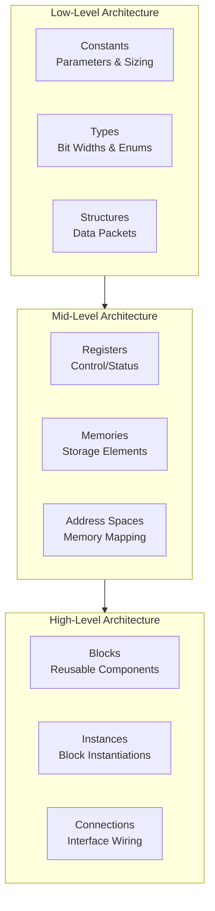
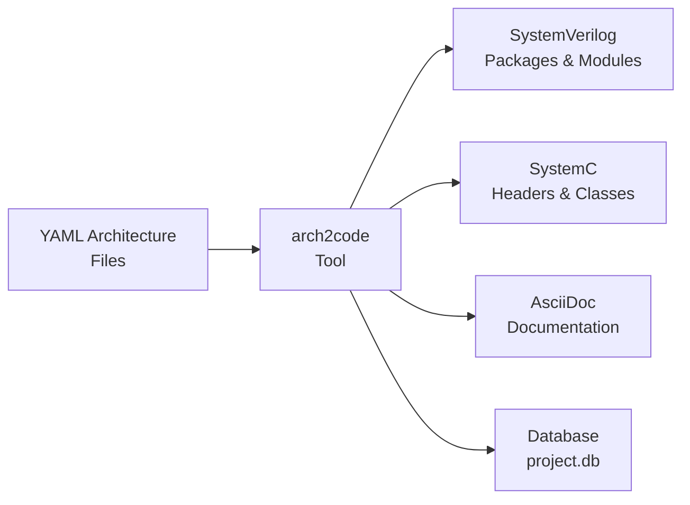
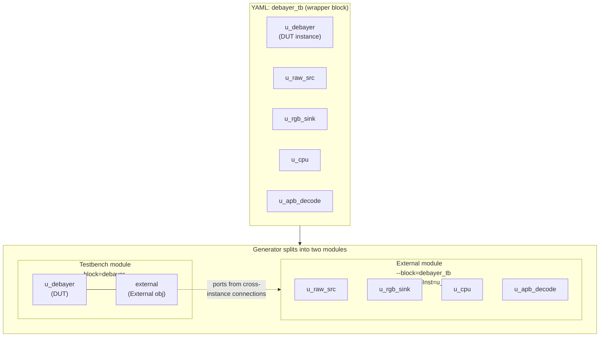
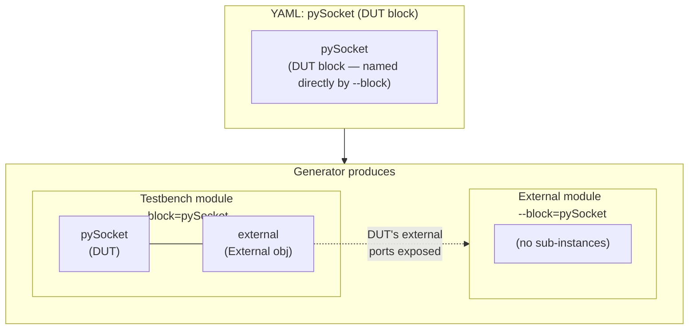
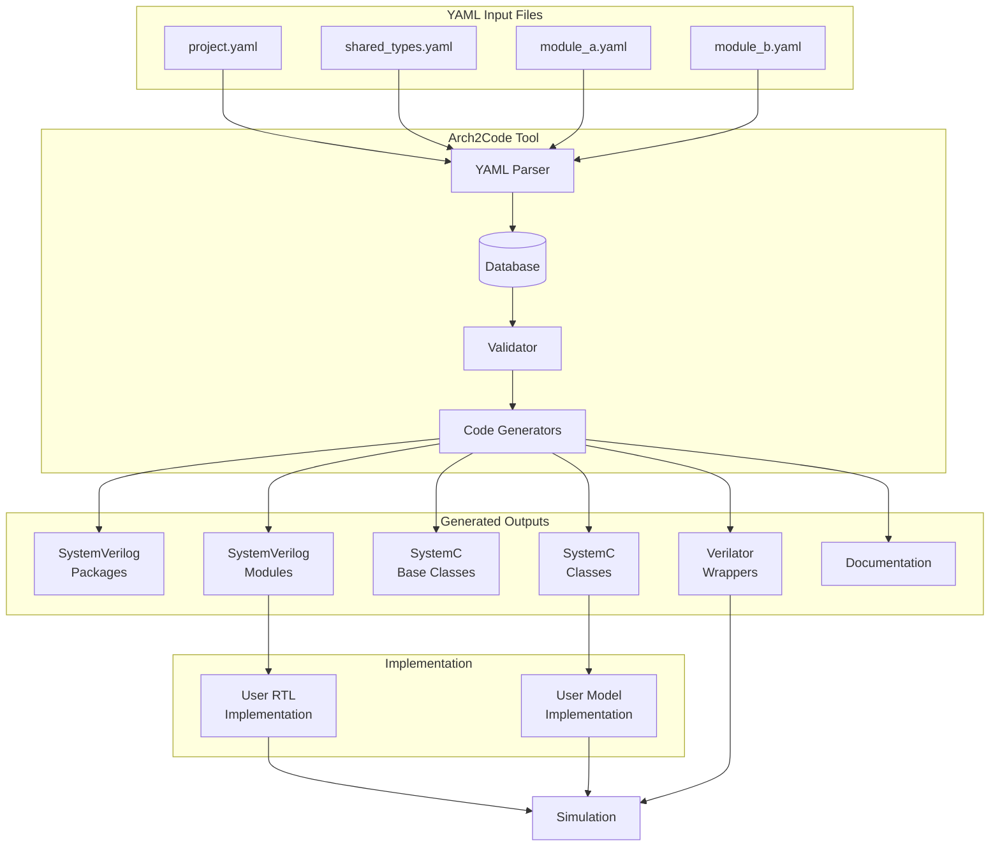

# Arch2Code AI Agent Rules and Guidelines

**Purpose:** Enable AI agents to assist users in creating YAML architecture files and implementing SystemVerilog/SystemC modules using the arch2code toolchain.

**Documentation References:**
- **Architecture & Code Generation:** https://github.com/arch2code/arch2code/wiki
- **SystemC User APIs:** `SYSTEMC_API_USER_REFERENCE.md` (for C++ implementation guidance)

---

## Table of Contents

1. [Quick Reference](#quick-reference)
2. [Core Concepts](#core-concepts)
3. [YAML File Structure](#yaml-file-structure)
4. [Low-Level Architecture Elements](#low-level-architecture-elements)
5. [Interfaces & Interface Types](#interfaces--interface-types)
6. [Blocks & Instances](#blocks--instances)
7. [Connections & Connection Maps](#connections--connection-maps)
8. [Registers & Address Management](#registers--address-management)
9. [Project Configuration](#project-configuration)
10. [Implementation Guidelines](#implementation-guidelines)
11. [Best Practices & Common Patterns](#best-practices--common-patterns)
12. [Error Prevention Rules](#error-prevention-rules)
13. [Code Generation Templates](#code-generation-templates)
14. [Troubleshooting](#troubleshooting)
15. [Appendix](#appendix)

---

## Quick Reference

### ⚠️ CRITICAL: Use Make Targets, Not Python Directly

**ALWAYS use make targets for code generation:**
- ✅ `make gen` - Generate code from YAML
- ✅ `make db` - Update project database
- ✅ `make newmodule` - Create missing implementation files (never YAML)
- ✅ `make clean` - Clean generated files
- ✅ `make help` - View all available targets

**NEVER use direct Python commands:**
- ❌ `python arch2code.py ...` - Bypasses project configuration
- ❌ `python builder/arch2code.py ...` - May use wrong environment
- ❌ Direct Python execution - Breaks dependency management

The make targets ensure proper environment setup, dependency management, and project-specific configurations.

---

### Minimal Project Structure

```
project_root/
├── prj/yaml/my_chipProject.yaml  # Project file
├── yaml/my_chip.yaml             # Design YAML of the root node
├── model/ rtl/ base/ tb/ verif/ fw/ registrar/   # Generated beside the node's YAML
├── include/make/
├── rundir/Makefile
└── Makefile
```

`arch2code.py --newproject` writes this hierarchical layout. A project file that sets no `fileGeneration.layout` gets the functional layout instead. See "Directory Structure Mapping" below and `setup-project.md`.

### Essential YAML Elements

```yaml
# Constants
constants:
  BUFFER_SIZE: {value: 1024, desc: "Buffer size in words"}
  ADDR_WIDTH: {eval: '$clog2($BUFFER_SIZE)', desc: "Address width"}

# Types
types:
  byte_t:
    width: 8
    desc: "8-bit byte"
  status_t:
    desc: "Status field"  # width auto-calculated from enum
    enum:
      - {enumName: STATUS_IDLE, value: 0, desc: "Idle state"}
      - {enumName: STATUS_BUSY, value: 1, desc: "Busy state"}

# Structures
structures:
  data_packet_t:
    payload: {varType: byte_t, arraySize: 16, desc: "Data payload"}
    valid: {varType: bit_t, desc: "Valid flag"}

# Interfaces
interfaces:
  data_channel:
    interfaceType: rdy_vld
    desc: "Data transfer channel"
    structures:
      - {structure: data_packet_t, structureType: data_t}

# Blocks
blocks:
  producer:
    desc: "Data producer block"
    hasRtl: true
    hasMdl: true

# Instances
instances:
  u_producer: {container: top, instanceType: producer, instGroup: main}

# Connections
connections:
  - {interface: data_channel, src: u_producer, dst: u_consumer}
```

---

## Core Concepts

### Architecture Philosophy

Arch2code implements a **Single Source of Truth (SSoT)** methodology where architecture is defined once in YAML and all implementation artifacts are generated from this definition.

### Three-Level Architecture Hierarchy


```mermaid
graph TB
    subgraph LowLevel [Low-Level Architecture]
        Constants[Constants<br/>Parameters & Sizing]
        Types[Types<br/>Bit Widths & Enums]
        Structures[Structures<br/>Data Packets]
    end
    
    subgraph MidLevel [Mid-Level Architecture]
        Registers[Registers<br/>Control/Status]
        Memories[Memories<br/>Storage Elements]
        AddressSpace[Address Spaces<br/>Memory Mapping]
    end
    
    subgraph HighLevel [High-Level Architecture]
        Blocks[Blocks<br/>Reusable Components]
        Instances[Instances<br/>Block Instantiations]
        Connections[Connections<br/>Interface Wiring]
    end
    
    LowLevel --> MidLevel
    MidLevel --> HighLevel
```

#### Low-Level: Data Structures
- **Constants**: Architectural parameters (buffer sizes, widths, counts)
- **Types**: Basic data types with bit widths and optional enumerations
- **Structures**: Composite data types combining multiple fields

#### Mid-Level: Design Objects
- **Registers**: Memory-mapped control and status registers
- **Memories**: Storage elements with address spaces
- **Address Groups**: Hierarchical address space organization

#### High-Level: Hierarchical Elements
- **Blocks**: Reusable design components (can be instantiated multiple times)
- **Instances**: Specific instantiations of blocks within a hierarchy
- **Connections**: Interface-based communication between instances

### Code Generation Flow


```mermaid
graph LR
    YAML[YAML Architecture<br/>Files] --> A2C[arch2code<br/>Tool]
    A2C --> SV[SystemVerilog<br/>Packages & Modules]
    A2C --> SC[SystemC<br/>Headers & Classes]
    A2C --> Doc[AsciiDoc<br/>Documentation]
    A2C --> DB[Database<br/>project.db]
```

---

## YAML File Structure

### Project File (`project.yaml`)

The project file is the entry point that orchestrates all architecture files.

**Required Fields:**
- `yamlFormat: 2`: `arch2code.py --newproject` writes it. If `make db` stops and asks for it, follow `migrate-project.md`.
- `projectName`: Unique identifier for the project
- `projectFiles`: List of architecture YAML files to include
- `topInstance`: Name of the top-level instance (root of hierarchy). A definitions-only project omits it
- `dirs`: Directory structure mapping. Only `root` is required. The other segments come from the base config

**Optional Fields:**
- `dbSchema`: Custom schema file path
- `instanceGroups`: Declares the names an instance's `instGroup:` may use
- `addressObjects`: Register and memory packing policy. A project with any register or `regAccess` memory needs it. See `manage-address-space.md`
- `templates`: Custom template mappings (overrides defaults from builder/base/config/project.yaml)
- `fileGeneration`: File generation template configuration

#### Complete Example

```yaml
yamlFormat: 2
projectName: my_design

projectFiles:
  - top_level.yaml
  - subsystem_a/subsystem_a.yaml
  - subsystem_b/subsystem_b.yaml

dbSchema: config/schema.yaml  # Optional custom schema

topInstance: top_tb

dirs:
  root: ../..                      # Required: project root. Other segments come from the base config

# Project-level address-policy sections
instanceGroups:
  all_instances: {}

addressObjects:
  memories:
    alignment: memsize
    sizeRoundUpPowerOf2: true
    sortDescending: true
  registers:
    alignment: 8
    sortDescending: true

# Optional: opt-in fileMap entries (firmware headers, per-product address defines)
# fileGeneration:
#   fileMap:
#     includeFW: {name: "IncludesFW", ext: {hdr: "h", src: "cpp"}, cond: {smartInclude: true}, mode: context, basePath: fwInc, langDomain: fw, desc: "FW includes"}
#     regAddresses: {name: "regAddresses", ext: {hdr: "h"}, mode: project, basePath: fwInc, langDomain: fw, desc: "Address defines"}
#   fileCopyrightStatement: "Copyright Your Company 2025"
```

**AI Agent Guidance:**
- To start a new project, run `arch2code.py --newproject`, which creates the project file for you; hand-author a `project.yaml` only when adding a sub-project (child project file) to an existing project tree
- Use `$root` and `$a2c` macros for path portability
- The `root` directory in `dirs` is required and serves as the base for all other paths
- `$a2c` is automatically defined and points to the arch2code installation directory
- **File generation defaults are inherited** from `builder/base/config/project.yaml` - no need to define fileMap unless customizing
- Add `fileGeneration.fileMap.includeFW` only if your project needs firmware header files, and `fileGeneration.fileMap.regAddresses` only if it needs per-product address defines. Both ship commented out in `builder/base/config/project.yaml`

### Architecture Files

Architecture files contain the actual design definitions. They can be split across several files.

#### File Organization Strategies

Both trees below use the functional layout, with every YAML file under `arch/yaml/`. In the hierarchical layout each node keeps its YAML in `<node>/yaml/` instead (`setup-project.md`).

**Strategy 1: Monolithic (Simple Projects)**
```
arch/yaml/
├── project.yaml
└── design.yaml  # All architecture in one file
```

**Strategy 2: Multi-file (Recommended for Large Projects)**
```
arch/yaml/
├── project.yaml
├── shared_types.yaml        # Common types shared across modules
├── top_level.yaml           # Top-level connections
├── subsystem_a/
│   ├── subsystem_a.yaml     # Subsystem A architecture
│   └── module_x.yaml        # Sub-module
└── subsystem_b/
    └── subsystem_b.yaml     # Subsystem B architecture
```

#### Include Mechanism

Use `include` to share definitions across files:

```yaml
# shared_types.yaml
constants:
  DATAPATH_WIDTH: {value: 32, desc: "System datapath width"}

types:
  datapath_t:
    width: DATAPATH_WIDTH
    desc: "Datapath type"

# module_a.yaml
include:
  - ../shared_types.yaml

structures:
  module_a_data_t:
    data: {varType: datapath_t, desc: "Uses shared type"}
```

**AI Agent Guidance:**
- Use relative paths in `include` statements
- Paths are resolved relative to the including file's location
- Each YAML file is its own context, and `include:` only makes names visible. Nothing is inlined
- A file sees itself, the files it includes, and the files those include. Nothing deeper is visible, so list every file whose names you use rather than relying on a chain
- The order of the `include:` list does not matter. Inside one file, declare a name in an earlier section than its use
- `projectFiles:` lists the entry files and adds no visibility. A child project opens only through the parent's `projectFiles:`. Naming a project file in `include:` stops `make db`
- A circular include stops `make db`
- Place shared types in dedicated files for reusability
- See `design-yaml-includes.md` for the module and package names each file generates

---

## Low-Level Architecture Elements

**Dense form.** Prefer one line per entry with an inline dict for `instances:`, `registers:`, `connections:`, `connectionMaps:`, and `memories:` (and `registerConnections:` when used). Multi-line maps parse the same. Prefer dense when authoring or editing so the file stays scannable and matches the examples under `builder/base/examples/`. Field-catalog Syntax blocks below may stay expanded so every key is easy to scan.

All types, consts, structs should be managed in the yaml, not in the user code

For the definitive representation contract for YAML types/structures, generated
SystemVerilog packed structs, generated SystemC C++ storage, `_packedSt`,
pack/unpack behavior, and thunker compatibility, see
`STRUCTURES_AND_DATA_TYPES_REFERENCE.md`. This section is an authoring summary;
do not duplicate low-level representation semantics here.

### Constants

Constants define architectural parameters used throughout the design.

#### Syntax

```yaml
constants:
  CONSTANT_NAME: {value: <number>, desc: "<description>"}
  # OR with evaluation
  CALCULATED_CONST: {eval: '<expression>', desc: "<description>"}
  # Optional parameterizable maximum
  PARAM_CONST: {value: <nominal>, maxValue: <worst_case>, desc: "<description>"}
```

#### Rules

1. **Naming Convention**: Use UPPER_CASE_WITH_UNDERSCORES
2. **Value or Eval**: Must specify either `value` OR `eval`, not both
3. **Description**: Required for documentation
4. **SystemVerilog Expressions**: `eval` is a SystemVerilog constant expression. It accepts SV integer literals (`255`, `8'hFF`, `'b1010`), `+ - * / %`, `& | ^ ~`, `<< >>`, comparisons, `?:`, `$clog2(...)`, `$NAME` and parentheses. `/` is integer division and truncates toward zero. Full grammar and semantics: `builder/base/specs/spec-eval-expressions.md`
5. **References**: Use `$CONSTANT_NAME` to reference other constants
6. **Rejected Syntax**: `make db` rejects anything outside this grammar, including `**` and C-style `0x` literals. Write hex as `'h`
7. **Parameterizable Maximums**: Use `maxValue` for constants whose value can vary per instance or variant
   - `maxValue` must be a positive integer and must be greater than or equal to the nominal `value`
   - Declare a parameterizable constant under `ipParameters.constants`. It must provide `maxValue` unless it is derived from another parameterizable constant
   - `maxValue` or `isParameterizable: true` on a regular constant also makes it parameterizable, so leave both off regular constants
   - For `eval` constants that reference parameterizable constants, arch2code auto-derives `maxValue`, and `make db` rejects one written by hand

#### Examples

```yaml
constants:
  # Simple value
  BUFFER_SIZE: {value: 1024, desc: "Buffer size in words"}
  
  # Calculated from another constant
  BUFFER_ADDR_WIDTH: {eval: '$clog2($BUFFER_SIZE)', desc: "Address width for buffer"}
  
  # Arithmetic expressions
  TOTAL_SIZE: {eval: '$BUFFER_SIZE * 2', desc: "Double buffer size"}
  
  # Complex expression
  FIFO_DEPTH: {eval: '($BUFFER_SIZE + 15) / 16', desc: "FIFO depth in 16-word blocks"}
```

Parameterizable constants belong under `ipParameters:`. See "Parameterizable IP Parameters" below.

**AI Agent Guidance:**
- When a user asks for a configurable size, create a constant
- Use `$clog2(SIZE)` to calculate the address width that indexes `SIZE` entries
- For power-of-2 checks or calculations, constants are essential
- Always add clear descriptions for maintainability

### Types

Types define bit widths and optional enumerations for data elements.

#### Syntax

```yaml
types:
  type_name:
    width: <number_or_constant>          # Required if no enum; auto-calculated if enum provided
    # OR widthLog2 / widthLog2minus1
    desc: "<description>"                # Required
    enum:                                # Optional
      - {enumName: <NAME>, value: <number>, desc: "<description>"}
```

#### Rules

1. **Naming Convention**: Use snake_case ending with `_t` (e.g., `byte_t`, `status_t`)
2. **Width**: 
   - Every non-enum type needs one of `width`, `widthLog2` or `widthLog2minus1` (error if all are omitted)
   - **Auto-calculated** for enum types (calculated from largest enum value)
   - Can be a number or reference a constant name directly
   - `widthLog2` stores the bit width needed for values up to the referenced size
   - `widthLog2minus1` stores the bit width needed to index `0..N-1`
3. **Enumerations**: Optional list of named values
4. **Enum Naming**: Use UPPER_CASE for enumeration names
5. **Description**: Required for all types and enum values
6. **Parameterizable Maximums**:
   - If the type width references a parameterizable constant, arch2code auto-derives `maxBitwidth`
   - A type declared under `ipParameters.types` with a literal width must have an explicit `maxBitwidth`
   - `maxBitwidth` or `isParameterizable: true` makes a type parameterizable, so leave both off regular types
   - `maxBitwidth` must be greater than or equal to the resolved nominal width

#### Examples

```yaml
types:
  # Simple fixed-width type
  bit_t:
    width: 1
    desc: "Single bit"
  
  byte_t:
    width: 8
    desc: "8-bit byte"
  
  # Type with constant width
  datapath_t:
    width: DATAPATH_WIDTH  # References constant
    desc: "Main datapath width"

  # Type whose nominal and maximum width come from a parameterizable constant
  # (IP_DATA_WIDTH is declared under ipParameters)
  ip_data_t:
    width: IP_DATA_WIDTH
    desc: "Per-instance data word"
  
  # Type with enumeration
  opcode_t:
    width: 4
    desc: "Operation code"
    enum:
      - {enumName: OPCODE_NOP, value: 0x0, desc: "No operation"}
      - {enumName: OPCODE_READ, value: 0x1, desc: "Read operation"}
      - {enumName: OPCODE_WRITE, value: 0x2, desc: "Write operation"}
      - {enumName: OPCODE_RESET, value: 0xF, desc: "Reset operation"}
  
  # Single-bit enum (FSM states, flags)
  direction_t:
    desc: "Transfer direction"  # width calculated from enum as 1
    enum:
      - {enumName: DIRECTION_READ, value: 0, desc: "Read from memory"}
      - {enumName: DIRECTION_WRITE, value: 1, desc: "Write to memory"}
```

**AI Agent Guidance:**
- For FSM states or command opcodes, always use enumerations
- **Every non-enum type needs one of `width`, `widthLog2` or `widthLog2minus1`**. Omitting all three is an error
- For enum types, width is auto-calculated from the largest enum value (can be omitted)
- Enum values can be non-contiguous (e.g., 0x00, 0x01, 0xFF)
- All types should be defined in the YAML, not in the code

### Structures

Structures group multiple fields into composite data types for interface communication.

#### Syntax

```yaml
structures:
  structure_name:
    field_name: {varType: <type_name>, desc: "<description>"}
    # OR with sub-structure
    field_name: {subStruct: <structure_name>, desc: "<description>"}
    # OR with array
    field_name: {varType: <type_name>, arraySize: <number>, desc: "<description>"}
    # Optional generator tag
    field_name: {varType: <type_name>, generator: <tag>, desc: "<description>"}
```

#### Rules

1. **Naming Convention**: Use snake_case ending with `_t` or `_st`
2. **Field Types**: Use `varType` for types OR `subStruct` for nested structures (not both)
3. **Arrays**: Use `arraySize` for fixed-size arrays
4. **Parameterizable Propagation**: Structures are marked parameterizable automatically when any field uses a parameterizable type, sub-structure, or `arraySize` constant
5. **Maximum Width**: `maxBitwidth` for structures is auto-computed; users should not write it directly in YAML
6. **Generator Tags**: Optional tags for code generation (e.g., `address`, `data`, `tracker(name)`)
7. **Representation**: SystemVerilog and SystemC representations are generated from the same YAML structure contract; see `STRUCTURES_AND_DATA_TYPES_REFERENCE.md`
8. **Field Order**: Field order is hardware-significant; the first YAML field is the MSB side of the SystemVerilog packed struct. See `STRUCTURES_AND_DATA_TYPES_REFERENCE.md` for the matching SystemC packed-form behavior.

#### Examples

```yaml
structures:
  # Simple structure
  apb_addr_t:
    address: {varType: dword32_t, generator: address, desc: "APB address"}
  
  apb_data_t:
    data: {varType: dword32_t, generator: data, desc: "APB data"}
  
  # Structure with multiple fields
  packet_header_t:
    dest_id: {varType: byte_t, desc: "Destination ID"}
    src_id: {varType: byte_t, desc: "Source ID"}
    opcode: {varType: opcode_t, desc: "Operation code"}
    length: {varType: word16_t, desc: "Payload length in bytes"}
  
  # Structure with array field
  axi_data_t:
    data: {varType: datapath_t, desc: "Data payload"}
    strb: {varType: bit_t, arraySize: 4, desc: "Byte strobe signals"}
    last: {varType: bit_t, desc: "Last transfer flag"}

  # Structure becomes parameterizable through both field width and array size
  ip_burst_t:
    samples: {varType: ip_data_t, arraySize: BUFFER_SIZE, desc: "Sample burst"}
  
  # Nested structure
  full_packet_t:
    header: {subStruct: packet_header_t, desc: "Packet header"}
    payload: {varType: byte_t, arraySize: 256, desc: "Packet payload"}
    crc: {varType: word16_t, desc: "CRC checksum"}
  
  # Structure with tracker generator
  command_t:
    cmd: {varType: opcode_t, generator: tracker(cmd), desc: "Command with tracker"}
    addr: {varType: dword32_t, desc: "Target address"}
```

**AI Agent Guidance:**
- For register interfaces, typically create separate `_addr_t` and `_data_t` structures
- Use `generator: address` for address structures and `generator: data` for data structures
- Use `generator: tracker(name)` to enable transaction tracking in verification
- Arrays are useful for byte strobes, multi-beat data, or fixed-size buffers
- Nested structures help organize complex data types hierarchically
- Do not hand-write generated metadata fields such as structure `isParameterizable` or `maxBitwidth`; arch2code derives them

---

### Parameterizable IP Parameters

Use `ipParameters` when constants or types can vary per instance/variant. Declare `ipParameters` in the block's own file or in a file it sees through `include:`. Its entries take the same fields as `constants:` and `types:`, and arch2code marks them parameterizable.

```yaml
ipParameters:
  constants:
    IP_DATA_WIDTH: {value: 8, maxValue: 16, desc: "Per-instance data width"}
    IP_MEM_DEPTH:  {value: 16, maxValue: 32, desc: "Per-instance memory depth"}
    IP_DATA_WIDTH_X2:
      eval: "$IP_DATA_WIDTH * 2"
      desc: "Derived width; maxValue is auto-derived"
  types:
    ip_data_t:
      width: IP_DATA_WIDTH
      desc: "Data type whose maxBitwidth is auto-derived"
    ip_literal_t:
      width: 8
      maxBitwidth: 16
      desc: "Literal-width parameterizable type"
```

#### Rules

1. `ipParameters` may contain `constants`, `types`, or `_mapto` aliases such as `enums`.
2. `ipParameters` may sit in any file the block's file sees through `include:`: the block's own file, or a definitions-only file that several IPs include. A file with no regular `constants:`, `types:`, `enums:` or `structures:` entry gets no context module, so its `ipParameters:` types get no model declaration. Give such a file at least one regular entry (`design-parameterizable-blocks.md`).
3. Direct parameterizable constants require `maxValue`; direct parameterizable types require `maxBitwidth`.
4. Derived constants/types inherit parameterizability when they reference parameterizable constants.
5. `blocks.<block>.params` lists the names that can be bound per variant under the top-level `parameters:` section.
6. Each `params` entry must resolve to exactly one visible parameterizable constant declared without `eval`, normally under `ipParameters:`. `make db` rejects a name with no backing constant.

```yaml
blocks:
  ip:
    desc: "Parameterized IP"
    params: [IP_DATA_WIDTH, IP_MEM_DEPTH]

parameters:
  ip:
    variant0:
      IP_DATA_WIDTH: 8
      IP_MEM_DEPTH: 16
    variant1:
      IP_DATA_WIDTH: 12
      IP_MEM_DEPTH: 8
```

If `IP_MEM_DEPTH` is used as memory `wordLines`, the address map reserves the backing constant's `maxValue` (32) in every variant, not the largest variant binding. `make db` rejects a variant that binds a parameter above its `maxValue`. A `parameters:` section may sit in any file whose scope reaches the block; it need not be the block's own file. An instance's `variant:` resolves through the file holding the instance row, the files it includes, and the files those include, and exactly one of them must declare that label.

---

## Interfaces & Interface Types

### Interface Concept

Interfaces define the communication protocol and data structures between block instances. Arch2code uses predefined interface types with specific signaling protocols.

### Available Interface Types

Based on the `builder/base/interfaces/` directory (`lmmi` is in `builder/pro/interfaces/` and needs A2C Pro):

| Interface Type | Protocol | Use Case |
|---------------|----------|----------|
| `rdy_vld` | Ready-valid handshaking | Streaming data, backpressure support |
| `req_ack` | Request-acknowledge bidirectional | Command-response protocols |
| `push_ack` | Push-acknowledge | FIFO writes, one-way flow control |
| `pop_ack` | Pop-acknowledge | FIFO reads, consumer-driven |
| `apb` | AMBA APB (ARM standard) | Memory-mapped register access |
| `lmmi` | Lattice Memory Mapped Interface (A2C Pro only) | Simple memory-mapped access |
| `axi4_stream` | AXI4-Stream | High-performance streaming |
| `axi_read` | AXI4 read channel | Memory read transactions |
| `axi_write` | AXI4 write channel | Memory write transactions |
| `status` | Status signal (no handshake) | Static signals, monitoring |
| `notify_ack` | Notify-acknowledge | Event notifications |
| `memory` | Memory interface | SRAM/ROM access |
| `external_reg` | External register | Register access |
| `raw` | Handshake-less data bus (**last resort**) | External boundary pinouts only |

### Interface Definition Syntax

```yaml
interfaces:
  interface_name:
    interfaceType: <type>
    desc: "<description>"
    structures:
      - {structure: <struct_name>, structureType: <binding>}
```

#### Rules

1. **Naming Convention**: Use snake_case for interface names
2. **Interface Type**: Must match a defined interface type
3. **Structures**: Bind structures to interface structureTypes
4. **Common StructureTypes**:
   - `data_t`: Primary data payload
   - `addr_t`: Address information
   - `rdata_t`: Response/read data
5. **Multiple Structures**: Some interfaces support multiple structure bindings (e.g., APB has addr_t and data_t)

### Interface Type Details

#### rdy_vld (Ready-Valid)

**Signals:**
- `vld`: Valid signal (source asserts when data available)
- `data`: Data structure
- `rdy`: Ready signal (destination asserts when can accept)

**Protocol:** Source drives `vld` and `data`, destination drives `rdy`. Transfer occurs when both `vld` and `rdy` are high.

**Example:**
```yaml
interfaces:
  data_stream:
    interfaceType: rdy_vld
    desc: "Data streaming interface"
    structures:
      - {structure: stream_data_t, structureType: data_t}
```

#### apb (AMBA APB)

**Signals:**
- `paddr`: Address
- `psel`: Select
- `penable`: Enable
- `pwrite`: Write enable
- `pwdata`: Write data
- `pready`: Ready
- `prdata`: Read data
- `pslverr`: Slave error

**Protocol:** Standard ARM AMBA APB protocol with setup and access phases.

**Example:**
```yaml
interfaces:
  cpu_reg_bus:
    interfaceType: apb
    desc: "CPU register bus"
    structures:
      - {structure: apb_addr_t, structureType: addr_t}
      - {structure: apb_data_t, structureType: data_t}
```

#### req_ack (Request-Acknowledge)

**Signals:**
- `req`: Request signal
- `data`: Request data
- `ack`: Acknowledge signal
- `rdata`: Response data

**Protocol:** Bidirectional with request and response phases.

**Example:**
```yaml
interfaces:
  command_if:
    interfaceType: req_ack
    desc: "Command interface"
    structures:
      - {structure: command_t, structureType: data_t}
      - {structure: response_t, structureType: rdata_t}
```

#### push_ack (Push-Acknowledge)

**Signals:**
- `push`: Push signal, from the source
- `data`: Data payload, from the source
- `ack`: Acknowledge signal, from the destination

**Protocol:** Source pushes a transaction, destination acknowledges.

**Example:**
```yaml
interfaces:
  fifo_write:
    interfaceType: push_ack
    desc: "FIFO write interface"
    structures:
      - {structure: fifo_data_t, structureType: data_t}
```

#### pop_ack (Pop-Acknowledge)

**Signals:**
- `pop`: Pop request, from the source
- `ack`: Acknowledge signal, from the destination
- `rdata`: Read data, from the destination

**Protocol:** Source requests with `pop`, destination acknowledges with data.

**Example:**
```yaml
interfaces:
  fifo_read:
    interfaceType: pop_ack
    desc: "FIFO read interface"
    structures:
      - {structure: fifo_data_t, structureType: rdata_t}
```

#### raw (Last Resort — Handshake-Less Boundary)

**`raw` is supported but is an interface of last resort.** Prefer `rdy_vld`,
`push_ack`/`pop_ack`, or `axi4_stream` for new interconnect. Use `raw` only at
design **boundaries** when adapting to **external IP** whose pinout is
a free-running data bus with **no ready/valid/ack wires** (validity is usually
encoded in the payload, e.g. CSI-style `fv`/`lv`). Do **not** use `raw` for new
internal pipeline links between arch2code blocks.

**Signals:**
- `data`: Data payload only (no handshake pins)

**Protocol:**
- **RTL:** Free-running `data` sampled on clock. There is no backpressure on the
  wire; the consumer cannot stall the producer in hardware.
- **SystemC:** Blocking `write()` / `read()` rendezvous. This is *not* the same
  as RTL sampling semantics, and timed/tandem runs can diverge if delay is
  enabled on a `raw` port.
- **Not `status`:** Same wire shape as `status`, but different SystemC meaning —
  `status` is publish/sample; `raw` is a one-shot transfer that blocks both
  sides until the beat is consumed.

**Why it is problematic (even though supported):**
1. No hardware backpressure — flow control cannot be expressed on the interface.
2. SystemC rendezvous ≠ RTL free-running sample — model and HDL timing can diverge.
3. `raw_channel` drives both handshake directions off one `sc_event`, unless
   the reader passes its own event to `setExternalEvent()`, which then carries
   "value written". `write()` returns only once the consumer has taken the
   value, so no beat is lost. On the single-event path each side is woken once
   more per beat than two events would need.
4. Co-sim depends on BFMs to invent clocked timing the protocol does not express.
5. Easy to misuse in place of `status` or a real streaming protocol.

**Example (boundary only):**
```yaml
interfaces:
  csi_video_in:
    interfaceType: raw
    desc: "External CSI-2 pixel bus at the chip/IP boundary"
    structures:
      - {structure: video_csi_t, structureType: data_t}
```

**AI Agent Guidance:**
- For streaming data with backpressure, use `rdy_vld`
- For register access, use `apb` (or `lmmi` with A2C Pro)
- For command-response patterns, use `req_ack`
- For FIFO-like interfaces, use `push_ack` (write) and `pop_ack` (read)
- Prefer `rdy_vld` / `push_ack` / `pop_ack` / `axi4_stream` for new streams
- Use `raw` only at chip/IP boundaries to match external handshake-less pinouts
- Do not use `raw` between new arch2code blocks; convert to a handshaked
  protocol at the first internal hop
- Do not confuse `raw` with `status` (same wires; different SystemC semantics)
- If proposing `raw`, confirm with the user that a handshaked protocol is
  impossible for that boundary
- The `structureType` must match what the interface definition expects
- Check `builder/base/interfaces/<type>/<type>_if.yaml` for structureType requirements

---

## Blocks & Instances

### Blocks

Blocks are reusable design components that can be instantiated one or more times in the hierarchy.

#### Syntax

```yaml
blocks:
  block_name:
    desc: "<description>"
    hasVl: <true|false>       # Has Verilator wrapper
    hasRtl: <true|false>      # Has RTL implementation
    hasMdl: <true|false>      # Has SystemC model
    hasTb: <true|false>       # Has testbench
    params:                    # Optional, for parameterized blocks
      - <param_name>
```

#### Rules

1. **Naming Convention**: Use snake_case for block names
2. **Description**: Required field
3. **Implementation Flags**: Control code generation
   - `hasRtl: true`: Generate SystemVerilog module skeleton
   - `hasMdl: true`: Generate SystemC class skeleton
   - `hasVl: true`: Generate Verilator wrapper. Recommended for user-authored blocks that have `hasRtl: true`
   - `hasTb: true`: Generate testbench skeleton
   - RTL hierarchy is closed: if a parent block has `hasRtl: true`, every block instantiated inside it must also have `hasRtl: true`. A `hasRtl: false` child is only valid under a model-only parent.
4. **Special Flags**:
   - `isRegHandler: true`: Marks a synthesised register handler block. It is set automatically on the generated handler blocks (`<blockname>` plus `fileGeneration.regBlockNaming.blockSuffix`, default `_regs`).
   - **Do not manually set** `isRegHandler` - a block that sets `isRegHandler: true` is rejected
5. **Parameters**:
   - `params` names block parameters that can be bound by variant under the project-level `parameters:` section
   - Each parameter must be backed by exactly one visible parameterizable constant, normally declared in `ipParameters`. `make db` rejects a parameter with no backing constant
   - When a parameter is used as memory `wordLines`, address sizing uses the backing constant's `maxValue`, and `make db` rejects a variant that binds it above that `maxValue`
6. **Default Values** (from schema):
   - `hasRtl`: defaults to `true` (most blocks have RTL)
   - `hasMdl`: defaults to `true` (most blocks have model)
   - `hasVl`: defaults to `false`; explicitly set it to `true` for normal user-authored RTL blocks
   - `hasTb`: defaults to `false` (set on the DUT block, not the `_tb` wrapper)
7. **RTL/Verilator Guidance**:
   - Prefer `hasRtl: true` and `hasVl: true` together for user-authored RTL blocks.
   - `hasRtl: true` with `hasVl: false` is legal but unusual; use it only when a block intentionally should not get a Verilator wrapper.
   - Auto-generated register handler blocks are the common exception: they have RTL but no Verilator wrapper and are created by arch2code, not handwritten in YAML.

#### Examples

```yaml
blocks:
  # Simple RTL block (hasRtl=true, hasMdl=true by schema default; set hasVl=true explicitly)
  fifo:
    desc: "FIFO buffer"
    hasVl: true
  
  # Model-only block (no RTL)
  cpu:
    desc: "CPU behavioral model"
    hasRtl: false
  
  # RTL-only block (no model)
  physical_phy:
    desc: "Physical layer (RTL only)"
    hasVl: true
    hasMdl: false
  
  # DUT block with testbench (hasTb on the DUT, not the _tb wrapper)
  my_dut:
    desc: "DUT block to be tested"
    hasVl: true
    hasTb: true
  
  # Block with Verilator co-simulation
  dma_tandem:
    desc: "DMA with RTL/model co-sim"
    hasVl: true

  # Parameterized IP
  ip:
    desc: "IP with variant-bound parameters"
    params: [IP_DATA_WIDTH, IP_MEM_DEPTH]
    hasVl: true
```

**AI Agent Guidance:**
- By default, blocks have both RTL and model (`hasRtl: true`, `hasMdl: true`)
- For new user-authored RTL blocks, explicitly set both `hasRtl: true` and `hasVl: true`; the schema default for `hasVl` is false, so do not rely on omission
- Set `hasRtl: false` for model-only blocks (e.g., behavioral CPU models)
- Do not instantiate a `hasRtl: false` block under a `hasRtl: true` parent. Either generate RTL for the child or make the parent model-only too.
- Set `hasMdl: false` for RTL-only blocks (e.g., physical layer, analog interfaces)
- Keeping RTL without VL is allowed but unusual; leave `hasVl: false` only for intentional no-wrapper cases. Auto-generated register handlers are the normal RTL/no-VL exception
- Set `hasTb: true` on the **DUT block** (not on the `_tb` wrapper block). This triggers generation of `*Testbench`, `*External`, and `*Config` files. The `_tb` wrapper block itself has `hasTb: false`
- Use `params` for values that will be assigned by variant under `parameters:`
- **Block register handlers are auto-generated**: In a project with at least one `addressBlock:` router, each reachable block that has registers or FW-accessible memories gets a generated handler block, `<blockname>` plus `fileGeneration.regBlockNaming.blockSuffix` (default `_regs`, `Regs` in the examples). The handler always has RTL. It has a model only when the owning block has children. A leaf block's own model holds its registers and the generated `regHandler` thread

### Instances

Instances are specific instantiations of blocks within the design hierarchy.

#### Syntax

```yaml
instances:
  instance_name:
    container: <parent_block_name>
    instanceType: <block_name>
    instGroup: <group_name>      # Optional; must name a group declared in instanceGroups:
    addressGroup: <addr_group>   # Set on an instance a router dispatches to (see Rules)
    addressMultiples: <number>   # Optional, defaults to 1
    variant: <variant_name>      # Optional, for variant-specific parameters
    color: <color_name>          # Optional, for visualization
```

`addressID` and `offset` are computed by address generation, in instance order within each address group. A value written in YAML is overwritten, so leave both out.

#### Rules

1. **Naming Convention**: Typically prefix with `u_` (e.g., `u_fifo`, `u_processor`)
2. **Container**: Must reference a defined block
3. **Instance Type**: Must reference a defined block
4. **Self-Referential**: Top-level can have `container` = `instanceType`
5. **Instance Groups**: Optional grouping. An `instGroup:` naming a group not declared in `instanceGroups:` fails `make db`
6. **Address Groups**: An instance a router dispatches to carries `addressGroup:` set to the router's `addressBlock.addressGroup`: a leaf that owns registers or `regAccess` memories, the outermost passthrough container, or a nested-router host. A register consumer inside a passthrough container carries none, and `make db` rejects one that does (`design-register-decode.md` §1)
7. **Unique Names**: All instance names must be unique across the entire project. An instance name must also differ from every clock, reset, port, register, memory and connection channel of its container block, because the generated module and class declare them in one scope
8. **Optional Fields**:
   - `variant`: Use with parameterized blocks (see parameters section)
   - `addressMultiples`: Use when block needs multiple address spaces (large memories)
   - `color`: For visualization only

#### Examples

```yaml
instances:
  # Top-level self-referential instance
  top: {container: top, instanceType: top, instGroup: top}
  
  # Simple functional instances
  u_processor: {container: top, instanceType: cpu, instGroup: main}
  
  u_memory: {container: top, instanceType: ram_block, instGroup: main}
  
  # Memory-mapped register block, served by the router of group system_addr_space
  u_control_regs: {container: top, instanceType: control_registers, instGroup: peripherals, addressGroup: system_addr_space}
  
  # Instance with multiple address spaces
  u_dma: {container: top, instanceType: dma_controller, instGroup: peripherals, addressGroup: system_addr_space, addressMultiples: 4}  # Allocates 4 address spaces
  
  # Hierarchical instances (instance within instance)
  u_subsystem_a: {container: top, instanceType: subsystem_a, instGroup: subsystems}
  
  u_module_x: {container: subsystem_a, instanceType: module_x, instGroup: subsystem_a_modules}  # Parent is subsystem_a
```

**AI Agent Guidance:**
- Always create a top-level instance first (self-referential)
- Use `instGroup` only with a group declared in `instanceGroups:`
- Set `addressGroup` on each instance a router dispatches to, as Rule 6 describes
- Do not write `addressID` or `offset`. Address generation assigns them in instance order
- Use hierarchical instances to mirror the physical design hierarchy
- **The register-bus decoder/router is a generated block** — declare it as a block with a populated `addressBlock:` and instance it in the container of the leaves it serves; its RTL comes from the `apbDecodeModule` template (`make newmodule` selects it automatically). Do not hand-author a top-level decoder.
- **Block-level register handlers** (e.g., `u_<blockname>_regs`, suffix from `fileGeneration.regBlockNaming.blockSuffix`) are generated. Do not create them.
- A routed leaf instance names the serving router's address group via `addressGroup:`; the register-bus fan-out below the primary router is synthesized. See the "Register/Memory Decode" skill (`design-register-decode.md`).

---

## Connections & Connection Maps

**Reference:** [Arch2Code Wiki - High Level Architecture](https://github.com/arch2code/arch2code/wiki/4-Yaml-High-Level-Arch)

### Direct Connections

Connections define interface-based communication between instances **within the same container**.

#### Syntax

```yaml
connections:
  - interface: <interface_name>
    src: <source_instance>
    dst: <destination_instance>
    name: <connection_name>          # Optional, overrides interface name, used for disambiguation
    srcport: <port_name>             # Optional, sets src port name (takes precedence over name)
    dstport: <port_name>             # Optional, sets dst port name (takes precedence over name)
    interfaceName: <channel_name>    # Optional, sets channel/interface instance name in generated code
    maxTransferSize: <bytes>         # Optional, for multicycle interfaces
    tracker: <alloc|dealloc|...>     # Optional, for tracker debug feature
```

#### Rules

1. **Interface**: Must reference a defined interface
2. **Source/Destination**: Must reference valid instances in the SAME container
3. **Direction**: Source is the producer or initiator, destination is the consumer or target. They bind the interface's `src` and `dst` modports
4. **Optional Fields Purpose**:
   - `name`: Use when multiple connections use same interface (for disambiguation)
   - `srcport`/`dstport`: Use when you need different port names at each end
   - `interfaceName`: Use to override the generated channel/interface instance name
   - `maxTransferSize`: Use to override interface's default transfer size
   - `tracker`: Use for tracker debug feature

#### Examples

```yaml
connections:
  # Simple point-to-point connection
  - {interface: data_stream, src: u_producer, dst: u_consumer}
  
  # Multiple connections with same interface type (use name for disambiguation)
  - {interface: apb_bus, src: u_cpu, dst: u_peripheral_a, name: cpu_to_periph_a}
  
  - {interface: apb_bus, src: u_cpu, dst: u_peripheral_b, name: cpu_to_periph_b}
  
  # Connection with custom channel name
  - {interface: data_stream, src: u_producer, dst: u_consumer, interfaceName: custom_channel_name}
```

#### Naming Precedence Rules (Critical for AI Agents)

Understanding port and channel naming is essential for correct disambiguation:

**Port Name Precedence:**
- **Source Port**: `srcport` (if specified) → `name` (if specified) → `interface` (default)
- **Destination Port**: `dstport` (if specified) → `name` (if specified) → `interface` (default)

**Channel/Interface Instance Name Precedence:**
- `interfaceName` (if specified) → `srcport` (if specified) → `name` (if specified) → `interface` (default)

**AI Agent Guidance:**
- Connections are unidirectional in terms of data flow (src → dst)
- For bidirectional protocols (e.g., req_ack), one connection handles both directions
- Use descriptive `name` when multiple connections of same interface exist
- Use `srcport`/`dstport` when you need different port names at each end
- Use `interfaceName` to override the default channel/interface instance name in generated code
- Verify interface structureTypes match between connected blocks
- **Connections ONLY connect instances in the SAME container** - use connectionMaps for hierarchical routing

### Connection Maps

Connection maps allow top-level interfaces to be routed to internal sub-block instances.

#### Syntax

```yaml
connectionMaps:
  - interface: <interface_name>
    block: <parent_block_name>
    direction: <src|dst>
    instance: <target_instance>
    name: <connection_name>     # Optional, must match connection if used
    port: <port_name>           # Optional, must match srcport/dstport from connection
    instancePort: <port_name>   # Optional, port name in target instance
```

#### Rules

1. **Purpose**: Maps external block interfaces to internal instance connections
2. **Block**: The parent block that contains the interface port
3. **Direction**: Whether the parent block is `src` or `dst` for this interface
4. **Instance**: The internal instance to map to
5. **Name**: Must match connection name if specified in original connection
6. **Port**: Must match `srcport` (if direction=src) or `dstport` (if direction=dst) from connection
7. **Critical**: Connections define communication within ONE container; connectionMaps bridge across container boundaries
8. **Chaining**: Multiple hierarchical connection maps can be used (one per level)

#### Example 1: Simple Hierarchical Connection

**Scenario:** Connect through a container block to an internal instance

```yaml
blocks:
  top:
    desc: "Top level"
  adam:
    desc: "Adam block (container)"
  bob:
    desc: "Bob block"
  colin:
    desc: "Colin block (inside adam)"

instances:
  u_top:   {container: top,  instanceType: top}
  u_adam:  {container: top,  instanceType: adam}
  u_bob:   {container: top,  instanceType: bob}
  u_colin: {container: adam, instanceType: colin}  # Inside adam!

# Connection at top level
connections:
  - {interface: xxx, src: u_bob, dst: u_adam}  # Connection to adam block

# Map adam's dst interface down to colin instance
connectionMaps:
  - {interface: xxx, block: adam, direction: dst, instance: u_colin}   # Route to colin inside adam
```

**Flow:** `u_bob` → `u_adam` (boundary) → `u_colin` (internal)

**Key Points:**
- Connection is at `top` level (both bob and adam in same container)
- ConnectionMap routes from `adam` block boundary to `u_colin` instance inside it
- Direction `dst` because adam is the destination in the original connection

#### Example 2: Named Ports with Disambiguation

**Scenario:** Different port names at each end for clarity

```yaml
blocks:
  top:
    desc: "Top level"
  adam:
    desc: "Adam block"
  bob:
    desc: "Bob block"
  colin:
    desc: "Colin block"

instances:
  u_top:   {container: top,  instanceType: top}
  u_adam:  {container: top,  instanceType: adam}
  u_bob:   {container: top,  instanceType: bob}
  u_colin: {container: adam, instanceType: colin}

# Connection with different port names at each end
connections:
  - {interface: xxx, src: u_bob, srcport: dave, dst: u_adam, dstport: eric}   # Adam's port named "eric"

# Map with port matching
connectionMaps:
  - {interface: xxx, block: adam, direction: dst, port: eric, instance: u_colin, instancePort: fred}  # Colin's internal port named "fred"
```

**Port Names Generated:**
- `bob` block: port named `dave` (from srcport)
- `adam` block: port named `eric` (from dstport)
- `colin` block: port named `fred` (from instancePort)

**Key Points:**
- `srcport`/`dstport` allow different names at connection ends
- `port` in connectionMap MUST match the corresponding `srcport` or `dstport`
- `instancePort` specifies the port name in the target instance
- Useful when multiple connections of same interface need unique names

**AI Agent Guidance:**
- Use connection maps when a block has hierarchical interfaces that need to connect to internal sub-blocks
- The `direction` must match the block's role in the original connection
- If connection uses `srcport`/`dstport`, connectionMap's `port` must match the appropriate one
- Connection maps are essential for hierarchical designs
- The mapped instance must exist within the specified block's container hierarchy
- **Remember**: Connections connect instances in SAME container; connectionMaps bridge container boundaries

### Connection & ConnectionMap Quick Reference

**For AI Agents: Decision Tree**

```
Need to connect two instances?
├─ Are they in the SAME container?
│  └─ YES → Use connections: {interface, src, dst}
│     └─ Multiple connections of same interface?
│        └─ YES → Add name: field for disambiguation
│     └─ Need different port names at each end?
│        └─ YES → Add srcport: and dstport:
│     └─ Need custom channel name?
│        └─ YES → Add interfaceName:
│
└─ Are they in DIFFERENT containers (hierarchical)?
   └─ YES → Use connections: for top level
            PLUS connectionMaps: to route into container
      └─ Direction in connectionMap?
         ├─ Block is src → direction: src
         └─ Block is dst → direction: dst
      └─ Connection uses srcport/dstport?
         └─ YES → connectionMap port: MUST match
```

**Naming Reference Card**

| Generated Name For | Precedence Order (First Found Wins) |
|-------------------|-------------------------------------|
| Source Port | `srcport` → `name` → `interface` |
| Destination Port | `dstport` → `name` → `interface` |
| Channel/Interface Instance | `interfaceName` → `srcport` → `name` → `interface` |
| Internal Port (via connectionMap) | `instancePort` → `name` → `interface` |

**Common Patterns**

| Pattern | Use | Example Fields |
|---------|-----|---------------|
| Simple connection | Two instances in same container | `interface, src, dst` |
| Multiple same interface | Disambiguation needed | Add `name:` |
| Different port names | Each end needs unique name | Add `srcport:`, `dstport:` |
| Custom channel | Override generated name | Add `interfaceName:` |
| Hierarchical routing | Cross container boundary | `connections:` + `connectionMaps:` |

---

## Registers & Address Management

### Register Definitions

Registers are memory-mapped control and status elements.

#### Syntax

```yaml
registers:
  - register: <register_name>
    regType: <rw|ro|ext|memory>
    block: <owner_block_name>
    structure: <structure_name>
    addressStruct: <structure_name> # Optional structure for memory reg
    wordLines: <depth_or_param>      # Required for regType: memory
    desc: "<description>"
```

#### Rules

1. **Register Types**:
   - `rw`: Read-write register
   - `ro`: Read-only register (status)
   - `ext`: External register (control handled by user logic, eg for registers that create actions on write). Its structure is at most 32 bits wide, the register bus width, and `make db` rejects a wider one, checking a parameterizable structure at its `maxBitwidth`
   - `memory`: Memory-style register with `wordLines` and `addressStruct`
2. **Block**: The block that owns this register
3. **Structure**: Data structure defining register fields
4. **Memory Register Depth**: For `regType: memory`, `wordLines` is a literal integer or a constant
5. **Worst-Case Sizing**: Parameterizable registers are allocated using the structure's worst-case `maxBitwidth`; generated `maxBytes` is internal metadata and should not be written by users. A parameterizable `rw` or `ro` register decodes every word of that allocation in every variant, in the RTL and the model. Words above the bound variant's width read 0 and drop writes
6. **Description**: Required for documentation

#### Automatic Block-Level Register Handler Generation

**Important:** In a project with at least one `addressBlock:` router, each block reachable from a router that defines registers OR has firmware-accessible memories (`regAccess` set) gets a generated handler:

1. **Register Handler Block**: A block named `<blockname>` plus `fileGeneration.regBlockNaming.blockSuffix`, which defaults to `_regs`. The examples set `blockSuffix: 'Regs'`.
   - Example: If block is `dma_controller` → `dma_controller_regs` with the default suffix
   - Generated for blocks with:
     - One or more registers defined
     - One or more memories with `regAccess` set (FW accessible)
   - This block handles register read/write operations within that specific block
   - The handler always has RTL. It has a model only when the owning block has children. A leaf block's own model holds its `hwRegister` members and the generated `regHandler` thread

2. **Purpose**: The handler block:
   - Decodes register addresses within the block's address space
   - Handles register read/write logic
   - Connects to the block's internal registers/memories
   - Is automatically instantiated within the owning block

A project with registers but no `addressBlock:` router gets no handler.

**What This Means:**
- You **do not** need to manually create `<blockname>_regs` blocks in your YAML
- These blocks are automatically generated and instantiated
- They handle register access **within** each block

#### Register-Bus Decoder/Router (Generated Block)

**Important:** The register-bus decoder/router is a **generated** block, not
hand-written. You declare it; the framework synthesises its RTL and the
register-bus fan-out below it.

1. **Router Block**: declare a block with a populated `addressBlock:` section.
   Its RTL is emitted by the `apbDecodeModule` template, which `make newmodule`
   selects automatically because the block carries `addressBlock:`. Never
   hand-write decode/demux logic.

2. **Router Instance**: instance the router in the **same container** as the
   routed leaves it serves. A router serves the other instances in its own
   container (its siblings) and nested routers — it never decodes its own
   container block.

3. **Routed Leaves**: a block that owns registers or `regAccess` memories
   (or authors `registerPorts:`) is a register consumer. Tag the instance the
   router dispatches to with `addressGroup:` naming the serving router's
   `addressBlock.addressGroup`. Inside a passthrough container only the
   outermost container instance carries it.

For the full decode decision rule (where registers/memories live, nested
routers, container blocks that own registers), see the **Register/Memory Decode**
skill (`design-register-decode.md`).

**Example:**
```yaml
blocks:
  apb_decode:
    desc: "APB register decoder (RTL generated from apbDecodeModule)"
    hasRtl: true
    hasMdl: true
    addressBlock:
      addressGroup: system
      addressIncrement: 0x01000000
      maxAddressSpaces: 16
      varType: system_addr_id_t
      enumPrefix: SYSTEM_ADDR_
      upstreamPort: cpu_apb_reg       # addressBus interface feeding this router
      registerDecoderPort: cpu_apb_reg # canonical downstream register-bus port

instances:
  u_apb_decode: {container: top, instanceType: apb_decode, instGroup: top}
```

#### Complete Example with Generated Router and Auto-Generated Handlers

```yaml
# ============================================
# In your architecture YAML
# ============================================

# 1. Declare the GENERATED router block (RTL from apbDecodeModule)
blocks:
  apb_decode:
    desc: "APB decoder routing to multiple blocks"
    hasRtl: true
    hasMdl: true
    addressBlock:
      addressGroup: system
      addressIncrement: 0x01000000
      maxAddressSpaces: 16
      varType: system_addr_id_t
      enumPrefix: SYSTEM_ADDR_
      upstreamPort: cpu_apb_reg
      registerDecoderPort: cpu_apb_reg

instances:
  u_apb_decode: {container: top, instanceType: apb_decode, instGroup: top}

# 2. Define your block with registers (a routed leaf)
blocks:
  dma_controller:
    desc: "DMA controller"
    hasRtl: true
    hasMdl: true

instances:
  u_dma_controller: {container: top, instanceType: dma_controller, instGroup: peripherals, addressGroup: system}        # names the router's addressBlock.addressGroup

# 3. Define registers for the block
registers:
  - {register: config, regType: rw, block: dma_controller, structure: dma_config_t, desc: "DMA configuration register"}
  
  - {register: status, regType: ro, block: dma_controller, structure: dma_status_t, desc: "DMA status register"}
  
  - {register: external_ctrl, regType: ext, block: dma_controller, structure: dma_external_t, desc: "External control register"}

  - {register: lookup_table, regType: memory, block: lut_core, structure: lut_entry_t, addressStruct: lut_addr_t, wordLines: 256, desc: "Lookup table memory register"}

# 4. Author ONLY the upstream feed into the primary router. Here the CPU and the
#    router share container `top`, so just a connection (no connectionMap).
connections:
  - {interface: cpu_apb_reg, src: u_cpu, dst: u_apb_decode}
```

**Behind the Scenes:**
After processing, arch2code **automatically** creates:

```yaml
# AUTO-GENERATED: Block-level register handler (not in your YAML)
blocks:
  dma_controller_regs:
    desc: "Register handler for dma_controller"
    hasRtl: true
    hasMdl: false       # dma_controller is a leaf, so its own model handles registers
    isRegHandler: true  # Special flag (set automatically)

# AUTO-GENERATED: the dma_controller_regs instance inside dma_controller, the
# leaf-to-handler connectionMap, and the u_apb_decode → u_dma_controller
# dispatch connection.
```

**Key Points:**
- **Generated (you declare)**: the `apb_decode` router (`addressBlock:`); RTL from `apbDecodeModule`.
- **Auto-generated (you do nothing)**: `dma_controller_regs` handler + the router→leaf dispatch.
- **Authored by hand**: only the upstream feed into the primary router (master→DUT connection, plus a DUT-boundary connectionMap when the master is outside the router's container).
- The router serves its **siblings** (and nested routers); it never decodes its own container block.

### Register Connections

A register connection wires a register the container block owns to one of its child instances. The child reads an `rw` register and drives an `ro` register. An `ext` or `memory` register reaches the child as a `dst` port, as `rw` does.

```yaml
registerConnections:
  - {register: <register_name>, block: <owning_container_block>, instance: <child_instance>}
```

**Example** (`examples/mixed`: container `blockB` owns `rwD` and forwards it to its child `uBlockF0`):
```yaml
registers:
  - {register: rwD, regType: rw, block: blockB, structure: dRegSt, desc: "A Read Write register"}

registerConnections:
  - {register: rwD, block: blockB, instance: uBlockF0}
```

### Memory Definitions

Memories define storage elements that can be accessed by firmware or hardware.

#### Syntax

```yaml
memories:
  - memory: <memory_name>
    block: <owner_block_name>
    structure: <data_structure_name>
    addressStruct: <address_structure_name>
    wordLines: <size_constant_or_param>
    desc: "<description>"
    regAccess: <false|rw|ro|wo|true>  # Optional, defaults to false; true means rw
    local: <true|false>          # Optional, defaults to false
    memoryType: <singlePort|dualPort|portRportRW|portRWportW|portRportW|register>  # Optional, defaults to dualPort
    ports: [<port_name>, ...]    # Optional, block-side ports, filling A then B
    clock: <owning_block_clock>  # Optional, the block-side port's clock, defaults to the block default clock
```

#### Rules

1. **Memory Types**:
   - `singlePort`: Single-port memory (one read/write port)
   - `dualPort`: Dual-port memory (default, two read/write ports A and B)
   - `portRportRW`: read-only port A, read/write port B
   - `portRWportW`: read/write port A, write-only port B
   - `portRportW`: read-only port A, write-only port B
   - `register`: Register-based memory (flops)
2. **regAccess**: the firmware access mode. `rw` (or `true`) lets firmware read and write, `ro` only read, `wo` only write. Any other value is an error.
   - **Triggers automatic register handler generation** (just like registers)
   - Memory becomes memory-mapped via register interface
   - The block-level register handler manages both registers and memories
   - The handler takes one port. Among the ports that support the mode it prefers the one whose capability matches the mode exactly. If two ports are still left, it takes port B. `portRportW` with `rw` has no supporting port and is an error
   - A firmware write to an `ro` memory, or read of a `wo` one, completes with no `pslverr`. The write is dropped and the read returns zero. The SystemC model logs it
   - With `regAccess`, a dual-port memory lists at most one port in `ports:` and a `singlePort` memory lists none
3. **clock**: the block-side port's clock. The handler's port always runs on the register clock, so a dual-port memory may sit on another clock. A `singlePort` `regAccess` memory must be on the register clock. A memory has no `reset:`; setting it is an error
4. **local**: Set to `true` for flop-based memories with fast array access
5. **Block**: The block that owns/implements this memory
6. **Structure**: Data structure defining memory data format
7. **addressStruct**: Address structure for memory addressing
8. **wordLines**: Number of addressable locations
   - May be a literal integer, a constant, an `ipParameters` constant, or a block parameter listed in `blocks.<block>.params`
   - If the structure or `wordLines` is parameterizable, address allocation uses worst-case sizing: the structure's `maxBitwidth`, and the `maxValue` of the constant that `wordLines` names or that backs the block parameter. `make db` rejects a variant that binds the parameter above that `maxValue`
   - Every variant uses one row stride, the worst-case row width in bytes rounded up to a power of two, at least 4. Row N is at `base + N * stride` in the RTL and the model. Bytes of a row above the bound variant's width read 0 and drop writes
   - `wordLines` resolves only through the declaring file and the files it sees through `include:`. A misspelled or out-of-scope name is an error

#### Example with Firmware Access

```yaml
# FW-accessible memory (triggers dma_controller_regs auto-generation)
memories:
  - {memory: buffer_mem, block: dma_controller, structure: buffer_data_t, addressStruct: buffer_addr_t, wordLines: BUFFER_SIZE, desc: "DMA buffer memory", regAccess: true, memoryType: dualPort}  # Makes it FW-accessible, triggers dma_controller_regs generation

  # Table that firmware loads and the datapath reads on its own clock
  - {memory: gamma_lut, block: isp, structure: lut_entry_t, addressStruct: lut_addr_t, wordLines: 256, desc: "Gamma LUT", regAccess: wo, memoryType: portRportW, ports: [rd], clock: pixClk}  # firmware writes port B on the register clock, the block reads port A on pixClk

  # Parameterized FW-accessible memory
  - {memory: ip_mem, block: ip, structure: ip_data_st, addressStruct: ip_mem_addr_st, wordLines: IP_MEM_DEPTH, desc: "Parameterized IP memory", regAccess: true}  # Uses IP_MEM_DEPTH.maxValue for address sizing

  # Local flop-based memory (no FW access)
  - {memory: fifo_storage, block: fifo, structure: fifo_entry_t, addressStruct: fifo_addr_t, wordLines: 16, desc: "FIFO storage", local: true, regAccess: false}  # No FW access, internal only
```

**Important:** When `regAccess` is set:
- Arch2code automatically generates the block's register handler (just like for registers)
- The handler handles both register and memory access for that block
- The memory becomes memory-mapped and accessible via the register bus interface
- The instance a router dispatches to must have `addressGroup` set, naming the serving router's `addressBlock.addressGroup`
- `regAccess` (with `local:` absent) is the single switch for FW-accessible memory; the serving router is a generated `addressBlock:` block (see the Register/Memory Decode skill)

### Address policy

Address configuration comes from two places:

- Each router block's `addressBlock:` declares one address group. See `design-register-decode.md` §6.
- The project file's `instanceGroups:` and `addressObjects:` sections set the address policy. See `manage-address-space.md`.

#### addressBlock

```yaml
blocks:
  apb_decode:
    desc: "APB register decoder"
    addressBlock:
      addressGroup: system          # instances it dispatches to name this in addressGroup:
      addressIncrement: 0x01000000  # bytes per address space, a power of two
      maxAddressSpaces: 16          # a power of two
      varType: system_addr_id_t     # generated address-ID enum type
      enumPrefix: SYSTEM_ADDR_
      upstreamPort: apbReg          # the addressBus interface feeding this router
      registerDecoderPort: apbReg   # downstream register-bus port name
```

**Fields:**
- `upstreamPort` and `registerDecoderPort` default to `apbReg`.
- Optional `clock:` and `reset:` name the router's bus clock and reset from the block's own `clocks:` and `resets:`. Without them the router uses the block's default clock and its selected reset. A router declares at most one clock.
- A block declaring `addressBlock:` must not also declare `registerPorts:`, and owns no registers or `regAccess` memories.
- An instance's `addressGroup:` resolves only within the project that owns the file declaring the instance. Within one project, one router block at most may declare a group name.
- `varType:` and `enumPrefix:` must be unique across the whole build, even across projects. In a reusable IP, qualify both by the declaring project.
- The primary router is the one not nested in another router's scope. Nothing in YAML marks it.

#### instanceGroups

`instanceGroups:` declares the names an instance's `instGroup:` may use. An `instGroup:` naming an undeclared group fails `make db`. Its `varType:` and `enumPrefix:` keys have no effect.

```yaml
instanceGroups:
  top: {}
```

#### addressObjects

`addressObjects:` places each block's registers and `regAccess` memories at offsets inside the block's address space. A project with any register or `regAccess` memory needs it. Without it every object keeps offset 0, and the model asserts on the overlap.

```yaml
addressObjects:
  memories:
    alignment: memsize  # Align to memory size
    sizeRoundUpPowerOf2: true
    sortDescending: true  # Largest first

  registers:
    alignment: 8  # 8-byte alignment
    sortDescending: true
```

- Key order sets placement. Within each block, offsets start at 0 and the first key's objects take the low offsets.
- `alignment` is a byte count, or `memsize` for memories to align each memory to its own size. Pair `memsize` with `sizeRoundUpPowerOf2: true`.
- `sizeRoundUpPowerOf2` rounds a memory's size up to a power of two, at least 4 bytes.
- `sortDescending` places the largest objects first. Without it, objects keep their declaration order.
- A `regType: memory` register is placed with the `registers` key but takes its alignment and rounding from the `memories` row, so a project with one needs both rows.

**AI Agent Guidance:**
- For multi-level decode, use **nested routers**: a second `addressBlock:` block
  inside a container that the parent router serves. The container instance
  carries the parent router's group and must not own registers or `regAccess`
  memories. The nested feed is auto-wired. See `design-register-decode.md` §1.
- Use `memsize` alignment for memories to enable lower-bit internal decode
- **The decoder is a generated `addressBlock:` block**. Declare and instance it
  in the container of the leaves it serves; its RTL and the register-bus fan-out
  below it are synthesized. Do not hand-author a decoder or its bus connections
  (beyond the single upstream feed into the primary router).

### Register Decoder Architecture (Critical Understanding)

Arch2code uses a **two-level decoder architecture** for register access. **Both
levels are generated** — you declare the router block and the leaf's registers;
the framework synthesises the RTL and the bus fan-out.

```
CPU → [Router (addressBlock:)] → [Block-Level Handler] → Registers/Memories
      (GENERATED block,            (AUTO-GENERATED,
       apbDecodeModule RTL)         <blockname> + blockSuffix)

      apb_decode                   dma_controller_regs
      (you DECLARE addressBlock:)  (arch2code creates this)
```

You author by hand only the **upstream feed** into the primary router (the
master→DUT connection, plus a DUT-boundary connectionMap when the master is
outside the router's container). Everything below the primary router is
synthesized.

#### Level 1: Register-Bus Router (GENERATED - You Declare `addressBlock:`)
- **Role**: Routes the register bus to the correct served instance based on
  high-order address bits.
- **What it is**: a block with a populated `addressBlock:`; its RTL is emitted by
  the `apbDecodeModule` template, auto-selected by `make newmodule`.
- **You declare**:
  - the router block with its `addressBlock:` section, and
  - an instance of it in the **same container** as the routed leaves it serves.
- **It serves**: the other instances in its own container (its siblings) and
  nested routers. It **never decodes its own container block**.
- **Example**: block `apb_decode` (`addressBlock:`), instance `u_apb_decode`.

#### Level 2: Block-Level Register Handler (AUTO - Arch2code Creates)
- **Name Pattern**: `<blockname>` plus `fileGeneration.regBlockNaming.blockSuffix` (default `_regs`, `Regs` in the examples)
- **Purpose**: Handles register/memory access within a specific block's address space
- **Arch2code Automatically**:
  - Creates the handler block
  - Instantiates it within the owning block
  - Wires it to the block's registers and memories
  - Emits the router→leaf dispatch connection
- **Triggered By** (in a project with at least one `addressBlock:` router):
  - Registers defined for the block, **or**
  - Memories with `regAccess` set for the block
- **RTL and model**: the handler always has RTL. It has a model only when the owning block has children. A leaf block's own model runs the generated `regHandler` thread
- **Example**: `dma_controller_regs` with the default suffix, `blockBRegs` in `examples/mixed`

#### Complete Flow Example

```yaml
# YOU DECLARE: the GENERATED router (RTL from apbDecodeModule)
blocks:
  apb_decode:
    desc: "System APB decoder"
    hasRtl: true
    hasMdl: true
    addressBlock:
      addressGroup: system
      addressIncrement: 0x01000000
      maxAddressSpaces: 16
      varType: system_addr_id_t
      enumPrefix: SYSTEM_ADDR_
      upstreamPort: cpu_apb_reg
      registerDecoderPort: cpu_apb_reg

instances:
  u_apb_decode: {container: top, instanceType: apb_decode, instGroup: top}

# AUTHOR the upstream feed (CPU and router share container → connection only)
connections:
  - {interface: cpu_apb_reg, src: u_cpu, dst: u_apb_decode}

# YOU DECLARE: routed leaf with registers
blocks:
  dma_controller:
    desc: "DMA controller"

instances:
  u_dma_controller: {container: top, instanceType: dma_controller, addressGroup: system}        # names the router's addressBlock.addressGroup

registers:
  - {register: config, regType: rw, block: dma_controller, structure: config_t, desc: "Config"}

# ARCH2CODE AUTO-CREATES:
# Block dma_controller_regs (handler) + its instance inside dma_controller,
# the leaf-to-handler connectionMap, and the u_apb_decode → u_dma_controller
# dispatch connection.
```

**Key Principle:**
- **Generated (you declare)**: the `addressBlock:` router; routing between blocks.
- **Automatic (you do nothing)**: register handling within each block + the fan-out below the primary router.
- **Authored by hand**: only the upstream feed into the primary router.
- See the Register/Memory Decode skill (`design-register-decode.md`) for the decode decision rule, nested routers, and container blocks that own registers.

---

## Project Configuration

### Directory Structure Mapping

The `dirs` section maps logical paths to physical directories.

#### Required Directories

```yaml
dirs:
  root: <relative_path>  # REQUIRED: Project root
```

#### Common Directory Mappings

```yaml
dirs:
  root: ../..                      # Project root
  base: $root/base                 # Base classes
  model: $root/model               # SystemC models
  rtl: $root/rtl                   # SystemVerilog RTL
  vl_wrap: $root/verif/vl_wrap     # Verilator wrappers
  tb: $root/tb                     # Testbenches
  fwInc: $root/fw/include          # Firmware includes
  registrar: $root/registrar       # Block registration files
```

These are the base defaults from `builder/base/config/project.yaml`, so a project file needs only `root`.

**Macros:**
- `$root`: References the `root` directory
- `$a2c`: Auto-defined, points to arch2code installation

#### Layout

`fileGeneration.layout` picks where generated files go.

- **`functional`** is the base default, used by a project file that sets no layout. Each `dirs:` segment has one root under the project root, and files inside it mirror the YAML file's directory relative to the project file.
- **`hierarchical`** is opt-in. Generated files sit beside the YAML of each node: a file at `<node>/yaml/<file>.yaml` generates into `<node>/model/`, `<node>/rtl/`, `<node>/base/` and so on. `arch2code.py --newproject` writes `layout: hierarchical` into the new project file.

To move a functional project to the hierarchical layout, follow `migrate-project.md` Section 7. `setup-project.md` describes both layouts.

### File Generation Configuration

The `fileGeneration` section controls automatic file skeleton generation.

**IMPORTANT:** Comprehensive defaults are provided in `builder/base/config/project.yaml`. Most projects do not need to customize file generation settings.

#### Default Configuration

Arch2code provides complete default file mappings for:
- SystemC base classes and model files
- SystemVerilog RTL modules
- Verilator wrappers (SystemC and SystemVerilog)
- Testbench files
- Include files (SystemC) and package files (SystemVerilog)

These defaults are automatically inherited from `builder/base/config/project.yaml` and cover standard project structures.

#### When to Customize

The common customization is uncommenting one of the two fileMap entries that
ship commented out in `builder/base/config/project.yaml`: firmware include file
generation, and per-product address defines.

```yaml
# In your project.yaml
fileGeneration:
  fileMap:
    # Add firmware includes (only if you need FW headers generated)
    includeFW: { 
      name: "IncludesFW", 
      ext: {hdr: "h", src: "cpp"}, 
      cond: {smartInclude: true}, 
      mode: context, 
      basePath: fwInc, 
      langDomain: fw,
      desc: "Firmware include file"
    }
    # Add per-product address defines (only if you need them)
    regAddresses: {
      name: "regAddresses",
      ext: {hdr: "h"},
      mode: project,
      basePath: fwInc,
      langDomain: fw,
      desc: "Per-project instance and register address defines"
    }
```

**Notes:**
- The `includeFW` mapping generates a header and a source file (`<context>IncludesFW.{h,cpp}`) in the `fwInc` directory (typically `$root/fw/include`)
- `smartInclude: true` creates a context's files only when the context has types, structures or constants. These come from `types:` (or its alias `enums:`), `structures:` and `constants:`, from `encoders:`, and from the address enum of a router's `addressBlock:`, which lands in the router block's own YAML file. A context whose YAML holds only registers, memories or `ipParameters:` gets no file. The default `include` (`Includes.cppm`) and `package` (`_package.sv`) entries follow the same rule
- `mode: context` generates one file per YAML file (not per block)
- `mode: project` generates exactly one file for the whole product, keyed to its top context
- `regAddresses` uses `name:` verbatim as the basename, with no project stem prepended, so a product normally spells its own (`axi4sRegAddresses` in `examples/axi4sDemo`). `basePath:` picks the segment, commonly `model` or `fwInc`. The default entry uses `fwInc` with `langDomain: fw`, next to `includeFW`
- Both are commented out by default in `builder/base/config/project.yaml`

#### Custom Copyright Statement

You can optionally customize the copyright statement:

```yaml
fileGeneration:
  fileCopyrightStatement: "Copyright Your Company 2025. All Rights Reserved."
```

**AI Agent Guidance:**
- **Do NOT define full fileMap sections** - use defaults from `builder/base/config/project.yaml`
- Add `includeFW` only for firmware headers, and `regAddresses` only for per-product address defines
- For other customizations, consult `builder/base/config/project.yaml` for the complete reference
- The defaults handle all standard SystemC, SystemVerilog, Verilator, and testbench file generation

### Post-Processing

Post-processing scripts run after YAML parsing. The base config lists:

```yaml
postProcess:
  - $a2c/config/postParseRegisterPorts.py
  - $a2c/config/postParseChecks.py
```

**AI Agent Guidance:**
- Use post-processing for validation and consistency checks
- Standard post-processors are in `$a2c/config/`
- `postProcess:` merges with `list_override`, so a project list replaces the base list. A project that sets `postProcess:` must list the base scripts too

---

## Implementation Guidelines

### Code Generation Workflow

**Step 1: Modify YAML Architecture Files**
- Edit the design YAML files (`arch/yaml/` in the functional layout, `<node>/yaml/` in the hierarchical one)
- Follow schema defined in `builder/base/config/schema.yaml`
- Validate syntax and references

**Step 2: Generate Code Using Make Targets**

```bash
# Full workflow: Parse YAML and generate all artifacts
make db         # Parse YAML → create/update project database (.db files)
make newmodule  # Create any implementation file that does not exist yet
make gen        # Fill the generated regions of files that exist

# Clean the database, .gen/ and rundir/build/ (source files are kept)
make clean
```

When a block needs an implementation file (`.sv`, `.cppm`, `.cpp`, `.h`) that arch2code scaffolds, use `make newmodule`. Do not create it by hand. Run it after `make db`, once the block is in the YAML. It is not interactive. It:
- Creates every missing file that a `fileGeneration.fileMap` entry names, such as the block files in `model/` and `rtl/` and the testbench files in `tb/`
- Never rewrites an existing file
- Never creates YAML. Add blocks to YAML files by hand

This applies to new blocks and to existing blocks gaining an artifact, for example `hasRtl: false` changed to `hasRtl: true`.

**Step 3: Implement Custom Logic**
- Add implementation in `rtl/` (SystemVerilog) or `model/` (SystemC)
- Use generated base classes and interfaces
- Do NOT edit between `GENERATED_CODE_BEGIN` and `GENERATED_CODE_END`. `make gen` rewrites those regions

**Step 4: Build and Test**
```bash
# Build the model (from rundir/)
cd rundir
make

# Run it
make run
```

**⚠️ CRITICAL RULE: Never Run Python Directly**
- ❌ `python arch2code.py ...` 
- ❌ `python builder/arch2code.py ...`
- ✅ Always use `make` targets

The make targets handle:
- Python path configuration
- Builder submodule location
- Project-specific environment variables
- Dependency tracking between YAML and generated code
- Correct working directory

---

### SystemVerilog Implementation

#### Auto-Generated Files

Arch2code generates:

1. **Packages** (`<includeName>_package.sv`, one per YAML file that declares constants, types, enums or structures)
   - Constants as `localparam`
   - Types as `typedef`
   - Enumerations
   - Structures as `typedef struct packed`

2. **Module Interfaces**
   - Interface ports based on connections
   - Parameterized with structure types

3. **Module Skeletons**
   - Module declaration with ports
   - Clock and reset as needed
   - Register blocks
   - Instance declarations

4. **Register Handlers** (`<block>` plus `fileGeneration.regBlockNaming.blockSuffix`, e.g. `blockARegs.sv`)
   - Address decode logic
   - Register read/write logic
   - Reset values

#### Implementation Workflow

1. `make newmodule` creates the file and `make gen` fills its generated region
2. Write your logic outside the `GENERATED_CODE_BEGIN`/`GENERATED_CODE_END` regions, after the generated region and before `endmodule`
3. Re-run `make gen`. It keeps code outside the generated regions

#### Example Generated Package

```systemverilog
// Auto-generated from my_design.yaml
package my_design_package;
localparam int unsigned BUFFER_SIZE = 32'h0000_0400;

typedef logic[7:0] byte_t;
typedef logic[31:0] dword32_t;

typedef enum logic[1:0] {
  STATUS_IDLE = 2'h0,
  STATUS_BUSY = 2'h1
} status_t;

typedef struct packed {
  dword32_t address;
} apb_addr_t;

typedef struct packed {
  dword32_t data;
} apb_data_t;

endpackage : my_design_package
```

#### Example Generated Module

```systemverilog
// From examples/apbDecode/rtl/blockA.sv, abbreviated
// GENERATED_CODE_PARAM --block=blockA
// GENERATED_CODE_BEGIN --template=moduleInterfacesInstances
//module as defined by block: blockA
module blockA
// Generated Import package statement(s)
import apbDecode_package::*;
(
    apb_if.dst apbReg,
    input clk, rst_n
);
    // ... interface instances, memory interfaces, the register handler
    // instance, child instances and memory instances ...
// GENERATED_CODE_END

// Hand-written logic goes here, outside the generated region

endmodule // blockA
```

**AI Agent Guidance:**
- Never manually edit files between `GENERATED_CODE_BEGIN` and `GENERATED_CODE_END`
- Add custom logic outside the generated regions
- The generated region imports the package of each YAML context the block takes types or constants from. To import other packages, list them after one `--importPackages` flag on the `GENERATED_CODE_PARAM` line (`--importPackages a_package b_package`). Do not hand-write an import in a module
- Use generated typedefs for signal declarations

### SystemC Implementation

**For detailed SystemC API documentation, see `SYSTEMC_API_USER_REFERENCE.md`**

This section covers code generation workflow. For user-facing SystemC APIs (registers, memory, channels, logging, etc.), refer to the dedicated SystemC API reference.

#### HW Dimensions vs. C++ Dimensions

Generated structures carry hardware dimensions and a packed-form conversion contract that intentionally differ from C++ object storage. Never assume `sizeof(T)` equals `T::_byteWidth`. See `STRUCTURES_AND_DATA_TYPES_REFERENCE.md` for the definitive structure/data-type representation contract and `SYSTEMC_API_USER_REFERENCE.md` for user-facing SystemC API usage.

#### Auto-Generated Files

1. **Base Classes** (`base/<block>Base.cppm`, module `<project>_<block>.base`)
   - Port declarations
   - `setTimed` and `setLogging` forwarding
   - Fully generated

2. **Model** (`model/<block>.cppm`, module `<project>_<block>.block`)
   - Generated class declaration with registers and memories
   - Generated constructor init list and body, including the register handler thread
   - Your members, threads and methods go outside the generated regions

3. **Includes** (`model/<includeName>Includes.cppm`, module `<project>_<includeName>`, namespace `<module>_ns`)
   - Constants, types and enums
   - Structure classes

A block or context name that equals the project name, or already starts with `<project>_`, is used unchanged. Copy a module name from the generated file's `export module` line rather than building it.

#### Implementation Workflow

1. `make newmodule` creates the files and `make gen` fills the generated regions
2. Implement behavior in the model's user regions
3. Re-run `make gen`. It keeps code outside the generated regions

#### Example Model File

An abbreviated `examples/apbDecode/model/blockA.cppm`:

```cpp
// GENERATED_CODE_PARAM --block=blockA --mode=module
// GENERATED_CODE_BEGIN --template=moduleScaffold --section=blockModuleHeader
module;
#include "systemc.h"
// ... other generated #includes ...
// GENERATED_CODE_END
// user #includes here
// GENERATED_CODE_BEGIN --template=moduleExport
export module apbDecode_blockA.block;
import apbDecode_blockA.base;
import apbDecode;
// GENERATED_CODE_END
// user imports here
// GENERATED_CODE_BEGIN --template=classDecl
using namespace apbDecode_ns;
export SC_MODULE(blockA), public blockBase, public blockABase
{
    // ... generated registers, memories, constructor declaration ...
    // GENERATED_CODE_END
    // block implementation members
private:
    void LocalRegAccess();
};

// GENERATED_CODE_BEGIN --template=constructor --section=init
// ... generated registration, regHandler, constructor init list ...
// GENERATED_CODE_END
// GENERATED_CODE_BEGIN --template=constructor --section=body
{
    // ... generated _a2cRegs.addRegister / addMemory calls, SC_THREAD(regHandler) ...
    // GENERATED_CODE_END
    SC_THREAD(LocalRegAccess);
};

void blockA::LocalRegAccess() { /* user thread */ }
```

**AI Agent Guidance:**
- Never edit `*Base.cppm` files. `make gen` regenerates them whole
- Models are not clocked. A thread loop that blocks in a port call needs no explicit `wait()`
- Implement behavior in derived module classes
- Use channel abstractions (e.g., `apb_channel`, `rdy_vld_channel`)
- For Verilator integration, use generated `*_hdl_sc_wrapper.h` files
- **For SystemC API usage details:** See `SYSTEMC_API_USER_REFERENCE.md` for complete reference on logging, register/memory access, channels, trackers, and implementation patterns

---

## Best Practices & Common Patterns

### 1. Module Creation Workflow

**⚠️ ALWAYS use `make newmodule` to create a block's implementation files.**

**Correct Approach:**
```bash
# User wants to add a new "uart" block
# 1. Add the block (and its instance) to a design YAML file by hand
# 2. Build the database
make db
# 3. Create the missing implementation files
make newmodule
# 4. Fill the generated regions
make gen

# For a uart block declared in arch/yaml/peripherals/periph.yaml (functional layout):
# - rtl/peripherals/uart.sv (if hasRtl)
# - model/peripherals/uart.cppm and base/peripherals/uartBase.cppm (if hasMdl)
```

**Wrong Approach (DO NOT DO THIS):**
```bash
# ❌ Manually creating an implementation file
touch rtl/peripherals/uart.sv
# ❌ Copying a scaffold from another block
cp model/i2c.cppm model/uart.cppm
```

**Why `make newmodule` is Required:**
- Applies the file templates with the generated markers
- Places files in the directory the layout defines
- Creates each file the block's `fileGeneration.fileMap` entries name
- Never rewrites an existing file

YAML is always written by hand. `make newmodule` never creates YAML.

---

### 2. Shared Types Pattern

Create a `shared_types.yaml` file for types used across multiple modules.

```yaml
# shared_types.yaml
constants:
  DATAPATH_WIDTH: {value: 32, desc: "System datapath width"}

types:
  bit_t: {width: 1, desc: "Single bit"}
  byte8_t: {width: 8, desc: "8-bit byte"}
  word16_t: {width: 16, desc: "16-bit word"}
  dword32_t: {width: 32, desc: "32-bit double word"}
  datapath_t: {width: DATAPATH_WIDTH, desc: "Datapath type"}

# Include in other files
include:
  - ../shared_types.yaml
```

### 3. Hierarchical Organization Pattern

Organize large projects in nested directories. The tree below is the functional layout. In the hierarchical layout each subsystem node keeps its YAML in `<subsystem>/yaml/` (`setup-project.md`).


```
arch/yaml/
├── project.yaml
├── shared_types.yaml
├── top_level.yaml              # Top connections only
├── subsystem_a/
│   ├── subsystem_a.yaml        # Subsystem blocks & instances
│   ├── module_x.yaml
│   └── module_y.yaml
└── subsystem_b/
    └── subsystem_b.yaml
```

### 4. Register Block Pattern

Standard pattern for register blocks:

```yaml
# 1. Define register structures
structures:
  config_reg_t:
    enable: {varType: bit_t, desc: "Enable bit"}
    mode: {varType: mode_t, desc: "Operation mode"}
  
  status_reg_t:
    busy: {varType: bit_t, desc: "Busy flag"}
    error: {varType: bit_t, desc: "Error flag"}

# 2. Define register interface
interfaces:
  reg_bus:
    interfaceType: apb
    desc: "Register bus"
    structures:
      - {structure: apb_addr_t, structureType: addr_t}
      - {structure: apb_data_t, structureType: data_t}

# 3. DECLARE the GENERATED router (RTL from apbDecodeModule)
blocks:
  apb_decode:
    desc: "APB decoder for system bus"
    hasRtl: true
    hasMdl: true
    addressBlock:
      addressGroup: system
      addressIncrement: 0x01000000
      maxAddressSpaces: 16
      varType: system_addr_id_t
      enumPrefix: SYSTEM_ADDR_
      upstreamPort: reg_bus
      registerDecoderPort: reg_bus

instances:
  u_apb_decode: {container: top, instanceType: apb_decode, instGroup: top}

# 4. Define your routed leaf with registers
blocks:
  my_module:
    desc: "My module with registers"
    hasRtl: true
    hasMdl: true

instances:
  u_my_module: {container: top, instanceType: my_module, instGroup: peripherals, addressGroup: system}  # names the router's addressBlock.addressGroup

# 5. Define registers
registers:
  - {register: config, regType: rw, block: my_module, structure: config_reg_t, desc: "Configuration register"}
  
  - {register: status, regType: ro, block: my_module, structure: status_reg_t, desc: "Status register"}

# 6. Author ONLY the upstream feed into the primary router
connections:
  - {interface: reg_bus, src: u_cpu, dst: u_apb_decode}
```

**What Gets Auto-Generated:**
```yaml
# Arch2code automatically creates:
blocks:
  my_module_regs:  # Block-level register handler
    desc: "Register handler for my_module"
    isRegHandler: true

# This my_module_regs block is automatically instantiated within my_module, plus
# the u_apb_decode → u_my_module dispatch connection.
```

**Key Points:**
- **You declare**: the generated `addressBlock:` router (`apb_decode`).
- **Arch2code auto-creates**: block-level handler (`my_module_regs`) + the router→leaf dispatch.
- **You author by hand**: only the upstream feed into the primary router.
- The router serves its siblings (and nested routers); it never decodes its own container block. See `design-register-decode.md`.

### 5. Streaming Data Pattern

Pattern for streaming data interfaces:

```yaml
structures:
  stream_data_t:
    data: {varType: datapath_t, desc: "Data payload"}
    last: {varType: bit_t, desc: "Last beat flag"}
    user: {varType: byte8_t, desc: "User sideband"}

interfaces:
  data_stream:
    interfaceType: rdy_vld
    desc: "Streaming data interface"
    structures:
      - {structure: stream_data_t, structureType: data_t}

connections:
  - {interface: data_stream, src: u_producer, dst: u_consumer}
```

### 6. Command-Response Pattern

Pattern for command-response protocols:

```yaml
structures:
  command_t:
    opcode: {varType: opcode_t, desc: "Command opcode"}
    address: {varType: dword32_t, desc: "Target address"}
    length: {varType: word16_t, desc: "Transfer length"}
  
  response_t:
    status: {varType: status_t, desc: "Response status"}
    data: {varType: dword32_t, desc: "Response data"}

interfaces:
  cmd_if:
    interfaceType: req_ack
    desc: "Command interface"
    structures:
      - {structure: command_t, structureType: data_t}
      - {structure: response_t, structureType: rdata_t}
```

### 7. Address Map Pattern (Nested Routers)

Hierarchical address mapping uses **nested `addressBlock:` routers** — one per
address group. The subsystem container is a routed leaf of the parent router and
hosts its own router for its children. The parent→child router feed is
auto-wired; author nothing for it (see `design-register-decode.md`).

```yaml
blocks:
  system_decode:                       # primary router (group: system)
    addressBlock: { addressGroup: system, addressIncrement: 0x01000000, maxAddressSpaces: 16,
                    varType: system_addr_t, enumPrefix: SYSTEM_,
                    upstreamPort: cpu_apb_reg, registerDecoderPort: cpu_apb_reg }
  subsys_a_decode:                     # nested router (group: subsystem_a)
    addressBlock: { addressGroup: subsystem_a, addressIncrement: 0x00100000, maxAddressSpaces: 32,
                    varType: subsys_a_addr_t, enumPrefix: SUBSYS_A_,
                    upstreamPort: cpu_apb_reg, registerDecoderPort: cpu_apb_reg }

instances:
  u_system_decode:  { container: top,         instanceType: system_decode }
  u_subsystem_a:    { container: top,         instanceType: subsystem_a, addressGroup: system }     # routed leaf of system router
  u_subsys_a_decode:{ container: subsystem_a, instanceType: subsys_a_decode }                       # nested router inside the subsystem
  u_module_x:       { container: subsystem_a, instanceType: module_x,   addressGroup: subsystem_a } # served by the nested router
```

### 8. Naming Conventions Summary

| Element | Convention | Example |
|---------|-----------|---------|
| Constants | UPPER_SNAKE_CASE | `BUFFER_SIZE`, `DATA_WIDTH` |
| Types | snake_case_t | `byte_t`, `opcode_t`, `packet_t` |
| Structures | snake_case_t or _st | `apb_addr_t`, `data_packet_st` |
| Enums | UPPER_SNAKE_CASE | `OPCODE_READ`, `STATUS_IDLE` |
| Interfaces | snake_case | `data_stream`, `cpu_reg_bus` |
| Blocks | snake_case | `fifo`, `aes_engine`, `uart` |
| Instances | u_snake_case | `u_fifo`, `u_cpu`, `u_uart_0` |
| Registers | snake_case | `config`, `status`, `control` |

### 9. Code Generation Markers — Comprehensive Reference

Arch2code uses two marker kinds to manage generated vs. user code in implementation files:

- **`GENERATED_CODE_PARAM`** — File-level parameters (block name, context, variant, etc.)
- **`GENERATED_CODE_BEGIN` / `GENERATED_CODE_END`** — Delimit a generated section with template and section arguments

The generator reads these markers, re-renders the content between BEGIN/END using the specified template, and preserves everything outside those regions.

#### Core Rules

1. **Never edit** between `GENERATED_CODE_BEGIN` and `GENERATED_CODE_END` — regeneration overwrites this content
2. **Add user code** outside generated regions (after `GENERATED_CODE_END`, between two generated blocks, etc.)
3. **Re-running generators** preserves all user code outside markers
4. **PARAM must appear before any BEGIN** in the file — it sets file-level defaults inherited by all sections
5. **Every BEGIN must have a matching END** — unpaired markers cause a parse error

#### File Scoping Modes

Files fall into four scoping categories based on which `GENERATED_CODE_PARAM` option they use:

| Mode | PARAM Option | What It Generates From | Example Files |
|------|-------------|----------------------|---------------|
| **Block-scoped** | `--block=<name>` | A single block's ports, instances, registers | `model/*.cppm`, `base/*Base.cppm`, `*.sv`, TB files, `registrar/*VlRegistrar.cpp` |
| **Context-scoped** | `--project=<project> --context=<yaml_file>` | All types/structures in a YAML file | `*Includes.cppm`, `*IncludesFW.h/cpp`, `*_package.sv` |
| **Project-scoped** | `--project=<name>` only | The whole project | `rtl.f`, `regAddresses.h` |
| **Hierarchy-scoped** | `--hierarchy` | Entire design hierarchy | None in the shipped examples |

---

#### `GENERATED_CODE_PARAM` — File-Level Parameters

One line per file, sets defaults for all `GENERATED_CODE_BEGIN` sections in that file.

**Syntax:** `// GENERATED_CODE_PARAM [options]`

| Option | Type | Description | Example |
|--------|------|-------------|---------|
| `--block=<name>` or `-b <name>` | string | Block name — used for block-scoped files | `--block=dma_controller` |
| `--context=<yaml_file>` | string (repeatable) | YAML file context — used for context-scoped files. Can appear multiple times for multi-context files | `--context=ip.yaml` |
| `--variant=<name>` | string | Block variant for parameterized blocks | `--variant=variant0` |
| `--hierarchy` | flag | Generate in hierarchy mode (whole design) | `--hierarchy` |
| `--excludeInst=<name>` | string | Exclude an instance (DUT) from the External module in testbenches | `--excludeInst=u_debayer` |
| `--inst=<name>` | string | Target a specific instance | `--inst=u_dma` |
| `--scope=<name>` | string | Hierarchy scope (e.g., top-level name) | `--scope=top` |
| `--mode=<mode>` | string | File-level mode modifier (e.g., `fw` for firmware headers) | `--mode=fw` |
| `--importPackages <pkg ...>` | list | SystemVerilog packages to import (SV files only) | `--importPackages shared_pkg` |
| `--project=<name>` | string | Owning project. Names the owner of a project-mode file or context file, or of a block whose bare name several projects declare | `--project=apbDecode` |
| `--parent=<name>` | string | Assembling block of a registrar file | `--parent=someRapper` |

##### Block-Scoped Examples

```cpp
// Model (model/dma_controller.cppm): class, constructor, register init
// GENERATED_CODE_PARAM --block=dma_controller --mode=module

// RTL module — generates module declaration, ports, instances
// GENERATED_CODE_PARAM --block=dma_controller

// Base class (base/dma_controllerBase.cppm): port declarations
// GENERATED_CODE_PARAM --block=dma_controller --mode=module

// Testbench External — excludes the DUT instance
// GENERATED_CODE_PARAM --block=dma_tb --excludeInst=u_dma --mode=module

// Verilator variant wrapper
// GENERATED_CODE_PARAM --block=ip --variant=variant0
```

##### Context-Scoped Examples

```cpp
// SystemC includes — generates types, structures, enums from YAML file
// GENERATED_CODE_PARAM --project=ip --context=ip.yaml --mode=module

// SystemVerilog package — generates package with types and structures
// GENERATED_CODE_PARAM --project=ip --context=ip.yaml

// Firmware includes — generates FW-safe headers in fw_ns namespace
// GENERATED_CODE_PARAM --project=dma --context=dma.yaml --mode=fw
```

---

#### `GENERATED_CODE_BEGIN` — Section-Level Parameters

Marks the start of a generated section within a file. Each file can have multiple BEGIN/END pairs.

**Syntax:** `// GENERATED_CODE_BEGIN [options]`

| Option | Type | Description |
|--------|------|-------------|
| `--template=<name>` | string (**required**) | Template to render for this section |
| `--section=<name>` | string | Sub-section within the template (e.g., `init`, `body`, `header`) |
| `--fileMapKey=<key>` | string | Must match a key in `project.yaml` → `fileGeneration.fileMap` |
| `--namespace=<ns>` | string | C++ namespace wrapper (SystemC only, e.g., `fw_ns`) |
| `--handler=<name>` | string | Generator handler function (default: `generic`) |
| `--noExternalComments` | flag | Suppress comments for external blocks (multi-project) |
| `--noDestructor` | flag | Omit destructor from class declaration (SystemC only) |

---

#### Template + Section Reference by File Type

##### SystemC Base Classes (`base/*Base.cppm`)

```
PARAM: --block=<block> --mode=module
```

| Template | Section | Content |
|----------|---------|---------|
| `moduleScaffold` | `baseModuleHeader` | Global module fragment `#include`s, `export module <project>_<block>.base;` and context imports |
| `baseClassDecl` | *(none)* | Base class with ports, plus the `Inverted` and `Channels` helper classes |

##### SystemC Model (`model/*.cppm`)

```
PARAM: --block=<block> --mode=module
```

| Template | Section | Content |
|----------|---------|---------|
| `moduleScaffold` | `blockModuleHeader` | Global module fragment `#include`s |
| `moduleExport` | *(none)* | `export module <project>_<block>.block;` and its imports |
| `classDecl` | *(none)* | Derived class: members, registers, memories, ports |
| `constructor` | `init` | Constructor initialization list (base classes, registers, memories) |
| `constructor` | `body` | Constructor body (`_a2cRegs.addRegister`, `_a2cRegs.addMemory`, `SC_THREAD(regHandler)`) |

User `#include`s go after the `moduleScaffold` region and user `import`s after the `moduleExport` region. User code goes **after** `GENERATED_CODE_END` inside the class body for manual member variables and method declarations.

##### SystemC Constructor (in `model/*.cppm`)

The `constructor` regions follow the class in the same file.

**User code insertion points:**
- **Between `init` END and `body` BEGIN:** Add manual member initializers (starting with `,`)
- **After `body` END:** Add `SC_THREAD` registrations and other constructor logic

```cpp
// GENERATED_CODE_PARAM --block=myBlock --mode=module
// ... moduleScaffold, moduleExport and classDecl regions ...
// GENERATED_CODE_BEGIN --template=constructor --section=init
myBlock::myBlock(sc_module_name blockName, const char * variant, blockBaseMode bbMode)
    : sc_module(blockName)
    ,blockBase("myBlock", name(), bbMode)
    ,myBlockBase(name(), variant)
    ,configReg()                    // generated register init
// GENERATED_CODE_END
    ,myUserVar(0)                   // <-- USER: manual initializer
// GENERATED_CODE_BEGIN --template=constructor --section=body
{
    _a2cRegs.addRegister( REG_ADDR_MYBLOCK_CONFIGREG, 4, "configReg", &configReg );
    SC_THREAD(regHandler);
// GENERATED_CODE_END
    SC_THREAD(mainProcess);         // <-- USER: manual thread
}
```

##### SystemC Includes (`model/*Includes.cppm`)

A context's types are a single C++20 module interface unit.

```
PARAM: --project=<project> --context=<yaml_file> --mode=module
```

| Template | Section | Content |
|----------|---------|---------|
| `moduleScaffold` | `moduleHeader` | Global module fragment `#include`s plus `export module <project>_<includeName>;` |
| `headers` | *(none)* | `import` + `using namespace` for each context this one depends on |
| `includes` | `constants` | `constexpr` constant definitions |
| `includes` | `types` | Typedef definitions |
| `includes` | `enums` | Enum definitions |
| `structures` | *(none)* | Full structure class definitions |
| `structures` | `testStructsHeader` | Structure round-trip test class declaration |
| `structures` | `testStructsCPP` | Structure round-trip test implementation |

##### SystemC Firmware Includes (`fw/include/*IncludesFW.h/.cpp`)

```
PARAM: --project=<project> --context=<yaml_file> --mode=fw
```

Same templates as regular Includes, but with:
- `--fileMapKey=includeFW_hdr` on the header `headers` section
- `--namespace=fw_ns` on the `structures` `cpp` section
- Content wrapped in `namespace fw_ns { ... }`

##### SystemC Register Handler (`model/<block>Regs.cppm`, only for a handler whose owning block has children)

```
PARAM: --block=<block>Regs --mode=module
```

| Template | Section | Content |
|----------|---------|---------|
| `moduleScaffold` | `blockModuleHeader` | Global module fragment `#include`s |
| `moduleExport` | *(none)* | `export module` line and imports |
| `blockRegs` | `header` | Register handler class declaration |
| `blockRegs` | `init` | Register handler constructor init list |
| `blockRegs` | `body` | Register handler constructor body |

##### SystemC Address Constants (`regAddresses.h` / `*RegAddresses.h`)

Scaffolded by the opt-in `regAddresses` fileMap entry, `mode: project`, one file
per product. The basename is that entry's `name:` verbatim and its directory is
its `basePath:` segment, so the path is per project (`model/regAddresses.h` in
`examples/apbDecode`, `fw/include/axi4sRegAddresses.h` in `examples/axi4sDemo`).
The default entry uses `basePath: fwInc`, which puts the file at
`fw/include/regAddresses.h` in the functional layout and `fw/regAddresses.h` in
the hierarchical one.

```
PARAM: --project=<projectName>
```

| Template | Section | Content |
|----------|---------|---------|
| `includes` | `addresses` | Address offset constants |
| `includes` | `regAddresses` | Register address map |

##### SystemC Testbench Files

The testbench framework involves **two YAML blocks**: the DUT block (has `hasTb: true`) and a `_tb` wrapper block that contains the DUT instance alongside surrounding test blocks. The `--excludeInst` option controls how the generator splits the wrapper into a Testbench module and an External module.

**With `--excludeInst` (standard pattern — DUT has surrounding blocks):**


```mermaid
graph TB
    subgraph YAML ["YAML: debayer_tb (wrapper block)"]
        DUT_Y["u_debayer<br/>(DUT instance)"]
        SRC_Y["u_raw_src"]
        SINK_Y["u_rgb_sink"]
        CPU_Y["u_cpu"]
        DEC_Y["u_apb_decode"]
    end

    subgraph GEN ["Generator splits into two modules"]
        direction LR
        subgraph TB_MOD ["Testbench module<br/>--block=debayer"]
            DUT["u_debayer<br/>(DUT)"]
            EXT_REF["external<br/>(External obj)"]
            DUT --- EXT_REF
        end
        subgraph EXT_MOD ["External module<br/>--block=debayer_tb<br/>--excludeInst=u_debayer"]
            SRC["u_raw_src"]
            SINK["u_rgb_sink"]
            CPU["u_cpu"]
            DEC["u_apb_decode"]
        end
        EXT_REF -. "ports from cross-<br/>instance connections" .-> EXT_MOD
    end

    YAML --> GEN
```

The External gets all instances from `debayer_tb` **except** `u_debayer`. Connections between `u_debayer` and the other instances become the External's ports, which the Testbench binds.

**Without `--excludeInst` (External is the DUT's inverse test surface):**


```mermaid
graph TB
    subgraph YAML2 ["YAML: pySocket (DUT block)"]
        DUT_Y2["pySocket<br/>(DUT block — named directly by --block)"]
    end

    subgraph GEN2 ["Generator produces"]
        direction LR
        subgraph TB_MOD2 ["Testbench module<br/>--block=pySocket"]
            DUT2["pySocket<br/>(DUT)"]
            EXT_REF2["external<br/>(External obj)"]
            DUT2 --- EXT_REF2
        end
        subgraph EXT_MOD2 ["External module<br/>--block=pySocket<br/>(no --excludeInst)"]
            EMPTY["(no sub-instances)"]
        end
        EXT_REF2 -. "DUT's external<br/>ports exposed" .-> EXT_MOD2
    end

    YAML2 --> GEN2
```

Without `--excludeInst`, `--block` names the **DUT block itself**, not a `_tb` container, and the External has no sub-instances to manage — every stimulus is hand-written in its user region. The DUT still instantiates its own children; that happens in the DUT's own generated region, not the External's. There need not be a `_tb` container at all (`examples/simple_ip/ip` and `examples/ip_test/ip` have none), and where one exists it may be bypassed deliberately: `pySocket_tb` does hold a peer (`u_dut`), yet `examples/pySocket` still uses `--block=pySocket` with hand-written stimulus. This is uncommon; most real testbenches have surrounding blocks.

**File-to-PARAM mapping:**

| File | `--block` | `--excludeInst` | Template | Section |
|------|-----------|------------------|----------|---------|
| `*Testbench.cppm` | DUT block | *(none)* | `moduleScaffold` | `testBenchModuleHeader` |
| `*Testbench.cppm` | DUT block | *(none)* | `moduleExport` | *(`--fileMapKey=testBench`)* |
| `*Testbench.cppm` | DUT block | *(none)* | `testbench` | `header`, `init` |
| `*Config.cpp` | DUT block | *(none)* | `tbConfig` | `prerequisites`, `class`, `registration` |
| `*External.cppm` | TB wrapper block | DUT instance | `moduleScaffold` | `tbExternalModuleHeader` |
| `*External.cppm` | TB wrapper block | DUT instance | `moduleExport` | *(`--fileMapKey=tbExternal`)* |
| `*External.cppm` | TB wrapper block | DUT instance | `tbExternal` | `header`, `init`, `body` |

The two `.cppm` files are C++20 module interface units and carry `--mode=module`
on their `GENERATED_CODE_PARAM` line. `*Config.cpp` is a plain translation unit
and has no `--mode=module`.

##### SystemVerilog Package (`rtl/*_package.sv`)

```
PARAM: --project=<project> --context=<yaml_file>
```

| Template | Section | Content |
|----------|---------|---------|
| `package` | *(none)* | Full package: constants, types, enums, structures (use `--fileMapKey=package_sv`) |

##### SystemVerilog Module (`rtl/*.sv`)

```
PARAM: --block=<block>
```

| Template | Section | Content |
|----------|---------|---------|
| `moduleInterfacesInstances` | *(none)* | Module declaration, ports, interface instances |

User code goes **after** `GENERATED_CODE_END`, before `endmodule`.

##### SystemVerilog Register Handler (`rtl/*Regs.sv`)

`Regs` stands for the configured `fileGeneration.regBlockNaming.blockSuffix`, which defaults to `_regs`.

```
PARAM: --block=<block>Regs
```

| Template | Section | Content |
|----------|---------|---------|
| `moduleRegs` | *(none)* | Register decoder with address decode, read/write logic |

##### SystemVerilog File List (`rtl/rtl.f`)

```
PARAM: --project=<project>
```

| Template | Section | Content |
|----------|---------|---------|
| `rtlDotF` | *(none)* | Simulation file list |

##### Verilator SV Wrapper (`verif/vl_wrap/*_hdl_sv_wrapper.sv`)

```
PARAM: --block=<block>                       (standard)
PARAM: --block=<block> --variant=<variant>   (variant)
```

| Template | Section | Content |
|----------|---------|---------|
| `module_hdl_sv_wrapper` | *(none)* | SystemVerilog wrapper module for Verilator |

##### Verilator SC Wrapper (`verif/vl_wrap/*_hdl_sc_wrapper.h`)

```
PARAM: --block=<block>
```

| Template | Section | Content |
|----------|---------|---------|
| `module_hdl_sc_wrapper` | `preamble` | Includes and imports |
| `module_hdl_sc_wrapper` | `hdl_sc_wrapper_class` | SC wrapper class definition |

##### Verilator Wrapper Registration (`registrar/<block>VlRegistrar.cpp`)

One file per assembling block and `hasVl` child.

```
PARAM: --block=<block> --parent=<assembling_block>
```

| Template | Section | Content |
|----------|---------|---------|
| `vlRegistrar` | *(none)* | Registers the child's Verilated wrapper with the instance factory |

##### Tandem Verification Files (A2C Pro)

**Tandem Header:**
```
PARAM: --block=<block>
```

| Template | Section | Content |
|----------|---------|---------|
| `tandem` | `tandem` | Tandem comparison class |

**Tandem Source:**
```
PARAM: --block=<block>
```

| Template | Section | Content |
|----------|---------|---------|
| `tandemConstructor` | `initTandem` | Tandem constructor init list |
| `tandemConstructor` | `bodyTandem` | Tandem constructor body |

---

#### `--excludeInst` — Concrete Example

Given this YAML:

```yaml
blocks:
  debayer:                              # DUT — the block being tested
    desc: "Debayer processor"
    hasTb: true                         # triggers testbench file generation
  debayer_tb:                           # TB wrapper — holds DUT + surrounding blocks
    desc: "Testbench container"
    hasMdl: false
    hasRtl: false

instances:
  debayer_tb: { container: debayer_tb, instanceType: debayer_tb,     instGroup: top }
  u_debayer:  { container: debayer_tb, instanceType: debayer,        instGroup: top }
  u_raw_src:  { container: debayer_tb, instanceType: raw_video_src,  instGroup: top }
  u_rgb_sink: { container: debayer_tb, instanceType: rgb_video_sink, instGroup: top }
  u_cpu:      { container: debayer_tb, instanceType: cpu,            instGroup: top }
  u_apb_decode: { container: debayer_tb, instanceType: apb_decode,   instGroup: top }
```

The three testbench files use these PARAM lines:

```cpp
// debayerTestbench.cppm — GENERATED_CODE_PARAM --block=debayer --mode=module
// debayerConfig.cpp     — GENERATED_CODE_PARAM --block=debayer
// debayerExternal.cppm  — GENERATED_CODE_PARAM --block=debayer_tb --excludeInst=u_debayer --mode=module
```

**Result:**
- **Testbench** instantiates `debayer` (the DUT) and creates an `external` object
- **External** instantiates `u_raw_src`, `u_rgb_sink`, `u_cpu`, `u_apb_decode` — everything from `debayer_tb` *except* `u_debayer`
- Connections that cross between `u_debayer` and the other instances become External's ports, bound by the Testbench

See the **verify-testbench** skill for additional detail on the `--excludeInst` mechanism.

---

#### Quick Decision Guide

```
What kind of file am I working with?
│
├─ Types, structures, enums (shared definitions)
│  └─ Use --project=<project> --context=<yaml_file>
│     ├─ SystemC: *Includes.cppm (add --mode=module)
│     ├─ SystemVerilog: *_package.sv
│     └─ Firmware: *IncludesFW.h/cpp (add --mode=fw)
│
├─ A single block's implementation
│  └─ Use --block=<block_name>
│     ├─ SystemC model: *.cppm (classDecl, constructor; add --mode=module)
│     ├─ SystemC base: *Base.cppm (baseClassDecl; add --mode=module)
│     ├─ SystemVerilog: *.sv (moduleInterfacesInstances)
│     ├─ Register handler: *Regs.sv (moduleRegs), suffix from blockSuffix
│     └─ Has variants? Add --variant=<name>
│
├─ Testbench files
│  └─ Testbench (*Testbench.cppm): --block=<dut_block> --mode=module
│     Config (*Config.cpp): --block=<dut_block>
│     External: --block=<tb_block> --excludeInst=<dut_instance> --mode=module
│
├─ Verilator wrappers for a block
│  └─ Use --block=<block_name>
│     Has variants? Add --variant=<name>
│
└─ Verilator wrapper registrar (registrar/*VlRegistrar.cpp)
   └─ Use --block=<child_block> --parent=<assembling_block>
```

---

## Error Prevention Rules

### 1. Required vs Optional Fields

#### Always Required
- `desc`: Description field in almost all elements
- `yamlFormat: 2`: In project.yaml
- `projectName`: In project.yaml
- `topInstance`: In project.yaml
- `dirs.root`: In project.yaml
- `container`: In instances
- `instanceType`: In instances
- `interface`, `src`, `dst`: In connections

#### Context-Dependent Required
- `addressGroup`: On each instance a router dispatches to
- An `addressBlock:` router: Required for each `addressGroup` an instance names
- `addressObjects`: In project.yaml, if any register or `regAccess` memory exists
- `structures`: Required in interfaces (at least one)
- `value` OR `eval`: Required in constants (exactly one)

### 2. Type Width Requirements

**Critical Rule:** Every non-enum type needs one of `width`, `widthLog2` or `widthLog2minus1`.

```yaml
# ❌ BAD - missing width for non-enum type
types:
  data_t:
    desc: "Data type"  # ERROR: needs width, widthLog2 or widthLog2minus1

# ✅ GOOD - width specified
types:
  data_t:
    width: 32
    desc: "Data type"

# ✅ ALSO GOOD - enum type (width auto-calculated)
types:
  state_t:
    desc: "FSM state"  # OK: width calculated from enum
    enum:
      - {enumName: IDLE, value: 0, desc: "Idle"}
      - {enumName: BUSY, value: 1, desc: "Busy"}
```

### 3. Reference Validation

Always validate references exist before use:

```yaml
# ❌ BAD - references non-existent type
structures:
  my_struct_t:
    field: {varType: undefined_type_t, desc: "Error!"}

# ✅ GOOD - type is defined first
types:
  my_type_t: {width: 8, desc: "My type"}

structures:
  my_struct_t:
    field: {varType: my_type_t, desc: "Correct"}
```

### 4. Connection Consistency

```yaml
# ❌ BAD - instances don't exist
connections:
  - {interface: data_if, src: u_nonexistent, dst: u_also_missing}

# ✅ GOOD - instances defined
instances:
  u_producer: {container: top, instanceType: producer, instGroup: main}
  u_consumer: {container: top, instanceType: consumer, instGroup: main}

connections:
  - {interface: data_if, src: u_producer, dst: u_consumer}
```

### 5. Address Space Overflow

Address generation assigns `addressID` in instance order within each group and overwrites any value written in YAML, so IDs cannot conflict. A group that runs out of spaces fails `make db`.

```yaml
# ❌ BAD - writing addressID by hand (it is overwritten)
instances:
  u_module_a: {container: top, instanceType: module_a, addressGroup: system, addressID: 0x0}

# ✅ GOOD - leave addressID out; raise maxAddressSpaces on the router if the group is full
instances:
  u_module_a: {container: top, instanceType: module_a, addressGroup: system}
  u_module_b: {container: top, instanceType: module_b, addressGroup: system}
```

### 6. Naming Collisions

```yaml
# ❌ BAD - duplicate instance names
instances:
  u_fifo: {container: top, instanceType: fifo, instGroup: main}
  u_fifo: {container: subsys, instanceType: fifo, instGroup: sub}  # Collision!

# ✅ GOOD - unique names
instances:
  u_top_fifo: {container: top, instanceType: fifo, instGroup: main}
  u_subsys_fifo: {container: subsys, instanceType: fifo, instGroup: sub}
```

### 7. Structure Type Mismatches

```yaml
# ❌ BAD - structureType doesn't match interface requirements
interfaces:
  data_if:
    interfaceType: apb  # APB requires addr_t and data_t
    structures:
      - {structure: my_struct_t, structureType: wrong_type}  # Error!

# ✅ GOOD - correct structureTypes for APB
interfaces:
  reg_if:
    interfaceType: apb
    structures:
      - {structure: apb_addr_t, structureType: addr_t}
      - {structure: apb_data_t, structureType: data_t}
```

### 8. Constant Expression Errors

```yaml
# ❌ BAD - referencing undefined constant
constants:
  ADDR_WIDTH: {eval: '$clog2($UNDEFINED_CONST)', desc: "Error"}

# ✅ GOOD - reference exists
constants:
  BUFFER_SIZE: {value: 1024, desc: "Buffer size"}
  ADDR_WIDTH: {eval: '$clog2($BUFFER_SIZE)', desc: "Address width"}
```

### 9. Container Hierarchy Violations

```yaml
# ❌ BAD - instance references non-parent container
instances:
  u_module_a: {container: top, instanceType: module_a, instGroup: main}
  u_module_b: {container: module_c, instanceType: module_b, instGroup: sub}  # module_c not instantiated!

# ✅ GOOD - proper hierarchy
instances:
  u_top: {container: top, instanceType: top, instGroup: top}
  u_module_a: {container: top, instanceType: module_a, instGroup: main}
  u_module_b: {container: module_a, instanceType: module_b, instGroup: sub}
```

### 10. Block Flag Inconsistencies

```yaml
# ⚠️ WARNING - block unnecessarily disables defaults
blocks:
  my_module:
    desc: "My module"
    hasRtl: true  # Redundant - defaults to true
    hasMdl: true  # Redundant - defaults to true

# ✅ BETTER - rely on defaults
blocks:
  my_module:
    desc: "My module"
    # hasRtl and hasMdl default to true

# ✅ GOOD - explicitly disable when needed
blocks:
  model_only:
    desc: "Model-only CPU"
    hasRtl: false  # Explicitly no RTL
  
  rtl_only:
    desc: "RTL-only PHY"
    hasMdl: false  # Explicitly no model
```

### 11. Missing Router for a Routed Leaf

```yaml
# ❌ BAD - a routed leaf with no router serving its container
registers:
  - {register: config, regType: rw, block: my_module, structure: config_t, desc: "Configuration register"}

instances:
  u_my_module: {container: top, instanceType: my_module, addressGroup: system}

# ERROR (from postParseRegisterPorts.py):
#   Leaf instance 'u_my_module' (block 'my_module') is in container 'top'
#   which is not served by any router, directly or through single-consumer
#   containers. Place the instance in a router's container, or in a container
#   that a router serves and that holds no other register consumer.

# ✅ GOOD - declare the GENERATED router and co-locate it with the leaf
blocks:
  apb_decode:
    desc: "APB router (RTL generated from apbDecodeModule)"
    hasRtl: true
    hasMdl: true
    addressBlock:
      addressGroup: system
      addressIncrement: 0x01000000
      maxAddressSpaces: 16
      varType: system_addr_id_t
      enumPrefix: SYSTEM_ADDR_
      upstreamPort: cpu_apb_reg
      registerDecoderPort: cpu_apb_reg

instances:
  u_apb_decode: {container: top, instanceType: apb_decode, instGroup: top}            # same container as u_my_module

# Author ONLY the upstream feed into the primary router
connections:
  - {interface: cpu_apb_reg, src: u_cpu, dst: u_apb_decode}
```

**Why:** The router is a generated `addressBlock:` block; it must be instanced in
the same container as the routed leaves it serves. Arch2code synthesises the
block-level handlers (e.g., `my_module_regs`) and the router→leaf dispatch. See
`design-register-decode.md`.

### 12. Include Path Errors

```yaml
# ❌ BAD - absolute or incorrect path
include:
  - /absolute/path/shared.yaml  # Don't use absolute paths
  - ../../outside/project.yaml   # Outside project structure

# ✅ GOOD - relative to current file
include:
  - ../shared_types.yaml
  - common/interfaces.yaml
```

**AI Agent Guidance:**
- **Give every non-enum type one of `width`, `widthLog2` or `widthLog2minus1`**. Omitting all three is an error
- Always validate all references before suggesting YAML
- Check that interface structureTypes match the interface definition requirements
- Verify container hierarchy is valid (containers must be instantiated)
- Ensure each `addressGroup` an instance names is declared by an `addressBlock:` router in the same project
- Use consistent naming conventions throughout
- Remember: blocks default to `hasRtl: true` and `hasMdl: true` (only specify if different)
- **Declare the register-bus router as a generated `addressBlock:` block** and instance it in the container of the leaves it serves - its RTL (`apbDecodeModule`) and the bus fan-out below it are synthesized
- **Never manually create block-level register handlers** (e.g., `<blockname>_regs`) - these are auto-generated
- Author only the upstream feed into the primary router; tag routed leaves with `addressGroup:`. See `design-register-decode.md`
- Do not write `addressID` or `offset`. Address generation assigns them


---

## Code Generation Templates

### Template System Overview

Arch2code uses Python-based templates to generate code. Templates are located in:
- `builder/base/templates/systemVerilog/`: SystemVerilog generators
- `builder/base/templates/systemc/`: SystemC generators
- `builder/base/templates/doc/`: Documentation generators
- `builder/base/templates/fileGen/`: File generation orchestration

### Template Customization

Projects override default templates in the `templates:` section of project.yaml:

```yaml
# project.yaml
templates:
  # Override specific templates (paths relative to project or using $a2c macro)
  package: $a2c/templates/systemVerilog/package.py
  baseClassDecl: custom/templates/myBaseClass.py
  # Default templates inherited from builder/base/config/project.yaml
```

**Notes:**
- Default templates are automatically loaded from `builder/base/config/project.yaml`
- Only specify templates you want to override
- Use `$a2c` macro to reference arch2code installation directory
- Template paths can be relative to project root or absolute

### SystemVerilog Templates

Key templates in `builder/base/templates/systemVerilog/`:

| Template | Purpose | Output |
|----------|---------|--------|
| `package.py` | Types, enums, structures | `*_package.sv` |
| `constantsTypesEnumsStructures.py` | Package contents | Embedded in packages |
| `moduleInterfacesInstances.py` | Module ports & instances | Module skeletons |
| `moduleRegs.py` | Register blocks | Register decode logic |
| `apbDecodeModule.py` | APB decoder | Address decoder modules |
| `encoder.py` | Encoding logic | Encode/decode functions |

### SystemC Templates

Key templates in `builder/base/templates/systemc/`:

| Template | Purpose | Output |
|----------|---------|--------|
| `moduleScaffold.py` | Global module fragment and `export module` lines | `*.cppm` headers |
| `baseClassDecl.py` | Base class declaration | `*Base.cppm` |
| `classDecl.py` | Derived class declaration | `*.cppm` |
| `constructor.py` | Constructor implementation | `*.cppm` |
| `blockRegs.py` | Register handler model | `*Regs.cppm` |
| `structures.py` | Structure classes | Structure definitions |
| `headers.py` | Context imports | `import` and `using namespace` lines |
| `includes.py` | Include file generation | `*Includes.cppm`, `*IncludesFW.h` |
| `vlRegistrar.py` | Verilated wrapper registration | `registrar/*VlRegistrar.cpp` |
| `testbench.py` | Testbench generation | `*Testbench.cppm`, `*External.cppm`, `*Config.cpp` |

### Understanding Generated Code

#### SystemVerilog Package Structure

```systemverilog
// GENERATED_CODE_PARAM --project=<project> --context=<yaml_file>
package <includeName>_package;

// Constants
localparam int unsigned CONST_NAME = <value>;

// Types
typedef logic[<width>-1:0] <type_name>;

// Enumerations
typedef enum logic[<width>-1:0] {
  ENUM_VALUE1 = <value>,
  ENUM_VALUE2 = <value>
} <enum_type>;

// Structures
typedef struct packed {
  <type> <field>;
} <struct_name>;

endpackage : <includeName>_package
```

#### SystemVerilog Module Structure

```systemverilog
// GENERATED_CODE_PARAM --block=<block>
// GENERATED_CODE_BEGIN --template=moduleInterfacesInstances
module <block>
// Generated Import package statement(s)
import <includeName>_package::*;
(
    <interface>_if.src <port_name>,   // or .dst
    input clk, rst_n
);
    // interface instances, register handler, child and memory instances
// GENERATED_CODE_END

// User implementation, outside the generated region

endmodule // <block>
```

#### SystemC Base Class Structure

```cpp
// GENERATED_CODE_PARAM --block=<block> --mode=module
// GENERATED_CODE_BEGIN --template=moduleScaffold --section=baseModuleHeader
module;
#include "systemc.h"
#include "<interface>_channel.h"

export module <project>_<block>.base;
import <project>_<includeName>;
using namespace <project>_<includeName>_ns;
// GENERATED_CODE_END

// GENERATED_CODE_BEGIN --template=baseClassDecl
export class <block>Base : public virtual blockPortBase
{
public:
    <interface>_in< ... > <port_name>;   // or <interface>_out
    ...
};
// <block>Inverted and <block>Channels helper classes follow
// GENERATED_CODE_END
```

### Customizing Generation

To customize generation behavior:

1. **Create custom template**: Copy from `builder/base/templates/` and modify
2. **Reference in project.yaml**: Add template to `templates:` section
   ```yaml
   templates:
     myCustomTemplate: custom/path/to/template.py
   ```
3. **Maintain compatibility**: Keep generator interface consistent

**AI Agent Guidance:**
- Don't modify templates unless specifically requested
- Understand generated code structure to guide implementation
- Point users to safe implementation regions
- When issues arise, check if templates need updating vs YAML needs fixing
- Default templates are inherited from `builder/base/config/project.yaml` - only override when necessary

---

## Troubleshooting

### Common Issues and Solutions

#### Issue 1: Unknown interface type

**Cause:** Referencing undefined or misspelled interface type. `make db` reports `section interfaces, key:my_if field interfaceType, value ready_valid was not valid in context ...`.

**Solution:**
```yaml
# Check interfaceType against available types
# Valid types: rdy_vld, req_ack, push_ack, pop_ack, apb, axi4_stream, etc. (lmmi needs A2C Pro)

# ❌ Wrong
interfaces:
  my_if:
    interfaceType: ready_valid  # Incorrect name

# ✅ Correct
interfaces:
  my_if:
    interfaceType: rdy_vld
```

#### Issue 2: Unknown structure

**Cause:** Using structure before it's defined or in wrong scope. `make db` reports `'my_data_t' is neither a type nor a structure in <file> or anything it includes.`

**Solution:**
```yaml
# Define structure before use
structures:
  my_data_t:
    field: {varType: byte_t, desc: "Field"}

# Then use in interface
interfaces:
  my_if:
    interfaceType: rdy_vld
    structures:
      - {structure: my_data_t, structureType: data_t}
```

**Alternative:** Use `include` if structure is in another file.

#### Issue 3: Unknown container

**Cause:** Instance created with incorrect container or container not instantiated. `make db` reports `section instances, key:u_child field container, value ... was not valid in context ...`.

**Solution:**
```yaml
# Ensure proper hierarchy
instances:
  # Parent must exist first
  u_parent: {container: top, instanceType: parent, instGroup: main}
  
  # Child references parent as container
  u_child: {container: parent, instanceType: child, instGroup: sub}  # Must match instanceType of u_parent
```

#### Issue 4: Undeclared address group

**Cause:** Instance references an `addressGroup` that no router declares. `make db` reports `'u_module' referenced address group 'system', which project '...' does not declare.`

**Solution:**
```yaml
# Declare a router whose addressBlock.addressGroup is the group name
blocks:
  apb_decode:
    addressBlock:
      addressGroup: system          # the group name
      addressIncrement: 0x01000000
      maxAddressSpaces: 16
      varType: system_addr_id_t
      enumPrefix: SYSTEM_ADDR_
      upstreamPort: cpu_apb_reg
      registerDecoderPort: cpu_apb_reg

instances:
  u_apb_decode: {container: top, instanceType: apb_decode}
  u_module: {container: top, addressGroup: system}  # Must match a router's addressBlock.addressGroup
```

#### Issue 5: Undeclared constant

**Cause:** Using constant before definition or wrong reference syntax. In `width:`, `make db` reports `Constant or enum 'X' is not declared in '<file>' or any file it includes.` In `eval`, it reports `eval expression '...' is invalid: unresolved symbol: $X`.

**Solution:**
```yaml
constants:
  BUFFER_SIZE: {value: 1024, desc: "Buffer size"}
  ADDR_WIDTH: {eval: '$clog2($BUFFER_SIZE)', desc: "Address width"}  # $ prefix in eval

types:
  buffer_addr_t:
    width: ADDR_WIDTH  # bare name, no $ prefix, in width
    desc: "Buffer address type"
```

#### Issue 5a: Type with no width

**Cause:** Width field omitted for a non-enum type. `make db` reports `type 'my_type_t' is missing width — must specify one of width, widthLog2, or widthLog2minus1 (or provide an enum)`.

**Solution:**
```yaml
# ❌ Wrong - width missing for non-enum type
types:
  my_type_t:
    desc: "My type"  # ERROR: needs width, widthLog2 or widthLog2minus1

# ✅ Correct - width specified
types:
  my_type_t:
    width: 8
    desc: "My type"

# ✅ Also correct - enum types auto-calculate width
types:
  status_t:
    desc: "Status type"  # width auto-calculated from enum values
    enum:
      - {enumName: STATUS_IDLE, value: 0, desc: "Idle"}
      - {enumName: STATUS_BUSY, value: 1, desc: "Busy"}
```

**Key Rule:** Every non-enum type needs one of `width`, `widthLog2` or `widthLog2minus1`. An enum type may omit all three, and arch2code derives the width from its values.

#### Issue 6: Connection fails between instances

**Cause:** Interface structureTypes mismatch or instances don't have compatible interfaces.

**Solution:**
```yaml
# Verify both blocks have compatible interface definitions
# Check that the interface is properly defined on both src and dst

# Example debugging:
# 1. Check interface definition
interfaces:
  data_if:
    interfaceType: rdy_vld
    structures:
      - {structure: data_t, structureType: data_t}

# 2. Check both blocks exist
blocks:
  producer: {desc: "Producer"}
  consumer: {desc: "Consumer"}

# 3. Check both instances exist
instances:
  u_producer: {container: top, instanceType: producer, instGroup: main}
  u_consumer: {container: top, instanceType: consumer, instGroup: main}

# 4. Check connection
connections:
  - {interface: data_if, src: u_producer, dst: u_consumer}
```

#### Issue 7: Generated code doesn't compile

**Cause:** Various possibilities - type mismatches, missing imports, syntax errors.

**Solution:**
1. Check generated package for syntax errors
2. Verify all types are properly defined
3. Check for naming conflicts
4. Ensure proper import statements
5. Review template customizations if any

**Debugging steps:**
```bash
# Check the generation log/output
make db
make gen

# Check generated files
# Look for incomplete generation or syntax errors

# Verify YAML syntax
# Use YAML validator to catch syntax issues early
```

#### Issue 8: Include file not found

**Cause:** Incorrect relative path in include statement.

**Solution:**
```yaml
# Include paths are relative to the file containing the include

# File structure:
# arch/yaml/
#   project.yaml
#   shared_types.yaml
#   module/
#     module.yaml

# In module/module.yaml:
include:
  - ../shared_types.yaml  # Go up one directory

# Not:
include:
  - shared_types.yaml  # Won't find it
  - /arch/yaml/shared_types.yaml  # Don't use absolute
```

#### Issue 9: Register not accessible

**Cause:** No router serves the routed leaf, or the leaf is not in the router's
container, or the upstream feed is missing.

**Solution:**
```yaml
# 1. DECLARE the router as a generated addressBlock: block
blocks:
  apb_decode:
    desc: "APB router (RTL generated from apbDecodeModule)"
    hasRtl: true
    hasMdl: true
    addressBlock:
      addressGroup: system
      addressIncrement: 0x01000000
      maxAddressSpaces: 16
      varType: system_addr_id_t
      enumPrefix: SYSTEM_ADDR_
      upstreamPort: cpu_apb_reg
      registerDecoderPort: cpu_apb_reg

# 2. Co-locate the router with the leaf, tag the leaf's addressGroup
instances:
  u_apb_decode: {container: top, instanceType: apb_decode, instGroup: top}
  u_module: {container: top, instanceType: module, instGroup: main, addressGroup: system}  # names the router's addressBlock.addressGroup

# 3. Author ONLY the upstream feed into the primary router
connections:
  - {interface: cpu_apb_reg, src: u_cpu, dst: u_apb_decode}
```

**Common Mistakes:**
```yaml
# ❌ MISTAKE 1: No router in the leaf's container
#   -> "Leaf instance '...' (block '...') is in container '...' which is not served
#      by any router, directly or through single-consumer containers. Place the
#      instance in a router's container, or in a container that a router serves
#      and that holds no other register consumer."
#   Fix: instance an addressBlock: router as the leaf's sibling, or place the leaf
#   in a passthrough container that a router serves and that holds no other
#   register consumer.

# ❌ MISTAKE 2: Manually creating block-level register handler
blocks:
  my_module_regs:  # DON'T create this - it's auto-generated!
    desc: "Register handler"

# ❌ MISTAKE 3: Expecting a block to be decoded by a decoder it CONTAINS
#   A router never decodes its own container block. If a block owns registers
#   and holds the only decoder inside itself, add a router in the parent (the
#   block becomes a routed leaf) or move the registers to a served child leaf.

# ✅ CORRECT: declare the addressBlock: router, define registers on leaves
blocks:
  apb_decode:        # generated router
    desc: "System router"
    addressBlock: { addressGroup: system, upstreamPort: cpu_apb_reg, registerDecoderPort: cpu_apb_reg, addressIncrement: 0x01000000, maxAddressSpaces: 16, varType: system_addr_id_t, enumPrefix: SYSTEM_ADDR_ }

registers:
  - {register: config, regType: rw, block: my_module, structure: config_t, desc: "Config"}  # Triggers auto-generation of my_module_regs
```

#### Issue 10: Verilator compilation fails

**Cause:** Various RTL issues or wrapper generation problems.

**Solution:**
1. Check that `hasVl: true` and `hasRtl: true` are both set
2. Verify Verilator wrapper files are generated
3. Check for SystemVerilog constructs not supported by Verilator
4. Use `--trace` for debugging
5. Review generated `_hdl_sv_wrapper.sv` and `_hdl_sc_wrapper.h`

**AI Agent Guidance:**
- Always validate YAML syntax before running arch2code
- Check file paths and references carefully
- Use verbose mode for better error messages
- Read error messages carefully - they usually point to the exact issue
- Verify all required fields are present
- Check that all references (types, structures, instances) exist before use

---

## Appendix

### A. Interface Type Reference

#### Quick Reference Table

| Interface | Handshake | Direction | Use Case | Required StructureTypes |
|-----------|-----------|-----------|----------|----------------------|
| `rdy_vld` | vld/rdy | Unidirectional | Streaming with backpressure | `data_t` |
| `req_ack` | req/ack | Bidirectional | Command-response | `data_t`, `rdata_t` |
| `push_ack` | push/ack | Unidirectional | FIFO write | `data_t` |
| `pop_ack` | pop/ack | Unidirectional | FIFO read | `rdata_t` |
| `apb` | APB protocol | Bidirectional | Register access | `addr_t`, `data_t` |
| `lmmi` (A2C Pro) | LMMI protocol | Bidirectional | Simple register access | see `builder/pro/interfaces/lmmi/lmmi_if.yaml` |
| `axi4_stream` | TVALID/TREADY | Unidirectional | High-speed streaming | `tdata_t`, `tid_t`, `tdest_t` (optional `tuser_t`) |
| `axi_read` | AXI4 | Bidirectional | Memory read | `addr_t`, `data_t` (optional `aruser_t`, `ruser_t`, `id_t`) |
| `axi_write` | AXI4 | Bidirectional | Memory write | `addr_t`, `data_t`, `strb_t` (optional `awuser_t`, `wuser_t`, `buser_t`, `id_t`) |
| `status` | None | Unidirectional | Static signals | `data_t` |
| `notify_ack` | notify/ack | Unidirectional | Event notification | None |
| `external_reg` | `write` | Bidirectional | Register owned outside the handler | `data_t` |
| `memory` | enable/wr_en | Bidirectional | Memory port | `addr_t`, `data_t` |
| `raw` | None (SC rendezvous only) | Unidirectional | **Last resort**. External boundary with no handshake | `data_t` |

#### Interface Files Location

All base interface definitions are in: `builder/base/interfaces/<interface_type>/` (`lmmi` is in `builder/pro/interfaces/`)

Each interface directory contains:
- `<type>_if.yaml`: Interface definition
- `<type>_if.sv`: SystemVerilog interface
- `<type>_channel.h`: SystemC channel
- `<type>_bfm.h`: Bus functional model
- `<type>_port_thunker.h` and `<type>_port_socket.h`: thunker and socket support, where the interface has them. `notify_ack` has no thunker. `external_reg`, `memory`, `raw` and `lmmi` have no socket

### B. Built-in Types

While you should define project-specific types, these are common conventions:

| Type Name | Width | Description |
|-----------|-------|-------------|
| `bit_t` | 1 | Single bit |
| `byte8_t` | 8 | 8-bit byte |
| `word16_t` | 16 | 16-bit word |
| `dword32_t` | 32 | 32-bit double word |
| `qword64_t` | 64 | 64-bit quad word |

### C. Reserved Keywords

Avoid using these as identifiers:

**YAML Reserved:**
- `include`, `constants`, `types`, `structures`, `interfaces`, `blocks`, `instances`, `connections`, `registers`
- `value`, `eval`, `desc`, `width`, `enum`, `varType`, `subStruct`, `arraySize`
- `interfaceType`, `hasVl`, `hasRtl`, `hasMdl`, `hasTb`
- `container`, `instanceType`, `instGroup`, `addressGroup`

**SystemVerilog Reserved:**
- All SystemVerilog keywords (`module`, `input`, `output`, `logic`, `interface`, etc.)

**SystemC Reserved:**
- All C++ and SystemC keywords (`class`, `void`, `sc_module`, `sc_signal`, etc.)

### D. File Extensions

| Extension | Purpose |
|-----------|---------|
| `.yaml` | Architecture definition files |
| `.sv` | SystemVerilog files |
| `.cppm` | C++20 module interface units (SystemC models, base classes, includes, socket shells, testbench top and External, registrars, Config modules) |
| `.h` | C/C++/SystemC header files (channels, Verilator wrappers, firmware headers) |
| `.cpp` | C++/SystemC source files (testbench Config, Verilated-wrapper registrars, firmware sources) |
| `.db` | Arch2code database (generated) |
| `.f` | File list for simulation |

### E. Code Generation Commands

**IMPORTANT:** Always use make targets, NOT direct Python commands.

```bash
# View available make targets
make help

# Generate project database and code (full workflow)
make db         # Parse YAML and create project database
make gen        # Generate SystemVerilog, SystemC, and documentation

# Create missing implementation files (never YAML)
make newmodule

# Clean the database, .gen/ and rundir/build/
make clean

# Build and run the model (from rundir/)
make
make run

# Setup AI assistant support
make agents-setup

# View documentation
# See project README for specific instructions
```

**Why use make targets:**
- Ensures proper environment variables are set
- Manages dependencies between generation steps
- Provides consistent interface across all arch2code projects
- Handles Python path and module imports correctly

**DO NOT use direct Python commands** like `python arch2code.py` - these bypass project-specific configurations and may fail or produce incorrect results.

### F. Directory Structure Template

Functional layout (the default when the project file sets no `fileGeneration.layout`):

```
project_name/
├── arch/
│   └── yaml/
│       ├── project.yaml
│       ├── shared_types.yaml
│       └── <modules>/
│           └── <module>.yaml
├── base/                      # Base classes (*Base.cppm)
│   └── <modules>/
├── model/                     # SystemC models
│   ├── <modules>/
│   │   └── <module>.cppm
│   └── *Includes.cppm
├── registrar/                 # Block registration files
├── rtl/                       # SystemVerilog RTL
│   ├── <modules>/
│   │   └── <module>.sv
│   ├── *_package.sv
│   └── rtl.f
├── verif/
│   └── vl_wrap/              # Verilator wrappers
├── tb/                        # Testbenches
│   └── <module>/
│       ├── <module>Testbench.cppm
│       ├── <module>External.cppm
│       └── <module>Config.cpp
├── fw/                        # Firmware (optional)
│   └── include/
├── rundir/Makefile
└── Makefile
```

In the hierarchical layout, which `arch2code.py --newproject` writes, each node holds its own `yaml/`, `model/`, `rtl/`, `base/`, `tb/`, `verif/`, `fw/` and `registrar/` directories, and the project file sits in `prj/yaml/`. See `setup-project.md`.

### G. Mermaid Diagram: Complete Flow


```mermaid
graph TB
    subgraph Input [YAML Input Files]
        PF[project.yaml]
        ST[shared_types.yaml]
        MA[module_a.yaml]
        MB[module_b.yaml]
    end
    
    subgraph A2C [Arch2Code Tool]
        Parse[YAML Parser]
        DB[(Database)]
        Val[Validator]
        Gen[Code Generators]
    end
    
    subgraph Output [Generated Outputs]
        SVP[SystemVerilog<br/>Packages]
        SVM[SystemVerilog<br/>Modules]
        SCB[SystemC<br/>Base Classes]
        SCC[SystemC<br/>Classes]
        VLW[Verilator<br/>Wrappers]
        DOC[Documentation]
    end
    
    subgraph Impl [Implementation]
        SVIMPL[User RTL<br/>Implementation]
        SCIMPL[User Model<br/>Implementation]
    end
    
    PF --> Parse
    ST --> Parse
    MA --> Parse
    MB --> Parse
    
    Parse --> DB
    DB --> Val
    Val --> Gen
    
    Gen --> SVP
    Gen --> SVM
    Gen --> SCB
    Gen --> SCC
    Gen --> VLW
    Gen --> DOC
    
    SVM --> SVIMPL
    SCC --> SCIMPL
    
    SVIMPL --> Sim[Simulation]
    SCIMPL --> Sim
    VLW --> Sim
```

### H. Additional Resources

- **Arch2Code Wiki**: https://github.com/arch2code/arch2code/wiki
- **SystemC API Reference**: `SYSTEMC_API_USER_REFERENCE.md` - Complete user-facing SystemC API documentation
  - Module logging (`log_` member)
  - Register and memory access
  - Communication channels (rdy_vld, APB, req_ack, etc.)
  - Transaction tracking and debugging
  - Implementation patterns and best practices
- **Example Projects**: `builder/base/examples/`
  - `helloWorld`: Minimal example
  - `simple`: Basic project structure
  - `mixed`: Complex hierarchical design
- **Interface Definitions**: `builder/base/interfaces/`
- **Template Source**: `builder/base/templates/`

### I. AI Agent Quick Checklist

When helping a user create arch2code files:

- [ ] Start with `project.yaml` - verify all required fields
- [ ] Create `shared_types.yaml` for common types
- [ ] Define constants before using in types/structures
- [ ] Define types before using in structures
- [ ] Define structures before using in interfaces
- [ ] Define interfaces before using in connections
- [ ] Define blocks before creating instances
- [ ] Create instances before making connections
- [ ] Verify all references exist (types, structures, blocks, instances)
- [ ] Check naming conventions (snake_case, UPPER_CASE, etc.)
- [ ] Ensure each `addressGroup` an instance names has an `addressBlock:` router in the same project
- [ ] Validate interface structureTypes match interface definition
- [ ] Check container hierarchy is valid
- [ ] Verify all required fields have values
- [ ] Add descriptions to all elements
- [ ] Use relative paths in includes

---

**End of Arch2Code AI Agent Rules**

