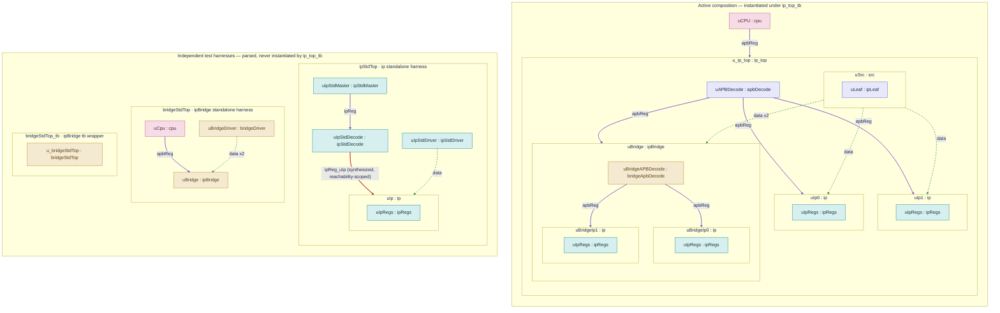

# `ip_test` — hierarchical composition example

`ip_test` is the intended **hierarchical composition** demonstration and test fixture for arch2code. A root project (`ip_test`) composes three self-contained sub-projects — `common`, `ip`, and `bridge` — into a single device tree, exercising IP reuse (the same `ip` block instanced four times), per-use-case variants, two-level register decode, and verilated cosim of the composed design. It is deliberately the **complex** case: the reusable-IP, multi-project, nested-decode scenario. For the simple common-case counterpart (a single project that instances one IP), see the `simple_ip` example.

The active top is `ip_top_tb`. Because each referenced child project file carries its own `topInstance`, the composed database also parses three standalone child testbench roots that no active top instantiates; they are documented separately below.

## Topology

The diagram reproduces the composed instance/connection topology. It has two parts:

- **Active composition** — the real device tree instantiated under `ip_top_tb`.
- **Independent test harnesses** — child-project standalone testbenches, fully parsed but instantiated by nothing.

Node labels read `instance : block`. Node color denotes the project that **defines** each block (provenance), not where it is wired.

### Legend

- **Node color** — defining project: `ip_test` (root, blue), `ip` (teal), `ipBridge` (amber), `common` (pink).
- **Solid violet edge** — register bus (`apbReg` / `ipReg`).
- **Dashed green edge** — data interface.
- **Red edge** — synthesized, reachability-scoped register route (`ipReg_uIp`); it exists only when `ipStdTop` is the active top.

### Notes on the active tree

- A single `uCPU` (`cpu`, from `common`) drives `u_ip_top` over `apbReg`.
- `u_ip_top`'s `uAPBDecode` (`apbDecode`) fans the register bus out to `uIp0`, `uIp1`, and `uBridge`.
- `uBridge` decodes a second time: `uBridgeAPBDecode` (`bridgeApbDecode`) fans out to `uBridgeIp0` and `uBridgeIp1`.
- The `ip` block is reused four times (`uIp0`, `uIp1`, `uBridgeIp0`, `uBridgeIp1`); each contains its own `uIpRegs` (`ipRegs`) register sub-block.
- Data originates at `uSrc` (`src`, containing `uLeaf` / `ipLeaf`) and flows to `uIp0`, `uIp1`, and twice into `uBridge`.

### Notes on the harnesses

- `ipStdTop`, `bridgeStdTop`, and `bridgeStdTop_tb` are standalone child-project testbenches, entering the composed database because each child project file declares its own `topInstance`. None is reached from `ip_top_tb`.
- The register-decode router `ipStdDecode` exists **only** inside `ipStdTop`; its synthesized route to `uIp` is scoped to that harness being the active top.

## Directory structure

The root project holds the project definition, the design nodes it owns, and the three vendored/composed sub-projects.

- `prj/` — root project definition (`yaml/ip_testProject.yaml`) and root verification (`verif/`).
- `top/` — root-owned design node for `ip_top` / `ip_top_tb` (`yaml/`, plus `base/`, `model/`, `rtl/`, `fw/`, `registrar/`, `tb/` segment dirs).
- `src/` — root-owned data-source node (`src`), holding the segment dirs above.
- `leaf/` — root-owned `ipLeaf` node.
- `ip/` — self-contained `ip` sub-project (its own `prj/`, `yaml/`, `fw/`, `include/`, generated `base/model/rtl/registrar/tb/`, `verif/`, `rundir/`, `Makefile`). Provides the reusable `ip` / `ipRegs` blocks and the `ipStd*` standalone harness.
- `bridge/` — self-contained `ipBridge` sub-project (same layout as `ip/`), with symlinks to `common@` and `ip@` for its composition. Provides `ipBridge` / `bridgeApbDecode` and the `bridgeStd*` harness.
- `common/` — self-contained `common` sub-project; provides shared types and the generic `cpu` APB master (`cpu/`).
- `fw/` — root firmware sources (`src/`).
- `include/` — shared make include fragments (`make/`).
- `rundir/` — the composed build/run directory (model and verilated cosim).
- `verif/` — root-level verification blocks and the verilator wrapper (`blocks/`, `vl_wrap/`).

Each sub-project (`ip`, `bridge`, `common`) is self-contained: it can be generated, built, and run on its own via its local `prj/`, `yaml/`, and `Makefile`, and is composed into the root through YAML `include` and cross-project instancing.

## Build and run

Standard flow from `builder/base`:

- **Generate** — `make -C examples/ip_test -j gen`
- **Run (model)** — `make -C examples/ip_test/rundir -j run`
- **Run (composed verilated cosim)** — `make -C examples/ip_test/rundir -j run-vl`

Because the composed design pulls in the `common`, `ip`, and `bridge` sub-projects, the build follows a **leaf-first order**: the self-contained sub-projects are generated and built before the root project that composes them. Always use `make` targets rather than invoking the generator directly, and pass `-j` for parallel builds.
