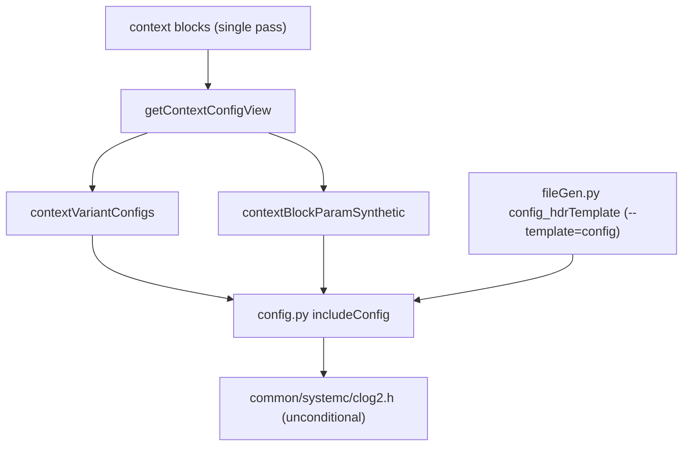

# Plan: clog2 Header + Consolidated Context Config Walk + Config Template Split

## Goal

Three scoped changes to the SystemC Config-header generation path:

1. **clog2 header.** Give Config headers the one constexpr helper they need
   (`clog2`) without depending on the broader packing helpers in
   `bitTwiddling.h`, and stop deciding the include by scanning canonical
   expressions.
2. **Consolidated context walk.** Collapse the multiple per-context walks in
   `getContextData()` into a single pass over context blocks, so the
   per-variant Config descriptors and synthetic block-param fields are not
   recomputed through separate traversals of `prj.data['blocks']`.
3. **Config template split.** Move standalone Config-struct rendering out of
   `templates/systemc/includes.py` into a dedicated
   `templates/systemc/config.py`, leaving `includes.py` responsible for
   context constants, types, and enums.

## Non-Goals (explicitly out of scope)

This was considered and deliberately dropped for this change:

- **No block-view flattening.** The flat block-view keys
  (`isParameterizable`, `hasOwnParams`, `defaultConfig`, `variantConfigs`)
  stay as they are. `getBlockConfigView()` and its cache are unchanged. This
  side is already memoized and does not contribute repeated large-dictionary
  iteration, and touching it would reach into the SystemVerilog consumers
  (`package.py`, `moduleRegs.py`) and instance resolution for no iteration
  benefit.

## Status (2026-06-11) — implemented in working tree / verified

All three parts are implemented in working tree and verified. This plan is now
historical for rollout cleanup; it does not claim committed status.

- **Part 1 (clog2 header): implemented in working tree / verified.**
  `common/systemc/clog2.h` created with the constexpr `clog2` helper;
  `bitTwiddling.h` now `#include "clog2.h"` with its local definition removed;
  `config.py::includeConfig()` emits an unconditional `#include "clog2.h"` when
  Config structs are emitted; the
  `contextConfigNeedsBitTwiddling` view flag/scan and `evalExpr.hasClog2()` were
  removed (sole consumer was the removed helper; `evalExpr` import retained for
  its other uses).
- **Part 2 (consolidated context walk): implemented in working tree /
  verified.** `getContextConfigView(contexts)` added as a single-pass
  `projectOpen` view; `getContextVariantConfigDescriptors`,
  `getContextBlockParamSynthetic`, and `getContextConfigNeedsBitTwiddling`
  removed; `getContextData()` assigns the two flat keys from the returned view.
- **Part 3 (config template split): implemented in working tree / verified.**
  `templates/systemc/config.py` created with `render()` + the moved
  `includeConfig`, `emitCStyleCanonical`, `_configSymSpelling`,
  `_configMemberRhs`, `_config_type`; `case 'config'` removed from
  `includes.py::render()`; `config:` mapping added to `config/project.yaml`;
  `fileGen.py::config_hdrTemplate` now emits `--template=config`.
- **Tests:** `unittest/test_config_template.py` and
  `unittest/test_eval_cpp_emit.py` updated and passing.
- **Integration:** `ip_test` re-scaffold + `make gen` produces Config headers
  with the new marker, the unconditional `clog2.h` include, and populated
  per-variant structs.

### Historical rollout notes and remaining owners

- **Existing-file marker migration: historical / deferred.** The `fileGen.py`
  change governs new scaffolds only; existing generated `*Config.h` files keep
  the old `--template=includes --section=config` marker until migrated by
  delete-the-header + `make newmodule` (re-scaffold) + `make gen`. `ip_test` was
  migrated in the working tree (`ipConfig.h` had a staged WIP index blob, so the
  worktree was migrated for re-staging). The remaining `mixed` migration concern
  is deferred to the active/in-process YAML migration work because its DB rebuild
  is blocked by the Python-style eval expression `($BSIZE-1).bit_length()`
  (`mixedInclude.yaml:7`) until that expression is converted to SV-subset form.
  `helloWorld` has no `newmodule` target, so this plan has no remaining
  migration owner for it.
- **Empty Config contexts: historical / implemented in working tree.**
  `_configHeaderContexts()` only emits a `*Config.h` for a context with a
  parameterizable constant or an instantiated block-with-`params`. `ip_top` and
  `helloWorldTop` qualify for neither, so their empty `*Config.h` files were
  stale pre-gating leftovers and were deleted in the working tree rather than
  migrated.
- **Silent error path: historical / implemented in working tree.** The `case _:`
  fall-through in template `render()` previously called bare `exit()` (status
  0), so a stale marker failed silently under `make gen`. This was hardened
  project-wide to fail loudly.

## Part 1: clog2 Header

Config headers currently include `bitTwiddling.h` conditionally, gated by a
view flag that is computed by scanning every parameterizable constant's
canonical expression for `$clog2`. Replace this with an unconditional include
of a small dedicated header.

- Create `builder/base/common/systemc/clog2.h` owning the existing constexpr
  `clog2(uint64_t)` helper (currently `bitTwiddling.h` lines 21-27, returns
  `uint16_t`, `$clog2` semantics: `clog2(0)=0`, `clog2(1)=0`, `clog2(2)=1`).
- Update `builder/base/common/systemc/bitTwiddling.h` to `#include "clog2.h"`
  and remove its local `clog2` definition. All existing `bitTwiddling.h`
  includers keep working because `clog2` remains visible transitively.
- In `templates/systemc/includes.py::includeConfig()`, emit
  `#include "clog2.h"` unconditionally when Config structs are emitted,
  replacing the current conditional `#include "bitTwiddling.h"` at the
  `contextConfigNeedsBitTwiddling` guard.
- Remove the view flag and its scan:
  - `ret['contextConfigNeedsBitTwiddling']` assignment in `getContextData()`.
  - `getContextConfigNeedsBitTwiddling()` helper.
  - `evalExpr.hasClog2()` if no other consumer remains (verify; the only known
    call site is `getContextConfigNeedsBitTwiddling`).

## Part 2: Consolidated Context Config Walk

`getContextData()` currently calls two helpers that each walk the
context-filtered blocks:

- `getContextVariantConfigDescriptors(contexts)` -> `contextVariantConfigs`
- `getContextBlockParamSynthetic(contexts)` -> `contextBlockParamSynthetic`

Replace both with one private single-pass helper, for example
`getContextConfigView(contexts)`, that walks the context blocks once and
returns both results:

```python
{
    'variantConfigs':     list,   # current contextVariantConfigs shape: {qualBlock, descriptor}
    'blockParamSynthetic': dict,  # current contextBlockParamSynthetic shape: {param: {valueType}}
}
```

- Compute the parameterizable `constants_by_name` set once (as
  `getContextBlockParamSynthetic` does today), before the block loop.
- In one loop over context-matching blocks: read the cached
  `getBlockConfigView(qualBlock)` bundle, append its variant descriptors, and
  scan that block's `params` for synthetic fields.
- `getContextData()` keeps assigning the existing flat keys from the returned
  view:
  - `ret['contextVariantConfigs'] = view['variantConfigs']`
  - `ret['contextBlockParamSynthetic'] = view['blockParamSynthetic']`

Keeping the existing flat key names preserves the `context`-prefix
shadow-avoidance for SystemVerilog `data.update` merging and requires **no**
change to `includeConfig()` for these two fields.

## Part 3: Config Template Split

Config-struct rendering currently lives in `templates/systemc/includes.py`
behind the `case 'config'` branch. Move it to a dedicated template so
`includes.py` owns only context constants, types, and enums.

- New file: `builder/base/templates/systemc/config.py` with its own
  `render(args, prj, data)` that renders the Config header (it does not need
  to switch on `args.section`).
- Move from `includes.py` to `config.py` (these symbols are used only by the
  config path; confirmed no production importer outside `includes.py`):
  - `includeConfig`
  - `emitCStyleCanonical`
  - `_configSymSpelling`
  - `_configMemberRhs`
  - `_config_type`
- `config.py` imports `pysrc.emissionUtils` (for `emitCStyleCanonical`). It
  does **not** use `wrap_module_namespace`; Config output is not
  namespace-wrapped.
- Leave in `includes.py`: `constReference_cpp`, `typeWidthExpression_cpp`,
  `wrap_module_namespace` usage, and the constants/types/enums/addresses
  sections. Remove only the `case 'config'` branch from `render()`.
- Base mapping: add `config: $a2c/templates/systemc/config.py` to the
  `templates:` section in `builder/base/config/project.yaml`.
- File scaffold: change `fileGen.py::config_hdrTemplate` line 542 from
  `// GENERATED_CODE_BEGIN --template=includes --section=config`
  to
  `// GENERATED_CODE_BEGIN --template=config`.

This part composes with Part 1: the unconditional `#include "clog2.h"` is
emitted from `config.py::includeConfig()`.

## Implementation Steps

1. Add `common/systemc/clog2.h` with the constexpr `clog2` helper.
2. Edit `bitTwiddling.h`: include `clog2.h`, remove the local `clog2`.
3. In `processYaml.py`:
   - Add the single-pass `getContextConfigView(contexts)` helper.
   - Replace the two helper calls in `getContextData()` with the single call
     and assign the two flat keys from the returned view.
   - Remove `getContextVariantConfigDescriptors`,
     `getContextBlockParamSynthetic`, `getContextConfigNeedsBitTwiddling`, and
     the `contextConfigNeedsBitTwiddling` assignment.
   - Remove `evalExpr.hasClog2()` if no other consumer remains.
4. Create `templates/systemc/config.py`:
   - Move `includeConfig`, `emitCStyleCanonical`, `_configSymSpelling`,
     `_configMemberRhs`, `_config_type` out of `includes.py`.
   - Add `render(args, prj, data)` that calls `includeConfig`.
   - Emit unconditional `#include "clog2.h"`; remove the conditional
     `bitTwiddling.h` include and its `contextConfigNeedsBitTwiddling` guard
     read.
   - Remove the `case 'config'` branch from `includes.py::render()`.
   - Add `config: $a2c/templates/systemc/config.py` to `config/project.yaml`
     `templates:`.
   - Update `fileGen.py::config_hdrTemplate` to `--template=config`.
5. Update tests:
   - `unittest/test_config_template.py`: import `config.py` and call
     `config.includeConfig`; drop `contextConfigNeedsBitTwiddling` from
     fixtures; change the bit-twiddling test to assert unconditional
     `#include "clog2.h"` when Config structs are emitted.
   - `unittest/test_eval_cpp_emit.py`: keep as the real `projectOpen` / context
     integration coverage; switch `emitCStyleCanonical` and `includeConfig`
     references from `includes` to `config`; update any include assertion that
     named `bitTwiddling.h` to `clog2.h`.

## Data Flow



## Verification

Run focused tests:

- `python3 test_config_template.py` from `builder/base/unittest`
- `python3 test_eval_cpp_emit.py` from `builder/base/unittest`

Then run lints on touched Python files. Verify generated Config headers still
compile by running the relevant `make gen` / `make run` for a parameterizable
example (for example `ip_test`).
