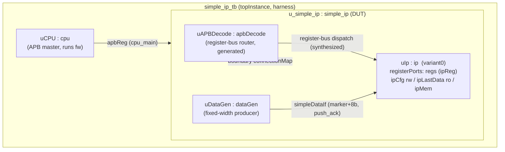

# Design Plan: `simple_ip` example (simple IP-reuse reference)

Status: DONE (2026-07-23). Built + both gates green (model `run` and composed
`run-vl`, "No error"; firmware register readback passes). Ownership verified
(parent blocks at root; no `cpu`/`shared_types`/`ipStd*` leakage; one `rtl.f`
per project). Top-level `Makefile` `simple-ip` target + `pipeline-test`/`clean`
entries added. Committed in the post-`c42b535` branch history.

FINAL LAYOUT CORRECTION (supersedes §6's `arch/yaml/` shape): the example is
`layout: hierarchical`, so the DESIGN-yaml folder becomes the artifact node dir.
`arch/yaml/` is a FUNCTIONAL-layout idiom (there `dirs:` sends artifacts to the
example root); under hierarchical it made `arch/` the node dir and piled every
parent-owned artifact into `arch/`. Chosen fix = "hierarchical, flat at root":
  - project file at `prj/yaml/project.yaml` (`A2C_PRJ_YAML` points here),
  - design at `yaml/simple_ip.yaml` (node dir = example root),
  - parent artifacts at the example root: `model/ rtl/ base/ tb/ registrar/ fw/`,
  - vendored `ip/` + `common/` unchanged; `dirs: root: ../..` (relative to the
    prj/yaml project file) still resolves to the example root.
Build-agent deviations that stand: parent node dir is the example root (not a
wrapper); the tb External block param must be `--block=simple_ip_tb
--excludeInst=u_simple_ip` (scaffold default `--block=simple_ip` segfaults on a
null DUT); `run-vl` vlInst path is `tb.simple_ip.uIp`; extra user-owned files
`prj/verif/Makefile` and `model/regAddresses.h` (hand-created marker shell, no
fileMap) are required. Restructure gotcha: example-level `make clean` does NOT
reach `rundir/build/*.d`, so stale compiler-dependency files kept a dead
`arch/model/regAddresses.h` prerequisite — clear `rundir/build` on such moves.

--- original proposal below (superseded where it conflicts with the above) ---

Author role: hardware architect draft for review.
Date: 2026-07-23.

All read-only source study was performed against `examples/ip_test_veh/**`
(a stable hierarchical copy of the reusable `ip` IP). `examples/ip_test/**` was
deliberately not read (mid-flip). Nothing under `ip_test_veh` is to be modified.

---

## 0. Locked decisions (architect, 2026-07-23)

These answers supersede the proposal text below where they differ.

- **Q1 = E2, vendored (confirmed).** Vendor self-contained copies of the `ip` and
  `common` sub-projects INTO `examples/simple_ip/`, referenced via `projectFiles:`.
  Copy from the **canonical committed `examples/ip_test/{ip,common}`** (after the
  in-place hierarchical flip lands), NOT from the disposable `ip_test_veh`.
- **Hierarchical from the beginning.** The whole example — the top project AND the
  vendored sub-projects — is `layout: hierarchical` from the start. This supersedes
  §6's functional/flat suggestion.
- **Q2 = use `common` (confirmed).** Real `cpu` + firmware register access; vendored
  and self-contained in `simple_ip`.
- **Trim `projectOverrides`.** Do NOT carry `ip_test`'s override set. With a single
  self-contained provider per project there should be no duplicate-provider conflict,
  so start with NO `projectOverrides:` and add an entry only if `make db` actually
  diagnoses a duplicate provider.
- **Q3:** proceed; the `apbReg`-router → `ipReg`-leaf arrangement is fine if `make db`
  resolves it (as in `ip_top`).
- **Q4:** `run-vl` verilates only the reused `ip` leaf.
- **Q5:** keep test functionality simple — single marked word + register readback; no
  memory-burst.

---

## 1. Goal and scope

`simple_ip` is the simple, common-case counterpart to the deliberately-complex
`ip_test`. Its single job is to be an easy-to-read "how to reuse an existing IP"
reference: it embeds the existing reusable `ip` IP exactly once, adds one small
second block that talks to it, drives its registers from a `cpu` register
master, and wraps the whole thing in a minimal testbench.

Contrast with `ip_test` (the complexity `simple_ip` deliberately drops):

- **Single reuse, not a multi-IP composition.** `ip_test` instantiates `ip`
  twice (`uIp0` variant0, `uIp1` variant1), adds a nested-router `ipBridge`
  subsystem that instantiates `ip` twice more, and composes three sub-projects
  (`common`, `ip`, `ipBridge`). `simple_ip` instantiates `ip` exactly once.
- **Native variant only.** `simple_ip` uses only the IP's own native
  `variant0`; it does not exercise the "declare a foreign variant at the parent"
  trick (`ip_test`'s `variant1`), so no parent-side `parameters:` block is
  needed.
- **A plain producer, not a parameterized one.** `ip_test`'s `src` block is a
  per-port-parameterized producer with four outputs feeding two IP instances and
  a bridge. `simple_ip`'s second block is a single fixed-width producer with one
  output.
- **No nested decode.** `simple_ip` has one register-bus router serving one
  routed leaf; `ip_test` has a primary router plus a nested `bridge` router
  (two address groups).

The deliverable of this task is this document only.

---

## 2. How the `ip` IP is embedded

Two candidate mechanisms were considered:

- **Option E1 — `projectFiles:` reference to the existing `ip` IP in place.**
  Point `simple_ip`'s `projectFiles:`/`include:` at
  `examples/ip_test_veh/ip/prj/yaml/ipProject.yaml` (and its `ipVariants.yaml`)
  without copying anything.
  - Pro: zero source duplication.
  - Con: couples a standalone teaching example to a sibling example directory
    (`ip_test_veh`, itself a "vehicle" tree). Cross-example path coupling is
    fragile, is hard to reason about in isolation, and breaks the "self-contained
    reference" goal. `make clean` semantics span two examples.

- **Option E2 (RECOMMENDED) — vendored copy of the `ip` sub-project, referenced
  via `projectFiles:`.** Copy the self-contained `ip` sub-project folder into
  `examples/simple_ip/ip/**` verbatim, and reference that local copy through the
  parent project's `projectFiles:` + `include:` (the same mechanism Option E1
  uses — the difference is copy locality, not the wiring).
  - Pro: hermetic and independently buildable/cleanable; it models the realistic
    reuse story (an IP dropped in as a submodule-like sub-project, referenced by
    the consuming super-repo). This is exactly how `ip_test_veh` embeds `ip`
    today (`examples/ip_test_veh/ip` is a contained sub-project referenced from
    the root `ip_testProject.yaml` via `projectFiles:` + `projectOverrides:`).
  - Con: a vendored source copy can drift from the canonical `ip` over time.

**Recommendation: Option E2.** Vendoring plus a `projectFiles:` reference is the
canonical composition mechanism in this codebase and keeps the example readable
in isolation. The mechanism the reader is meant to learn (parent references child
IP project via `projectFiles:`, ownership resolved by child-project detection)
is identical either way; vendoring simply makes the example self-contained.

The same reasoning applies to the shared `common` sub-project (it owns
`shared_types.yaml` — the `apbReg` bus interface — and the reusable `cpu`
master). `simple_ip` needs both, so `common` is vendored the same way. See §3/§8
for the alternative that avoids `common` entirely.

> Architect decision required: confirm E2 (vendor `ip` + `common`) over E1
> (reference `ip_test_veh` in place). See also the "no-`common`" variant in §8.

---

## 3. Design / block diagram

The top design instantiates the reusable `ip` once (native `variant0`), adds one
fixed-width producer (`dataGen`) that drives `ip.ipDataIf`, places the generated
`apbDecode` router to reach `ip.regs`, and puts the `cpu` register master in the
testbench container.

The one meaningful interaction chosen is the simplest closed loop the `ip` block
supports: `ip` exposes only a data input (`ipDataIf`, `push_ack`, `dst`) plus a
register bus; it has no data output stream. Therefore the natural second block is
a producer, and the "consumer" of the IP's result is the `cpu`, which reads the
captured word back through the `ipLastData` read-only register. Concretely:

- `dataGen` pushes a marked data word into `uIp.ipDataIf`.
- `ip` captures it into its `ipLastData` (`ro`) register.
- `cpu` firmware reads `ipLastData` back and also writes/reads `ipCfg` (`rw`),
  demonstrating the full firmware register path into a reused IP.

### Instance / connection diagram



ASCII equivalent:

```
                 apbReg (authored: cpu -> DUT + boundary map)
   uCPU (cpu) ─────────────────────────────► u_simple_ip [DUT]
                                                 │
                                          uAPBDecode (router)
                                                 │  (synthesized dispatch)
                                                 ▼
   uDataGen (dataGen) ──simpleDataIf──►  uIp (ip, variant0)
        marker + 8b push_ack               regs: ipReg  (ipCfg/ipLastData/ipMem)
```

### Blocks and connections table

| Block / instance | Role | hasRtl/hasMdl/hasVl/hasTb | Key ports / interfaces |
| --- | --- | --- | --- |
| `simple_ip_tb` (`simple_ip_tb`) | Testbench harness container; `topInstance` | F / F / F / F | contains `u_simple_ip`, `uCPU` |
| `cpu` (`uCPU`) | Reusable APB master (vendored from `common`); runs firmware | T-model-only (hasRtl F) | `cpu_main`: `apbReg` src |
| `simple_ip` (`u_simple_ip`) | DUT container | T / T / T / T | boundary `apbReg` dst (to router) |
| `apbDecode` (`uAPBDecode`) | Register-bus router (generated `apbDecodeModule`) | T / T / T / F | `addressBlock` group `top`; `upstreamPort` `apbReg`; `registerDecoderPort` `apbReg` |
| `dataGen` (`uDataGen`) | Fixed-width producer; second block that talks to `ip` | T / T / T / F | `out`: `simpleDataIf` src |
| `ip` (`uIp`) | Reusable IP under reuse (vendored); `variant0` | T / T / T / T | `ipDataIf` dst; `registerPorts.regs`: `ipReg` |
| `ip_regs` (`uIpRegs`) | Register handler for `uIp` | synthesized | synthesized dispatch + leaf map |

New definitions `simple_ip` introduces (all non-parameterized, fixed to
`variant0` widths, mirroring `ip_test_veh`'s `ipStdTop` boundary pattern):

- `types`: `simpleMarkerT` (width 1), `simpleData8T` (width 8).
- `structures`: `simpleData8St { marker: simpleMarkerT, data: simpleData8T }`
  — field order and widths match `ipDataSt` under `IP_DATA_WIDTH=8` (variant0).
- `interfaces`: `simpleDataIf` (`push_ack`, `data_t = simpleData8St`).

Because `uIp` is parameterized, its module-local `ipDataIf` payload typedef
cannot be named at container scope; `simple_ip` declares the concrete
non-parameterized `simpleDataIf` and cross-binds it to `uIp.ipDataIf` on the
consumer side (the `push_ack` thunker adapts). This mirrors `ipStdTop`'s
`ipStdData8If` / `ip_top`'s `srcOut0BoundaryIf` exactly.

---

## 4. Register access (`cpu -> decode -> ip.regs`)

The `ip` block is a reusable-IP routed leaf: it authors exactly one
`registerPorts: { regs: { interface: ipReg } }` row, so its register-bus surface
is self-contained. Its FW-accessible state (`ipCfg` rw, `ipLastData` ro, `ipMem`
`regAccess: true`) must be served by a register-bus router in its container.

Wiring (identical shape to `ip_top` in `ip_test_veh`):

- Router placement: declare block `apbDecode` with a populated `addressBlock:`
  (group `top`, `upstreamPort: apbReg`, `registerDecoderPort: apbReg`) and
  instance it as `uAPBDecode` inside `simple_ip` — the same container as `uIp`.
- Routed-leaf tag: `uIp` carries `addressGroup: top` (naming the router's group)
  and `variant: variant0`.
- Authored upstream feed (the only register-bus wiring authored by hand):
  - `connection`: `apbReg` from `uCPU.cpu_main` to `u_simple_ip` (name
    `cpu_main`).
  - `connectionMap`: `apbReg` at the `simple_ip` boundary, `direction: dst`,
    into `uAPBDecode`.
- Synthesized below the router (authored by nobody): the `ip_regs` handler
  block/instance, the leaf-to-handler `connectionMap`, and the
  `uAPBDecode -> uIp` register dispatch connection.

Address group: one group (`top`); no nested router (contrast `ip_test`'s
`bridge` group). `uIp` is the single routed leaf.

Bus-interface note (verify at `make db`): the router's `upstreamPort` /
`registerDecoderPort` are `apbReg` (from `common/shared_types`), while the leaf's
`registerPorts` interface is the IP's own `ipReg`. Both are `apb`-type buses with
32-bit address/data (`ipReg` uses `ipRegAddrT`/`ipRegDataT` at width 32;
`apbReg` uses `apbAddrT`/`apbDataT` at `DWORD=32`), and this exact
`apbReg`-router-serving-`ipReg`-leaf arrangement is what `ip_top` already does
and compiles. This is called out as a thing to confirm, not a thing to invent.

Firmware: a small `fw/src/fwSimpleMain.{h,cpp}` (modeled on `ip_test_veh`'s
`fwIpMain.cpp`) that, at `BASE_ADDR_UIP`:

- reads `REG_IP_IPLASTDATA` and checks the marker byte `dataGen` drove;
- writes then reads back `REG_IP_IPCFG`;
- consumes one generated FW constant from `ipIncludesFW.h` (e.g.
  `IP_FIXED_WORD_COUNT`) to prove the per-context FW header is consumed.

---

## 5. Variant / registrar / config

- **Variant instantiated:** `variant0` only — the IP's own native variant
  (`IP_DATA_WIDTH=8`, `IP_MEM_DEPTH=16`, `IP_NONCONST_DEPTH=24`), already bound in
  the vendored `ip/ip/yaml/ipVariants.yaml`. Because this is the IP's own
  variant, `simple_ip` needs **no** parent-side `parameters:` block (unlike
  `ip_test`, which declares the foreign `variant1` at the parent).
- **Ownership (per the reuse model):** the vendored `ip` sub-project owns the
  generation of `ip`'s own implementation files (its `base/model/rtl/tb`), and
  the `simple_ip` parent owns its own instance `uIp` and the per-use-case
  variant/config it selects. The parent-owned variant-config module
  (`simple_ip_ip_variantConfig` analogue of `ip_test`'s
  `ip_test_ip_variantConfig.cppm`) is generated in the parent tree. Child-project
  detection (`CONTEXTOWNINGPROJECT`) keeps `ip`-owned files in the `ip` tree and
  `common`-owned files (`cpu`, `shared_types`) in the `common` tree; the parent
  generates only its own objects.
- **Registrar:** the generated registrar artifacts follow the same
  ownership split (each sub-project registers its own blocks; the parent
  registers its own). No hand-authored registrar is required.

---

## 6. Layout and project structure

**Top-project layout: `hierarchical` (per §0 — supersedes the earlier
functional/flat suggestion).** The top project and the vendored `ip`/`common`
sub-projects are all `layout: hierarchical` from the start. The concrete
generated hierarchical directory tree mirrors the flipped committed `ip_test`
convention (`prj/`, per-node dirs, `verif/`), so use the post-flip `ip_test` as
the structural template. The vendored `ip` and `common` sub-projects are copied
from the canonical committed `ip_test/{ip,common}` verbatim.

Proposed directory / file tree (`examples/simple_ip/`):

```
examples/simple_ip/
  Makefile                         # clean; includes include/make/shared.mk
  include/make/shared.mk           # PROJECTNAME=simple_ip, TB_TOP_MODULE=simple_ip,
                                   #   A2C_PRJ_YAML -> arch/yaml/project.yaml
  arch/yaml/
    project.yaml                   # top parent project (see shape below)
    simple_ip.yaml                 # top design: simple_ip, simple_ip_tb, apbDecode, dataGen;
                                   #   instances uIp/uDataGen/uAPBDecode/uCPU; boundary defs
  ip/                              # VENDORED copy of the reusable ip sub-project (verbatim)
    prj/yaml/ipProject.yaml
    ip/yaml/{ip.yaml,ipTop.yaml,ipVariants.yaml}
    yaml/ipLeaf.yaml
    (base/ model/ rtl/ tb/ fw/ ... generated in the ip tree)
  common/                          # VENDORED copy of shared_types + cpu sub-project (verbatim)
    prj/yaml/commonProject.yaml
    common/yaml/shared_types.yaml
    cpu/yaml/cpu.yaml
  fw/src/fwSimpleMain.{h,cpp}      # cpu firmware (register-access test)
  rundir/Makefile                  # run / run-vl targets
  (model/ rtl/ base/ tb/ verif/vl_wrap/ fw/include/  -> generated, parent-owned)
```

Proposed `arch/yaml/project.yaml` shape (mirrors `ip_testProject.yaml`, trimmed
to one IP):

```yaml
yamlFormat: 2
projectName: simple_ip

projectFiles:
    - ../../common/prj/yaml/commonProject.yaml   # shared_types + cpu
    - ../../ip/prj/yaml/ipProject.yaml           # the reused IP
    - simple_ip.yaml                             # the top design

# No projectOverrides: (see §0) — single self-contained provider per project.
# Add an entry only if `make db` diagnoses a duplicate provider.

topInstance: simple_ip_tb

instanceGroups:
    top:    { varType: inst_top, enumPrefix: INST_TOP_ }
    blocks: { varType: blockID,  enumPrefix: BLOCK_TOP_ }

addressObjects:
    memories:  { alignment: memsize, sizeRoundUpPowerOf2: true, sortDescending: true }
    registers: { alignment: 8, sortDescending: true }

dirs:
    root: ../..
    base: $root/base
    model: $root/model
    rtl: $root/rtl
    vl_wrap: $root/verif/vl_wrap
    tb: $root/tb
    fwInc: $root/fw/include

fileGeneration:
    layout: hierarchical          # top project keeps default mirror; blocks are flat because
                                  #   simple_ip.yaml sits at arch/yaml root
    template: $a2c/templates/fileGen/fileGen.py
    fileMap:
        includeFW: { name: "IncludesFW", ext: {hdr: "h", src: "cpp"}, cond: {smartInclude: true}, mode: context, basePath: fwInc, desc: "yaml based fw include file" }
    fileCopyrightStatement: "copyright the arch2code project contributors, see https://github.com/arch2code/arch2code/blob/main/LICENSE"
    regBlockNaming: { instancePrefix: "u", blockSuffix: "Regs", camelCase: true }
```

Proposed `arch/yaml/simple_ip.yaml` shape (schematic — not final YAML):

```yaml
include:
    - ../../common/common/yaml/shared_types.yaml   # apbReg
    - ../../common/cpu/yaml/cpu.yaml               # cpu master block
    - ../../ip/ip/yaml/ipVariants.yaml             # ip block + variant0 binding

types:
    simpleMarkerT: { width: 1, desc: "Boundary marker; matches ipDataSt::marker" }
    simpleData8T:  { width: 8, desc: "8-bit boundary payload; matches ipDataSt::data @variant0" }

structures:
    simpleData8St:
        marker: { varType: simpleMarkerT, desc: "marker bit" }
        data:   { varType: simpleData8T,  desc: "8-bit payload @variant0" }

interfaces:
    simpleDataIf:
        desc: "Non-parameterized producer->ip.ipDataIf boundary"
        interfaceType: push_ack
        structures:
            - { structure: simpleData8St, structureType: data_t }

blocks:
    simple_ip:
        desc: "DUT: one reused ip + producer + register decoder"
        hasVl: true; hasMdl: true; hasTb: true; hasRtl: true
    simple_ip_tb:
        desc: "Testbench harness container"
        hasVl: false; hasMdl: false; hasTb: false; hasRtl: false
    dataGen:
        desc: "Fixed-width producer feeding ip.ipDataIf"
        hasVl: true; hasMdl: true; hasTb: false; hasRtl: true
        ports:
            out: { interface: simpleDataIf, direction: src }
    apbDecode:
        desc: "APB register decoder"
        hasVl: true; hasMdl: true; hasTb: false; hasRtl: true
        addressBlock:
            addressGroup: top
            addressIncrement: 0x01000000
            maxAddressSpaces: 16
            varType: addr_id_top
            enumPrefix: ADDR_ID_TOP_
            upstreamPort: apbReg
            registerDecoderPort: apbReg

instances:
    simple_ip_tb:  { container: simple_ip_tb, instanceType: simple_ip_tb, instGroup: top }
    u_simple_ip:   { container: simple_ip_tb, instanceType: simple_ip,    instGroup: top }
    uCPU:          { container: simple_ip_tb, instanceType: cpu,          instGroup: top }
    uAPBDecode:    { container: simple_ip,    instanceType: apbDecode,    instGroup: top }
    uDataGen:      { container: simple_ip,    instanceType: dataGen,      instGroup: top }
    uIp:           { container: simple_ip,    instanceType: ip,           instGroup: top, addressGroup: top, variant: variant0 }

connections:
    - { interface: apbReg,       src: uCPU,     srcport: cpu_main, dst: u_simple_ip, name: cpu_main }
    - { interface: simpleDataIf, src: uDataGen, srcport: out,      dst: uIp, dstport: ipDataIf }

connectionMaps:
    - { interface: apbReg, block: simple_ip, direction: dst, instance: uAPBDecode, name: cpu_main }

# No parameters: block — variant0 is the IP's own native variant.
```

---

## 7. Build and run flow

Mirror the standalone/composed makefile pattern used by `ip_test_veh`:

- `examples/simple_ip/include/make/shared.mk`: set `PROJECTNAME=simple_ip`,
  `TB_TOP_MODULE=simple_ip`, `HDL_TOP_MODULE=simple_ip`, and
  `A2C_PRJ_YAML=$(REPO_ROOT)/arch/yaml/project.yaml`; include
  `a2c-common.mk` (and `a2cPro.mk` if present), as the peer shared.mk files do.
- `examples/simple_ip/rundir/Makefile`: include `shared.mk`,
  `a2c-systemc.mk`, `a2c-agents.mk`; add `EXTRA_PRJ_SRC_DIRS +=
  $(REPO_ROOT)/fw/src` (the cpu firmware) and the `EXTRA_O3_CPP_SRC` filter for
  `*Includes.cpp %IncludesFW.cpp`; define:
  - `run` — `$(BIN) $(TB_TOP_MODULE)` (model), or with `--vlInst
    $(HDL_TOP_MODULE)` when `VL_DUT` is set.
  - `run-vl` — `make clean; make all VL_DUT=1; make run-vl-ip`, where
    `run-vl-ip` runs `$(BIN) $(TB_TOP_MODULE) --vlInst
    $(TB_TOP_MODULE).u_simple_ip.uIp` (verilate the reused IP leaf; the single
    meaningful cosim target).
- Standard `make` targets: `make db` (build DB), `make gen` (generate),
  `make -C rundir -j run`, `make -C rundir -j run-vl`. Use `-j` per project
  convention.

Suite integration (top-level `builder/base/Makefile`), mirroring the `ip-test`
target:

- Add a `SIMPLE_IP_DIR = examples/simple_ip` variable and a phony target:
  ```
  .PHONY : simple-ip
  simple-ip:
  	make -C $(SIMPLE_IP_DIR) gen
  	make -C $(SIMPLE_IP_DIR)/rundir -j run
  	make -C $(SIMPLE_IP_DIR)/rundir -j run-vl
  ```
- Add `simple-ip` to the `pipeline-test` aggregate target (alongside
  `ip-test`).
- Add `make -C $(SIMPLE_IP_DIR) clean` to the top-level `clean` target.
- Optionally add a regression JSON (`rundir/regr_simple_ip.json`) and a `regr`
  target if regression coverage is wanted; not required for the first landing.

---

## 8. Open questions for the architect — ALL RESOLVED (see §0)

The answers are recorded in §0; the items below are retained for rationale.

- **Q1 — embed source (§2).** Confirm Option E2 (vendor `ip` + `common`) over
  E1 (reference `ip_test_veh` in place). E2 is recommended for hermeticity.
- **Q2 — `common` dependency (§3/§4).** Two shapes:
  - **Q2a (recommended):** vendor `common` and reuse the real `cpu` (apbReg
    master running firmware) + the `apbReg`-based router into `ip`'s `ipReg`
    leaf. This best matches the "reuse real IPs + real cpu + firmware register
    access" story the task asks for, at the cost of a second vendored
    sub-project.
    - **Q2b (leaner alternative):** drop `common`; build the register path
    entirely on the IP's own `ipReg` bus with a tiny local apb master block (a
    `cpu` stub with a single `ipReg` src port, like `ipStdTop`'s `ipStdMaster`).
    Fewer moving parts and no `common`, but the "cpu" is a bespoke stub rather
    than the reusable common master, and there is no firmware-worker
    register-access demonstration. Recommend Q2a unless "smallest possible" is
    weighted above "realistic cpu + firmware".
- **Q3 — `apbReg` router serving an `ipReg` leaf (§4).** Confirm at `make db`
  that the `apbReg`-typed router dispatching to the `ipReg` `registerPorts` leaf
  resolves cleanly (it does in `ip_top`; flagged only because the two bus
  interfaces have different names though identical 32-bit `apb` shape).
- **Q4 — cosim scope (§7).** Confirm that verilating only the reused `ip` leaf
  (`--vlInst ...uIp`) is the intended `run-vl` target, matching the standalone
  `ip` project, versus whole-DUT verilation.
- **Q5 — producer richness.** Confirm the single-word marked producer
  (`dataGen`) plus register readback is a sufficiently meaningful interaction, or
  whether a short burst into `ipMem` (memory `regAccess`) should also be shown.
  Recommend keeping it single-word for simplicity.

---

## 9. Phased implementation checklist (for later — not part of this task)

1. **Scaffolding prerequisite.** Load `manage-build.md`; use `make newmodule`
   for every new block (`simple_ip`, `simple_ip_tb`, `dataGen`, `apbDecode`).
   Do not hand-create `.cpp/.h/.sv` for generated blocks. `apbDecode` must carry
   `addressBlock:` before `make newmodule` so the `apbDecodeModule` template is
   selected.
2. **Vendor the IPs.** Copy `examples/ip_test_veh/ip/**` to
   `examples/simple_ip/ip/**` and `examples/ip_test_veh/common/**` to
   `examples/simple_ip/common/**`, verbatim (no edits to the vendored YAML).
3. **Author the top project.** Write `arch/yaml/project.yaml` (§6 shape) and
   `arch/yaml/simple_ip.yaml` (§6 shape): boundary types/structures/interface,
   the four blocks, instances, the two authored connections, and the one
   boundary `connectionMap`. No `parameters:` block.
4. **Validate the DB.** `make db` — resolve any co-location / router / bus-name
   diagnostics (see the `design-register-decode` appendix). Confirm one primary
   router, one routed leaf, one address group.
5. **Scaffold + generate.** `make newmodule` for the new blocks, then
   `make gen`. Confirm the synthesized `ip_regs` handler and the
   `uAPBDecode -> uIp` dispatch appear, and that `ip`/`common`-owned files
   generate in their own trees (ownership check).
6. **Implement the small user logic.** Fill user regions only:
   - `dataGen` model/RTL: push one marked `simpleData8St` word onto `out`.
   - `simple_ip` testbench: instantiate via the generated `createTbTop()` helper;
     no factory code in user regions.
   - `fw/src/fwSimpleMain.{h,cpp}`: register read/write/readback (§4).
7. **Wire the build.** Add `include/make/shared.mk`, `rundir/Makefile`,
   top-level `Makefile` `simple-ip` target, `pipeline-test` entry, and `clean`
   entry (§7).
8. **Run.** `make -C examples/simple_ip gen`, then
   `make -C examples/simple_ip/rundir -j run` and `-j run-vl`. The firmware
   register-readback assertion is the pass/fail gate.
9. **Review.** Run a `review-model` / `review-rtl` pass on the hand-written
   `dataGen` and firmware; keep user logic minimal.
```
