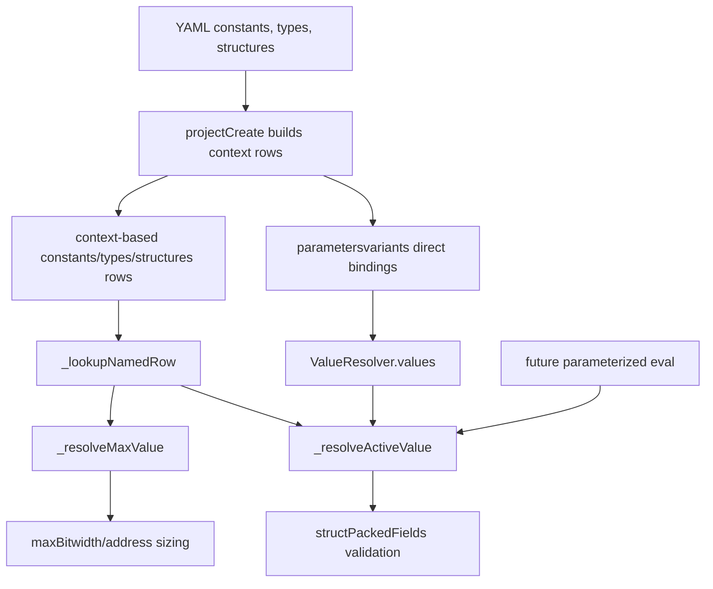

# ValueResolver Refactor Plan

## Current Status

- **Classification (reconciled 2026-07-24):** complete / committed.
- **Status taxonomy:** implementation and focused tests landed in `fd9ee1d`.
- **Current state:** `_lookupNamedRow`, `_resolveActiveValue`, and
  `_resolveMaxValue` implement the active/max split; schema-backed
  `blockParamKey` identity and the duplicate-parameter regression are present.
  The implementation steps below are retained as the execution record.
- **Related active owner:** parameterized eval recomputation remains out of
  scope here and is tracked by `plan-eval-symbolic-emission.md`.

## Goal
Clean up the repeated resolution logic in [`/work/ws/debayer/builder/base/pysrc/valueResolver.py`](/work/ws/debayer/builder/base/pysrc/valueResolver.py) so all direct constant/enum references use one maintainable resolution path and share the same override semantics. This addresses the current `arraySizeKey` drift without implementing parameterized eval.

`ValueResolver` is a create-time helper for the `projectCreate` processing flow. Its data contract is the context-based in-memory shape used while YAML is being processed, for example `project.data['constants'][yaml_context][name]`, `project.data['types'][yaml_context][name]`, and `project.data['structures'][yaml_context][name]`. Do not make this resolver support the flattened `projectOpen` database shape as a fallback path.

## Current Shape
`ValueResolver` currently has multiple overlapping paths:

- `value(ref)` resolves active numeric values and honors `self.values` overrides.
- `_constantRow(key)` returns constant metadata and bypasses `self.values`.
- `arraySize()` uses `_constantRow(key)['value']`, so it ignores direct qualified overrides.
- `typeWidth()` uses `value(key)`, so it does honor direct qualified overrides.
- `typeMaxWidth()`, `arraySize(use_max=True)`, and `_auto_structMaxBitwidth()` need worst-case sizing, not active variant values.

The important distinction is not `type` vs `array`; it is active-value resolution vs max-value resolution.

## Chosen Design
Refactor `ValueResolver` around explicit internal primitives with clear contracts:

- `_lookupNamedRow(key, label)` performs metadata lookup only for a qualified constant or enum key in the context-based `projectCreate` data shape.
- `_resolveActiveValue(ref, context, label)` resolves active values and always honors `self.values` overrides for direct bare or qualified references.
- `_resolveMaxValue(key, label)` resolves worst-case values from `maxValue` for parameterizable constants, otherwise from the default value. Enums use their declared value.

Rework `value()`, `typeWidth()`, `typeMaxWidth()`, `arraySize()`, `varWidth()`, and packed-field traversal so each call site explicitly chooses active or max behavior.

Keep `value()` as the public active-value entry point for current callers. The new helpers should remain private implementation details, not a second public resolver API.

## Non-Goals
Do not implement eval-derived active recomputation in this change. Derived constants may already have create-time default values and max values, but variant-aware eval requires a separate expression/dependency data contract.

Do not add compatibility fallbacks for flattened `projectOpen` rows or missing schema fields. Do not use defensive `.get(..., default)`, `or {}`, silent empty values, broad exception handling, optional alternate paths, or compatibility wrappers unless a current valid caller or accepted YAML form demonstrably needs that behavior. If a required field is absent from the context-based create-time data, fix the producer or validation.

## Implementation Steps
1. Add focused tests first in [`/work/ws/debayer/builder/base/unittest/test_value_resolver_qualified_override.py`](/work/ws/debayer/builder/base/unittest/test_value_resolver_qualified_override.py):
    - Keep the new failing `arraySizeKey` override test.
    - Add a `use_max=True` check so max sizing still uses `maxValue`, not the active override.
    - Make the fake project rows match the context-based `projectCreate` data contract, including required schema fields used by the resolver.
    - Add an enum or foreign-context sanity check only if it protects the active/max helper split without expanding scope.

2. Refactor [`/work/ws/debayer/builder/base/pysrc/valueResolver.py`](/work/ws/debayer/builder/base/pysrc/valueResolver.py):
    - Replace `_lookupNamedValueQualified()` and `_constantRow()` overlap with one row lookup helper and two value-selection helpers.
    - Keep all row lookup against context-based `projectCreate` structures; do not add flattened `projectOpen` lookup fallback code.
    - Read required schema/view fields directly. Only branch on explicitly optional relationships, and fail at the invariant boundary rather than substituting empty defaults.
    - Make `value()` use active resolution for all direct constant/enum references.
    - Make `typeWidth()` use active resolution.
    - Make `typeMaxWidth()` use max resolution when it cannot return `maxBitwidth` directly.
    - Make `arraySize()` use active resolution for normal packed fields and max resolution for `use_max=True`.
    - Keep `structPackedFields()` on active values, because `checkInterfacePair()` passes variant bindings for packed-form compatibility.
    - Keep `_structureWidth(..., use_max=True)` and `typeMaxWidth()` on max values for create-time sizing.

3. Move variant target-parameter identity into the schema instead of reconstructing it in [`/work/ws/debayer/builder/base/pysrc/processYaml.py`](/work/ws/debayer/builder/base/pysrc/processYaml.py):
   - Add a regression test with two visible blocks that both declare the same bare parameter name, for example `WIDTH`.
   - The test must prove a `parameters:` row for one block qualifies to that block's own `blocksparams.blockparamKey`, not to another visible block's same-named parameter.
   - Use existing schema facilities, not a custom auto hook: add a `blockParam` `_combo` field under `parameters.variants` built from the already-validated `block` plus the user-authored `param`, and validate it against `blocksparams.blockparam`.
   - Treat `param` as the bare emitted/config field name only.
   - Treat `blockParamKey` as the target parameter identity for joins, override maps, and direct qualified `ValueResolver` overrides.
   - Keep `blockVariantParamKey` as the unique row key for one `(block, variant, param)` binding; do not use it as the target parameter key.
   - Update `variantValueBindings()` to select `blockParamKey` and produce both the bare `param` binding and the qualified `blockParamKey` binding.
   - Remove `_qualifiedVariantParamKey()` entirely; do not replace it with another Python-side lookup or fallback.
   - Update post-parse checks and any SQL/manipulators that compare variant rows to block params to use `blockParamKey` / `blocksparams.blockparamKey`, constrained to the same `blockKey` where applicable.
   - Leave template emission that writes HDL/SystemC parameter names on bare `param`; only identity-sensitive code should move to `blockParamKey`.
   - Do not attempt eval-derived recomputation in this pass.

4. Document the new data contract in [`/work/ws/debayer/builder/base/config/SCHEMA_SPECIFICATION.md`](/work/ws/debayer/builder/base/config/SCHEMA_SPECIFICATION.md):
   - `parametersvariants.param` is the user/emission name.
   - `parametersvariants.blockParamKey` is the block-scoped target parameter identity.
   - `parametersvariants.blockVariantParamKey` is the unique variant-row key.
   - Foreign-key lookup by bare `param` is insufficient when multiple visible blocks declare the same parameter name.

5. Verify with focused tests:
    - `python3 test_value_resolver_qualified_override.py` from [`/work/ws/debayer/builder/base/unittest`](/work/ws/debayer/builder/base/unittest).
    - The duplicate-parameter-name schema regression test added in step 3.
    - Any existing parameterization tests touched by resolver behavior, especially address-control parameterized interface tests.

6. Verify with project-level build evidence:
    - Run the existing `ip_test` clean flow from [`/work/ws/debayer/builder/base/examples/ip_test/rundir`](/work/ws/debayer/builder/base/examples/ip_test/rundir): `make clean && make db && make gen && make && make run`.

## Later Task: Parameterized Eval
Do not solve eval-derived active values in this change. Capture it as a follow-up that will likely need:

- Persisted or reconstructable eval expressions for constants.
- Dependency tracking from derived constants to parameterized source constants.
- A variant-aware expression evaluator that substitutes active variant bindings.
- Negative packed-form tests where only an eval-derived value makes interfaces incompatible.

## Data Flow

